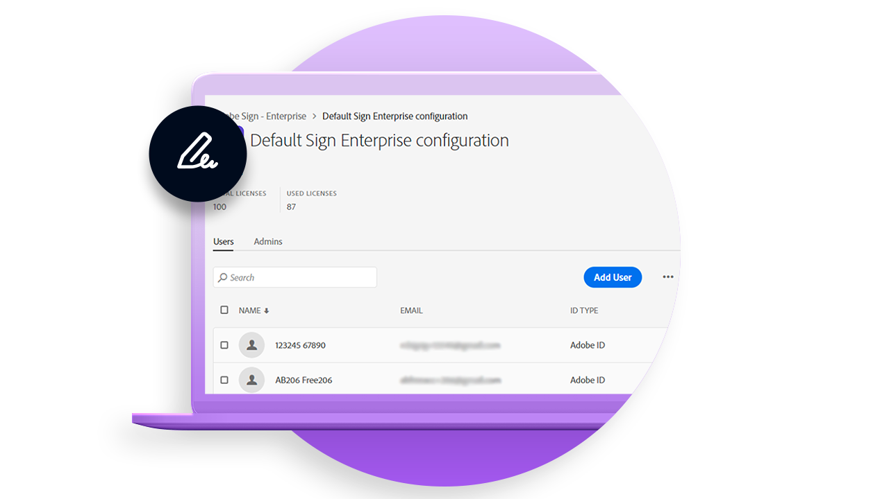
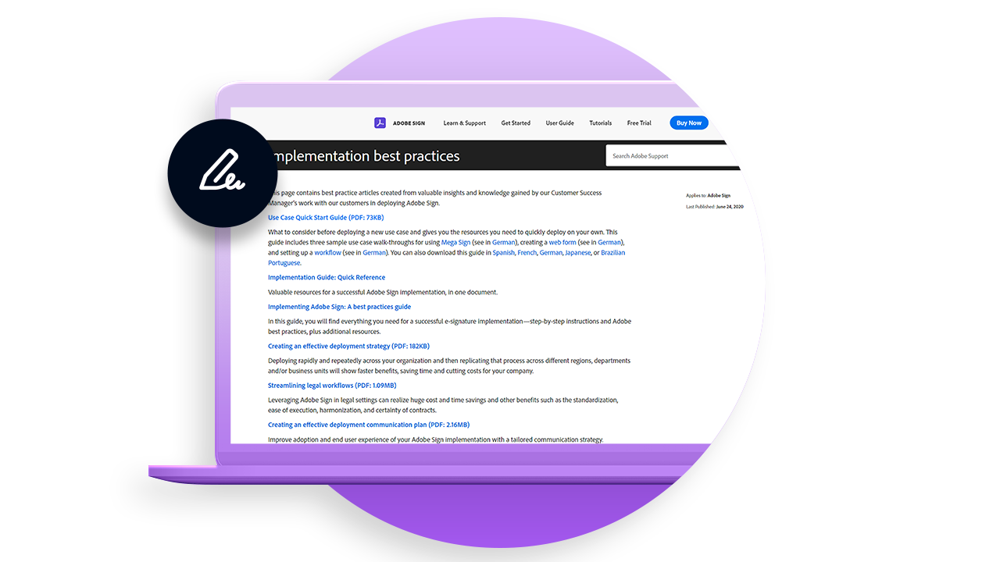
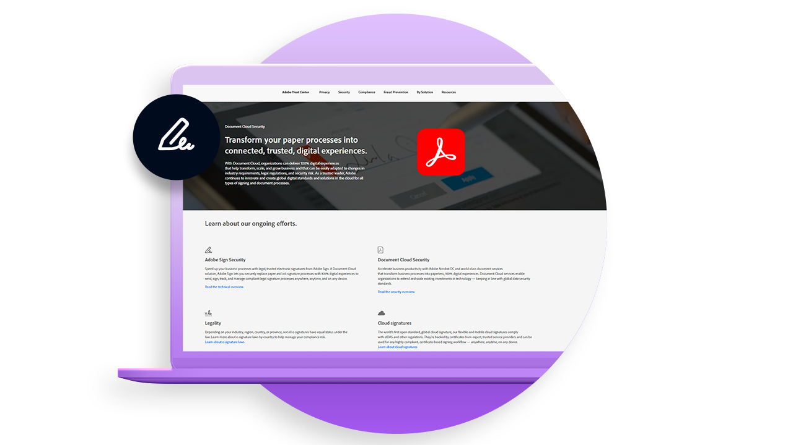
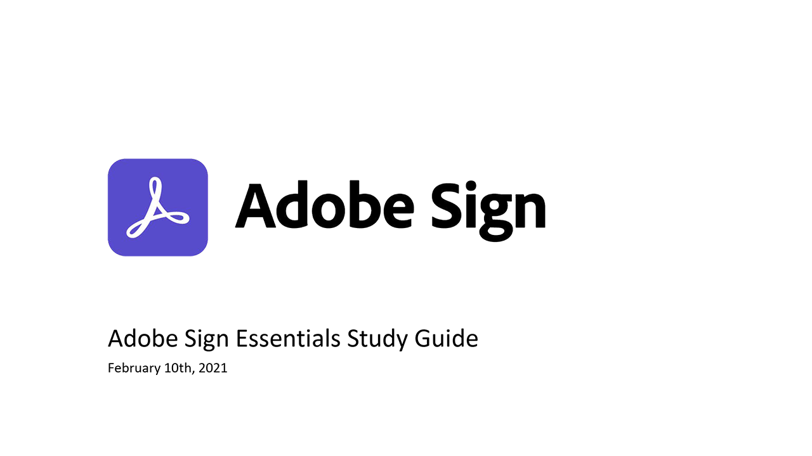

# Deploy overview

Best practice articles with valuable insight on deploying Adobe Sign within your organization.

<table style="table-layout:fixed">
<tr>
  <td>
    
    

    <a href="https://helpx.adobe.com/enterprise/using/adobe-sign-for-enterprise.html" target="_blank"><strong>Managing Adobe Sign on the Admin Console</strong></a>
    

    <em>Learn how to manage Adobe Sign users and licenses on Adobe’s enterprise platform the Adobe Admin Console</em>
     
  </td>
  <td>
    
    

    <a href="https://helpx.adobe.com/sign/using/adobe-sign-training-best-practice.html" target="_blank"><strong>Best practices</strong></a>
    

    <em>Review valuable insights and knowledge gained by our Customer Success Manager's work with our customers in deploying Adobe Sign</em>
     
  </td>  
  <td>
    
    

    <a href="https://www.adobe.com/trust/document-cloud-security.html" target="_blank"><strong>Adobe Trust Center</strong></a>
    

    <em>Learn about our ongoing efforts in security, legality, and standards for Adobe Sign</em>
     
  </td>
</tr>
<tr>
  <td>
    
    

    <a href="assets/SignStudyGuide.pdf"><strong>Adobe Sign Essentials Study Guide</strong></a>
    

    <em>Adobe Sign Study Guide for the Adobe Sign Essentials Assessment (AD3-D104)</em>
     
  </td>
  <td>
    
    

     
  </td>
  <td>
    
    

     
  </td>
</tr>
</table>
