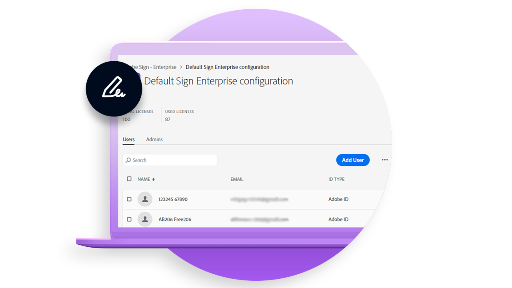
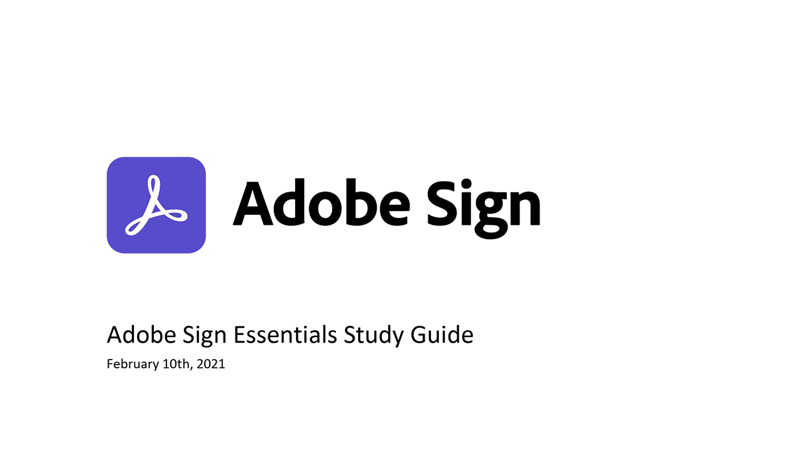

# Deploy overview

Articles with valuable insight and best practices on deploying Acrobat Sign within your organization.

<table style="table-layout:fixed">
<tr>
  <td>
    
    

    <a href="https://helpx.adobe.com/enterprise/using/adobe-sign-for-enterprise.html" target="_blank"><strong>Managing Acrobat Sign on the Admin Console</strong></a>
    

    <em>Learn how to manage Acrobat Sign users and licenses on Adobe's enterprise platform the Adobe Admin Console</em>
     
  </td>
  <td>
    
    

    <a href="https://www.adobe.com/trust/document-cloud-security.html" target="_blank"><strong>Adobe Trust Center</strong></a>
    

    <em>Learn about our ongoing efforts in security, legality, and standards for Acrobat Sign</em>
     
  </td>
  <td>
    
    

    <a href="assets/SignStudyGuide.pdf"><strong>Acrobat Sign Essentials Study Guide</strong></a>
    

    <em>Acrobat Sign Study Guide for the Acrobat Sign Essentials Assessment (AD3-D104)</em>
     
  </td>
  <td>
    
    

     
  </td>
</tr>
</table>
