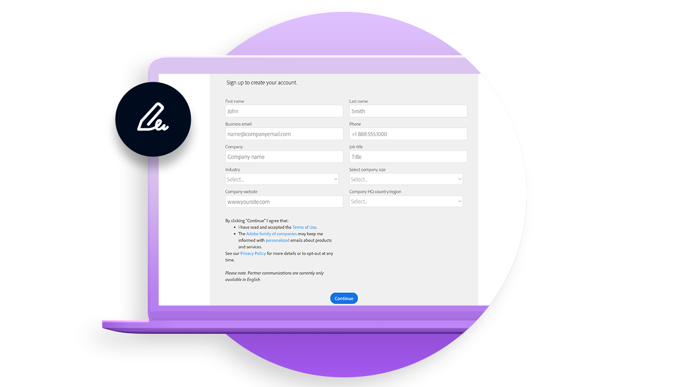
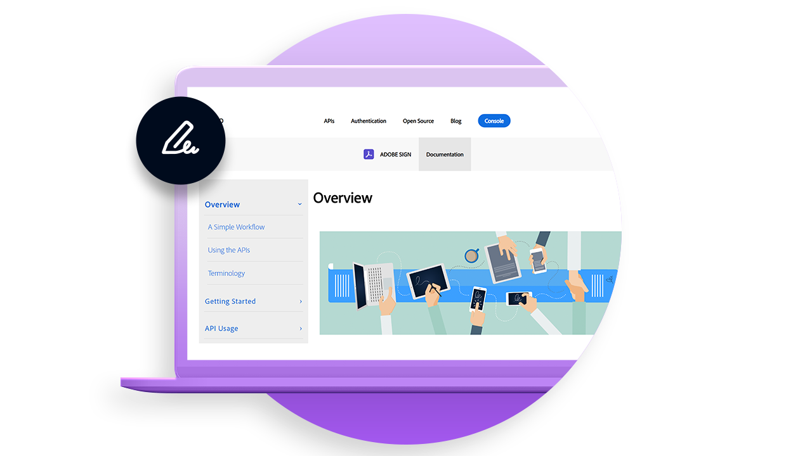

# Develop Overview

40% of agreements in Adobe Sign are created using APIs. Use APIs to create custom applications for your teams, partners and customers.

<table>
<tr>
  <td valign="top">
    
    

    <a href="https://www.adobe.io/apis/documentcloud/sign.html"><strong>Getting started</strong></a>
     
  </td>
  <td valign="top">
    
    

    <a href="https://www.adobe.io/apis/documentcloud/sign.html"><strong>Learn what you can do</strong></a>
     
</tr>
</table>
