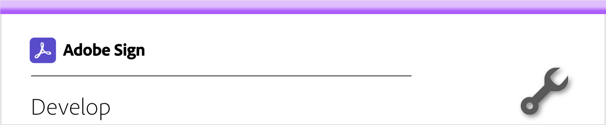

# Develop overview

40% of agreements in Adobe Sign are created using APIs. Use APIs to create custom applications for your teams, partners and customers.

<table style="table-layout:fixed">
<tr>
  <td>
    
    

    <a href="https://www.adobe.io/apis/documentcloud/sign.html"><strong>Getting started</strong></a>
     
    <em>Create your developer account now to get started</em>
  </td>
  <td>
    
    

    <a href="https://www.adobe.io/apis/documentcloud/sign/docs.html"><strong>Learn what you can do</strong></a>
     
    <em>Learn how you can incorporate the functionality of Adobe Sign into any external application</em>
  </td>  
  <td>
    
    

    <a href="gigasign.md"><strong>Gather High-Volume Documents using GigaSign</strong></a>
     
    <em>Send, collect, and track documents for signature to thousands of people at the same time</em>
  </td>
</tr>
</table>
