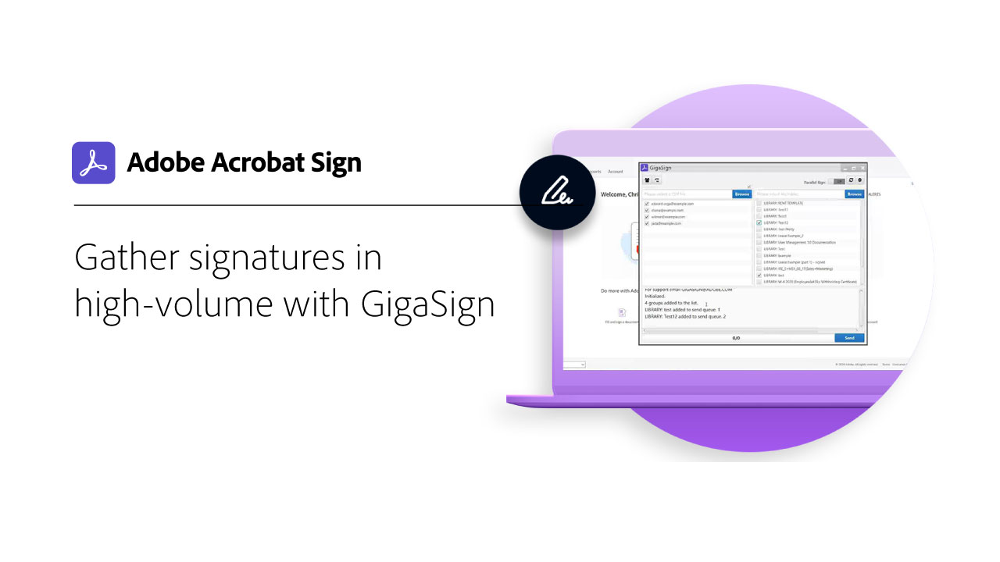
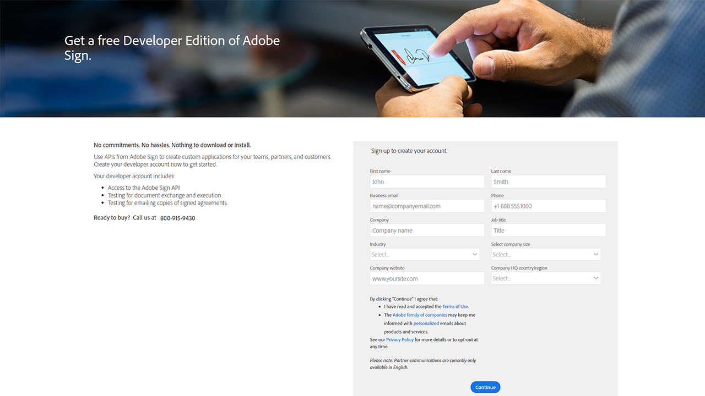

# Develop overview

40% of agreements in Acrobat Sign are created using APIs. Use APIs to create custom applications for your teams, partners and customers.

<table style="table-layout:fixed">
<tr>
  <td>
    
    

    <a href="https://www.adobe.io/apis/documentcloud/sign.html" target="_blank"><strong>Create a developer account</strong></a>
    

    <em>Learn how to get started with a developer account</em>
     
  </td>
  <td>
    
    

    <a href="https://www.adobe.io/apis/documentcloud/sign/docs.html" target="_blank"><strong>Learn what you can do</strong></a>
    

    <em>Learn how you can incorporate the functionality of Acrobat Sign into any external application</em>
     
  </td>  
  <td>
    
    

    <a href="gigasign.md"><strong>Gather high-volume documents using GigaSign</strong></a>
    

    <em>Send, collect, and track documents for signature to thousands of people at the same time</em>
     
  </td>
   <td>
    
    

    <a href="embeddedesignature.md"><strong>Create embedded e-signature and document experiences</strong></a>
    

    <em>Learn how to use Acrobat Sign APIs to embed e-signature and document experiences into your web platforms and content and document management systems</em>
     
  </td>
</tr>
</table>
