# Create embedded e-signature and document experiences

Learn how to use Acrobat Sign APIs to embed e-signature and document experiences into your web platforms and content and document management systems. There are four parts to this hands-on tutorial.

## Part 1: What you need

In part 1, learn how to get started with everything you need for parts 2–4. Let's begin with getting API credentials.

+++View details on how to get API credentials

* [Acrobat Sign Developer Account](https://acrobat.adobe.com/us/en/sign/developer-form.html)
* [Starter Code](https://github.com/benvanderberg/adobe-sign-api-tutorial)
* [VS Code (or editor of your choice)](https://code.visualstudio.com)
* Python 3.x 
  * Mac — Homebrew
  * Linux — Built-in Installer
  * Windows — Chocolatey
  * All — https://www.python.org/downloads/

+++

## Part 2: Low/No Code — the power of web forms

In part 2, explore the low/no-code option of using web forms. It's always a good idea to see if you can avoid writing code at first.

+++View details on how to create a web form

1. Access Acrobat Sign with your developer account.

1. Select **Publish a web form** on the home page.

   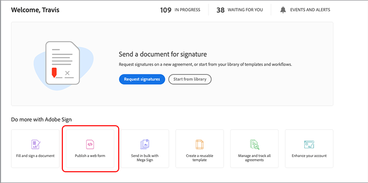

1. Create your agreement.

   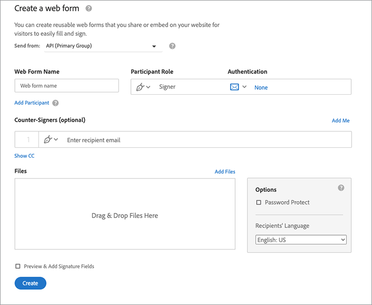

1. Embed your agreement on a flat HTML page.

1. Experiment with dynamically adding query parameters.

   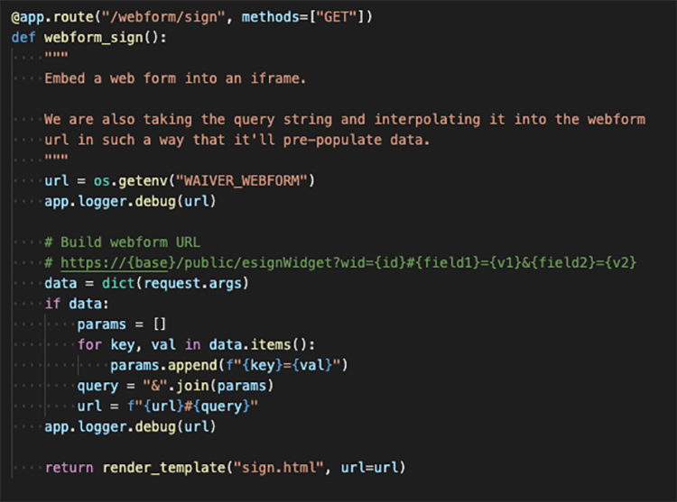

+++

## Part 3: Send agreement with a form and merge data

In part 3, dynamically create agreements.

+++View details on how to dynamically create agreements

First, you need to establish access. With Acrobat Sign, there are two ways to connect via API. OAuth Tokens & Integration Keys. Unless you have a very specific reason to use OAuth with your application, you should explore Integration Keys first.

1. Select **Integration Key** on the **API Information** menu under the **Account** tab in Acrobat Sign.

   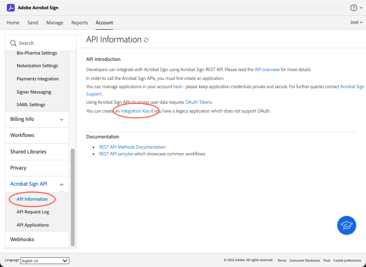

Now that you have access and can interact with the API, see what you can do with the API.

1. Navigate to the [Acrobat Sign REST API Version 6 Methods](http://adobesign.com/public/docs/restapi/v6).

   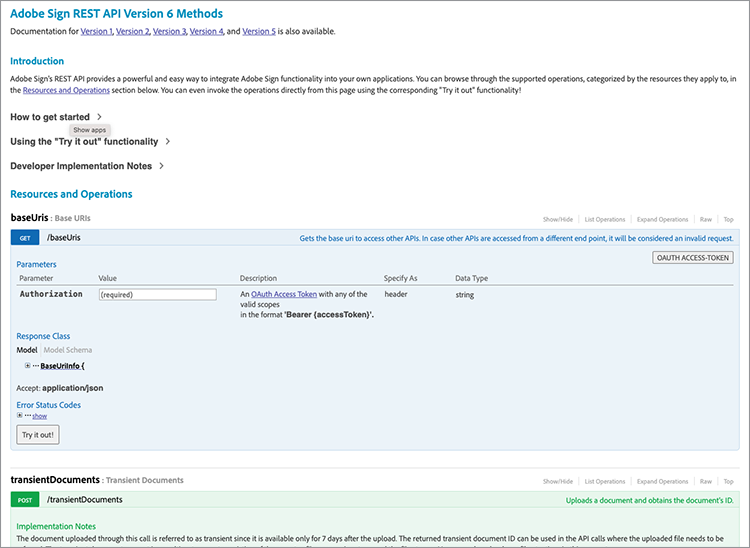

1. Use the token as a "bearer" value.

   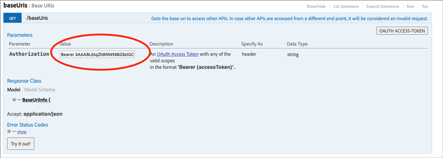

To send your first agreement it's best to understand how to use the API. 

1. Create a Transient Doc and send it. 

  >[!NOTE]
  >
  >JSON-based request calls have a "Model" and "Minimal Model Schema" option. This gives specs and a minimum payload set. 

  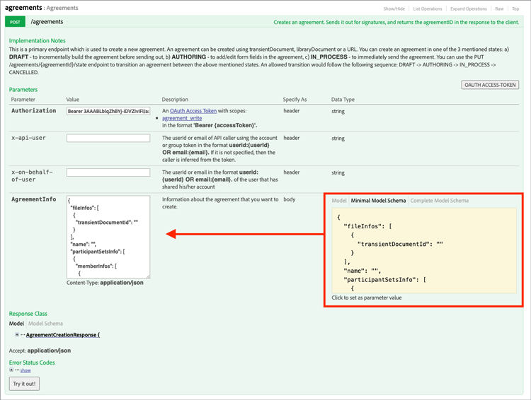

After sending an agreement for the first time, you're ready to add the logic. It's always a good idea to establish some helpers to minimize repetition. Here are some examples:

**Validation**

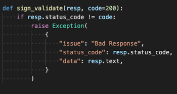

**Headers/Auth**
  
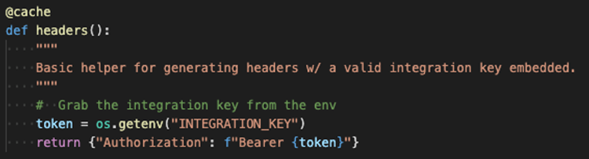

**Base URI**

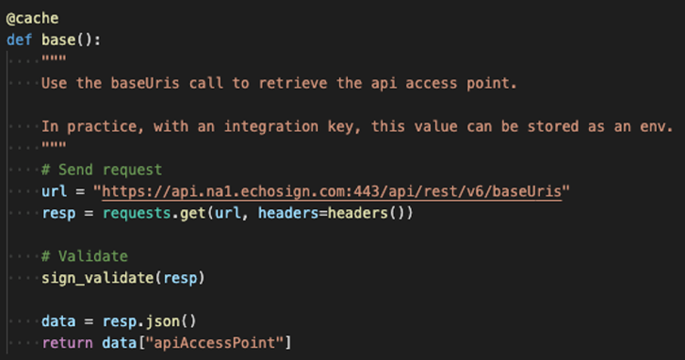

Be aware of where Transient docs land within the grand scheme of the Sign ecosystem.
Transient -> Agreement
Transient -> Template -> Agreement
Transient -> Widget -> Agreement

This example uses a template as our document source. This is usually the best route, unless you have a solid reason to dynamically generate documents for signature (e.g., legacy code or document generation).

The code is fairly straightforward; it uses a library document (template) for the document source. The first and second signers are dynamically assigned. The `IN_PROCESS` state means that the document is being sent immediately. Also, `mergeFieldInfo` is leveraged to dynamically fill fields.

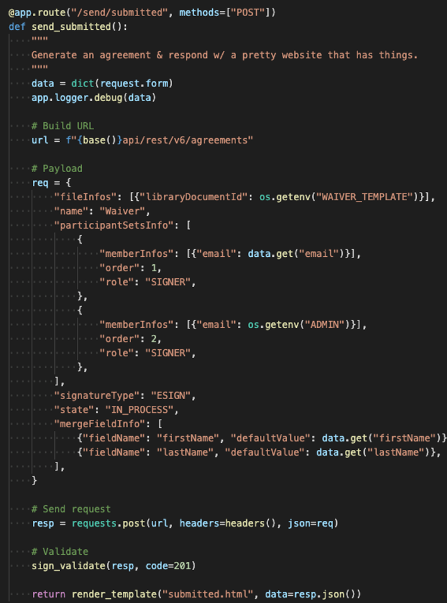

+++

## Part 4: Embed signing experience, redirects, and more

In many scenarios, you may want to allow the triggering participant to immediately sign an agreement. This is useful for customer-facing applications and kiosks.

+++View details on how to embed the signing experience

If you don't want the first sending email to trigger, an easy way is to manage the behavior is with a modification to the API call.

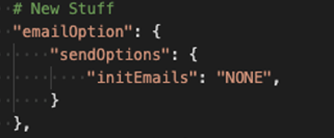

Here's how to control the post-signing redirect:

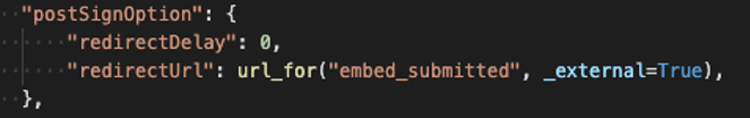

After updating the agreement creation process, the final step is generating the signing URL. This call is also pretty straightforward and generates a URL that a signer may use to access their part of the signing process.

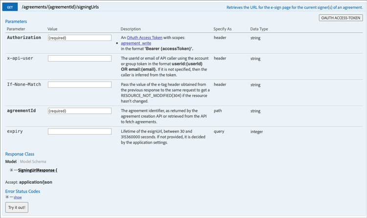

>[!NOTE]
>
>Note that the agreement creation call is technically asynchronous. This means a 'POST' agreement call can be made, but the agreement isn't ready yet. The best practice is to establish a retry loop. Use a retry or whatever is the best practice for your environment.

When everything is put together, the solution is pretty straightforward. You're making an agreement and then generating a signing URL for the signer to click on and begin the signing ritual.

+++

## Additional topics

* [JS Events](https://www.adobe.io/apis/documentcloud/sign/docs.html#!adobedocs/adobe-sign/master/events.md)
* Webhook Events
  * [REST API](https://sign-acs.na1.echosign.com/public/docs/restapi/v6#!/webhooks/createWebhook)
  * [Webhooks in Acrobat Sign v6](https://www.adobe.io/apis/documentcloud/sign/docs.html#!adobedocs/adobe-sign/master/webhooks.md)
* [Reactivate Request Emails (with events)](https://sign-acs.na1.echosign.com/public/docs/restapi/v6#!/agreements/updateAgreement)
* [Replace Timeout with a Retry](https://stackoverflow.com/questions/23267409/how-to-implement-retry-mechanism-into-python-requests-library)
* Custom Reminders
  * With the initial creation

    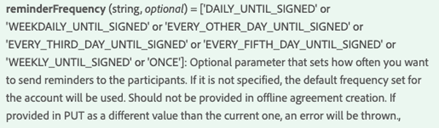

  * Or add one [in-flight](https://sign-acs.na1.echosign.com/public/docs/restapi/v6#!/agreements/createReminderOnParticipant)
