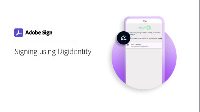

# Get a digital ID from [!DNL Digidentity]

Learn how to obtain a digital signing certificate from [!DNL Digidentity]. Once registered and your identity is verified, [!DNL Digidentity] issues you with a digital ID that is used to apply an Acrobat Sign cloud signature.

>[!VIDEO](https://video.tv.adobe.com/v/337067?hidetitle=true)

 &nbsp;

**Select the image below to learn how to use your [!DNL Digidentity] digital ID in Acrobat Sign.**

