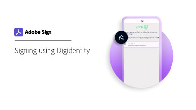

# Get a digital ID from Digidentity

Learn how to obtain a digital signing certificate from Digidentity. Once registered and your identity is verified, Digidentity issues you with a digital ID that is used to apply an Adobe Sign cloud signature.

>[!VIDEO](https://video.tv.adobe.com/v/337067?hidetitle=true)

Select the image below to learn how to use your Digidentity digital ID in Adobe Sign.

