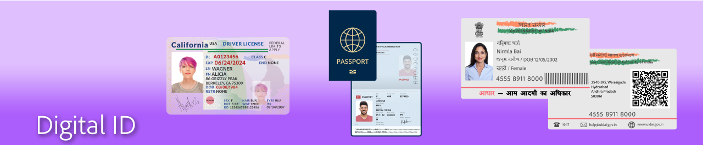
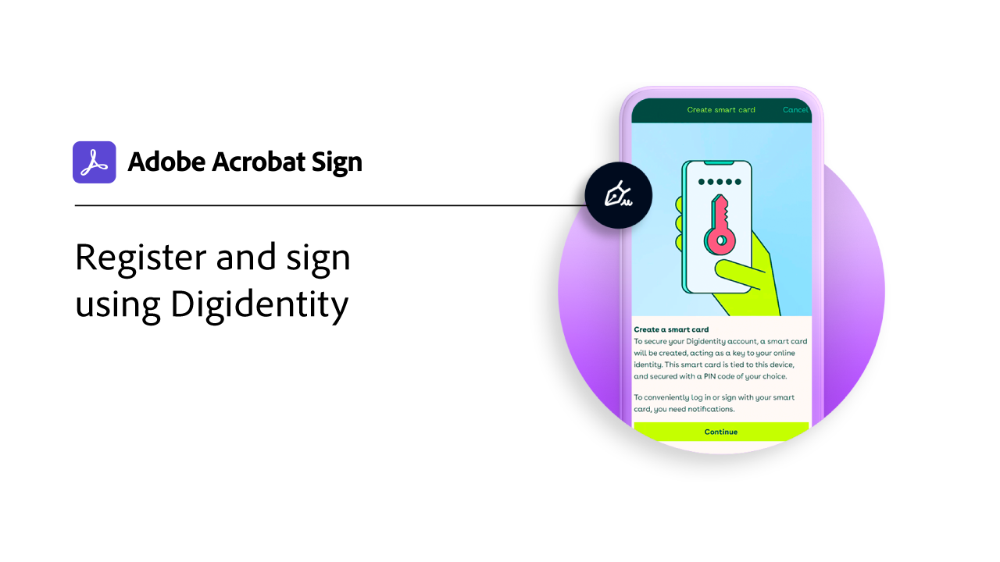
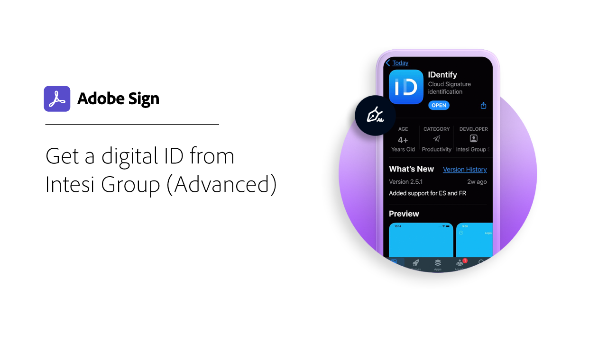
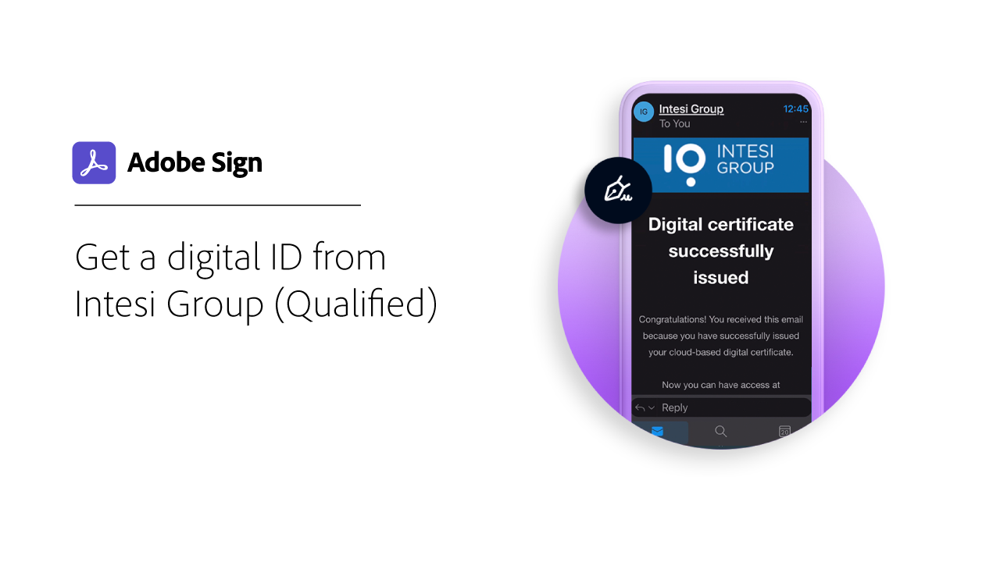
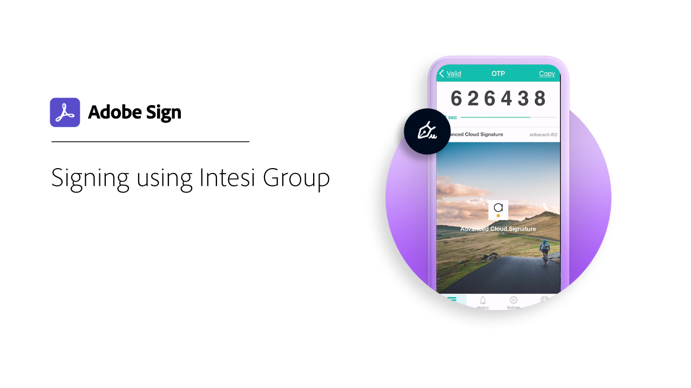

# Digital ID overview

Similar to a passport in electronic form, a digital identity (digital ID) allows you to securely prove that you are who you say you are. And, when e-signing in Adobe Sign, using a digital ID provides a higher level of assurance that you authorized your e-signature on that specific document. The following tutorials show you how to use digital IDs from around the world with Adobe Sign.

>[!NOTE]
>
>Before you can use a digital ID with a cloud signature, please check with your organization’s administrator to confirm that the provider’s solution is enabled in Adobe Sign.

## Digidentity

<table style="table-layout:fixed">
<tr>
 <td>
    
    

    <a href="digidentity-reg.md"><strong>Get a digital ID from Digidentity</strong></a>
    

     
    <em>Learn how to obtain a digital signing certificate from Digidentity</em>
  </td>
  <td>
    
    

    <a href="digidentity-sign.md"><strong>Signing using Digidentity</strong></a>
    

     
    <em>Learn how to use your Digidentity digital ID with Adobe Sign</em>
  </td>
  <td>
    
    

     
  </td>
</tr>
</table>

## Intesi Group

<table style="table-layout:fixed">
<tr>
  <td>
    
    

    <a href="digitalid-advanced.md"><strong>Get a digital ID from Intesi Group (Advanced)</strong></a>
    

     
    <em>Learn how to obtain an Advanced digital signing certificate from Intesi Group</em>
  </td>
  <td>
    
    

    <a href="intesi-qualified.md"><strong>Get a digital ID from Intesi Group (Qualified)</strong></a>
    

     
    <em>Learn how to obtain a Qualified digital signing certificate from Intesi Group</em>
  </td>
  <td>
    
    

    <a href="intesi-signing.md"><strong>Signing using Intesi Group</strong></a>
    

     
    <em>Learn how to use your Intesi Group digital ID</em>
  </td>
</tr>
</table>
