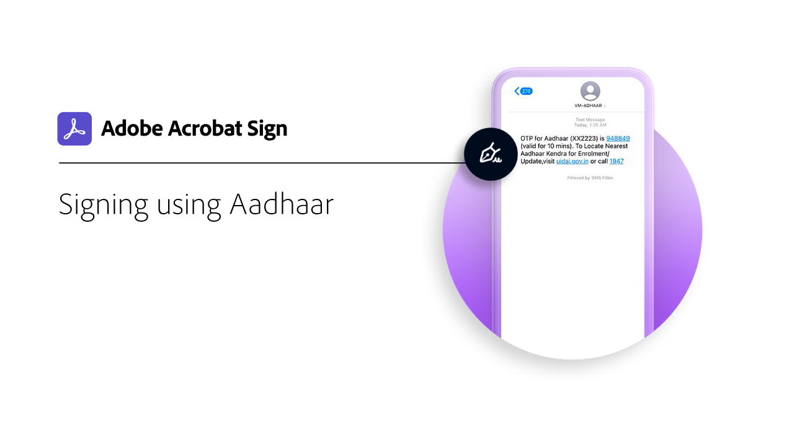
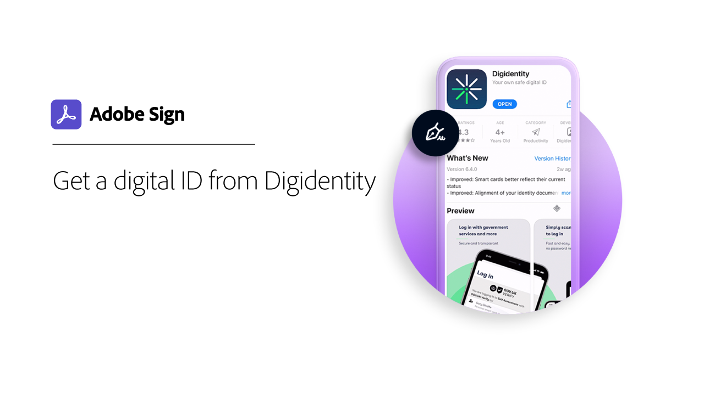
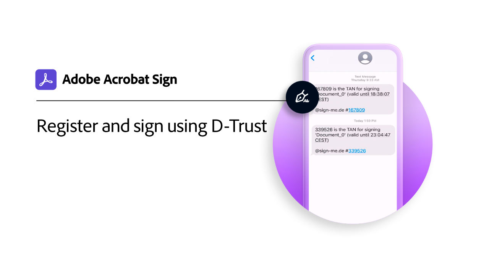

# Digital ID overview

Similar to a passport in electronic form, a digital identity (digital ID) allows you to securely prove that you are who you say you are. And, when e-signing in Acrobat Sign, using a digital ID provides a higher level of assurance that you authorized your e-signature on that specific document. The following tutorials show you how to use digital IDs from around the world with Acrobat Sign.

>[!NOTE]
>
>Before you can use a digital ID with a cloud signature, please check with your organization's administrator to confirm that the provider's solution is enabled in Acrobat Sign.

## What's new

* [Register and sign using D-Trust](d-trust.md)
  Learn how to register your identity with [!DNL D-Trust], and then use the [!DNL D-Trust] digital signature on a document in Acrobat Sign

## [!DNL Aadhaar]

<table style="table-layout:fixed">
<tr>
 <td>
    
    

    <a href="aadhaar-sign.md"><strong>Signing using [!DNL Aadhaar]</strong></a>
    

    <em>Learn how to use your [!DNL Aadhaar] digital ID with Acrobat Sign</em>
     
  </td>
  <td>
    
    

     
  </td>
  <td>
    
    

     
  </td>
</tr>
</table>

## [!DNL Digidentity]

<table style="table-layout:fixed">
<tr>
 <td>
    
    

    <a href="digidentity-reg.md"><strong>Get a digital ID from [!DNL Digidentity]</strong></a>
    

    <em>Learn how to obtain a digital signing certificate from [!DNL Digidentity]</em>
     
  </td>
  <td>
    
    

    <a href="digidentity-sign.md"><strong>Signing using [!DNL Digidentity]</strong></a>
    

    <em>Learn how to use your [!DNL Digidentity] digital ID with Acrobat Sign</em>
     
  </td>
  <td>
    
    

     
  </td>
</tr>
</table>

## [!DNL D-Trust]

<table style="table-layout:fixed">
<tr>
  <td>
    
    

    <a href="d-trust.md"><strong>Register and sign using D-Trust</strong></a>
    

    <em>Learn how to register your identity with [!DNL D-Trust], and then use the [!DNL D-Trust] digital signature on a document in Acrobat Sign</em>
     
  </td>
  <td>
    
    

     
  </td>
  <td>
    
    

     
  </td>
  </tr>
  </table>

## [!DNL Intesi Group]

<table style="table-layout:fixed">
<tr>
  <td>
    
    

    <a href="intesi-advanced.md"><strong>Get a digital ID from [!DNL Intesi Group] (Advanced)</strong></a>
    

    <em>Learn how to obtain an Advanced digital signing certificate from [!DNL Intesi Group]</em>
     
  </td>
  <td>
    
    

    <a href="intesi-qualified.md"><strong>Get a digital ID from [!DNL Intesi Group] (Qualified)</strong></a>
    

    <em>Learn how to obtain a Qualified digital signing certificate from [!DNL Intesi Group]</em>
     
  </td>
  <td>
    
    

    <a href="intesi-sign.md"><strong>Signing using [!DNL Intesi Group]</strong></a>
    

    <em>Learn how to use your [!DNL Intesi Group] digital ID with Acrobat Sign</em>
     
  </td>
</tr>
</table>
