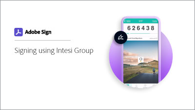

# Get a digital ID from Intesi Group (Qualified)

Learn how to obtain a qualified digital signing certificate from Intesi Group. Once registered and your identity is verified, Intesi Group issues you with a digital ID that is used to apply an Adobe Sign cloud signature.

>[!VIDEO](https://video.tv.adobe.com/v/337064?hidetitle=true)

 &nbsp;

**Select the image below to learn how to use your Qualified Intesi Group digital ID in Adobe Sign.**

