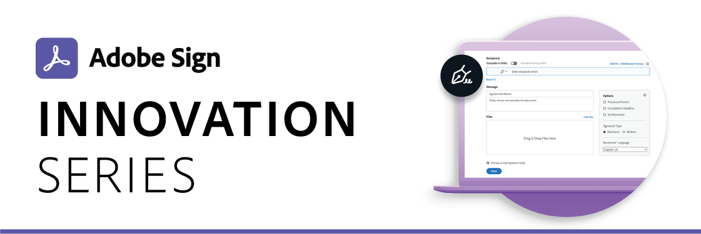

# Adobe Sign Innovation Series

 

The Adobe Sign Innovation Series are 30-minute sessions packed with content that you want to know about. This monthly webinar series was designed exclusively for our customers and will discuss new releases, integrations, and review features you already have access to. Each month a new topic will be highlighted.

## Domain Name Change

[Register for session](https://event.on24.com/wcc/r/2706474/A969A2147FBE327B6905D19ED66B007A?partnerref=EXL)

Date: 2020-11-05

Focus: Adobe is transitioning its former domain, echosign.com, to Adobe Sign. Before you switch domains, further actions may be required if your organization uses specific features or configurations. Join us for the Innovation Series webinar to learn more about the domain name change and what actions you need to take to make the switch.

## Create Reusable Templates

[Watch Session](https://event.on24.com/wcc/r/2610633/A35E5A376EA0FBCF5BCAF2EAA72EBA89?partnerref=EXL)

Date: 2020-10

Focus: Learn just how easy it is to create reusable templates for the documents you use most. You’ll learn how to save time and effort while reducing errors across the whole team.

## Adobe Sign 11.3 Release Details

[Watch Session](https://acrobat.adobe.com/us/en/business/webinars/adobe-sign-11-3-release-details.html)

Date: 2020-09-10

Focus: Learn what's new in the Adobe Sign 11.3 release.

## Power up business workflows with Adobe Sign and Microsoft Power Apps

[Watch Session](https://event.on24.com/wcc/r/2441915/BF8E21409D15697E7531DAA0308EC4480

Date: 2020-08-06

Focus: The Power Apps integration with Adobe Sign and Microsoft Power Automate enables you to quickly preset hundreds of business processes without any coding and deliver solutions faster via your custom web and mobile apps using the Adobe Sign Power Automate connector.

## Adobe Sign 11.2 Release Details

[Watch Session](https://event.on24.com/wcc/r/2354350/C5FBCF28ED017C6E3132DF44228200D7)

Date: 2020-07-09

Focus: Learn what's new in the Adobe Sign 11.2 release.

## Adobe Sign and Microsoft Teams

[Watch Session](https://event.on24.com/wcc/r/2313108/DF86B130461117D133143DA68E62A620)

Date: 2020-06-04

Focus: Quickly and securely sign and send documents, contracts, and digital forms for e-signature and approval directly from a tab in the Microsoft Teams interface.

## Business Workflows in Adobe Sign

[Watch Session](https://event.on24.com/wcc/r/2185760/28424C8300484D0745F7A548487DBA26)

Date: 2020-05-07

Focus: How to map your business use-cases to get the most value from Adobe Sign

## Adobe Sign 11.2 Release Preview

[Watch Session](https://event.on24.com/wcc/r/2185759/61A2053CE0B7DCE0E8E97905806EF5D2)

Date: 2020-04-02

Focus: A sneak peek at what's new in the Adobe Sign 11.2 Release.

## Salesforce Integration

[Watch Session](https://event.on24.com/wcc/r/2185750/8237842CA02E5A9D873B71201073D823)

Date: 2020-03-05

* Review of the new version of the Adobe Sign package for Salesforce
* How to use the workflow designer functionality with Salesforce integrations

## Adobe Sign 11.1 Release

[Watch Session](https://event.on24.com/wcc/r/2143803/C8B93ED05FE7C3A40C0071237D81BD0D)

Date: 2020-02-06

## Workday Integration

[Watch Session](https://event.on24.com/wcc/r/2139357/95509F8510797F5F040478581E641BA2)

Date: 2020-01-09

## Legal and Compliance Update 2019

[Watch Session](https://event.on24.com/wcc/r/2130120/AF79ECB05BBD52BCE047639E164E29AC)

Date: 2019-12-05

## Microsoft Integrations

[Watch Session](https://event.on24.com/wcc/r/2106668/C709085AFD1B9352DF93445F0FB5D3A6)

Date: 2019-11-01

## 11.0 Deep Dive

[Watch Session](https://event.on24.com/wcc/r/2083380/037722BC1F5C05B93106C1C1371D1EB3)

Date: 2019-10-01

Focus: Leverage the latest updates to streamline your digital signature experience.

## Special Topics

[Watch Session](https://esign.adobeconnect.com/pv4drcf61p8d/)

Date: 2019-09-01

