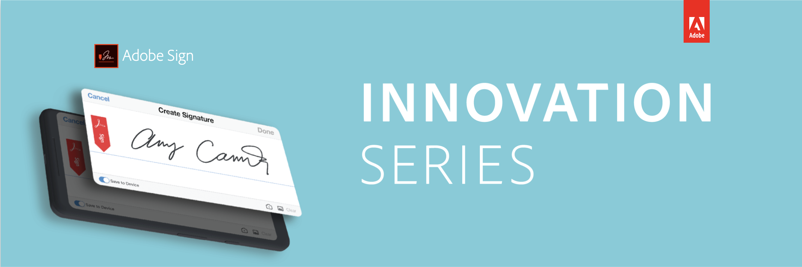

# Adobe Sign Innovation Series

 

The Adobe Sign Innovation Series are 30-minute sessions packed with content that you want to know about. This monthly webinar series was designed exclusively for our customers and will discuss new releases, integrations, and review features you already have access to. Each month a new topic will be highlighted.

## Special Topics

[Watch Session](https://esign.adobeconnect.com/pv4drcf61p8d/)

Date: 2019-09-01

## 11.0 Deep Dive

[Watch Session](https://event.on24.com/wcc/r/2083380/037722BC1F5C05B93106C1C1371D1EB3)

Date: 2019-10-01

Focus: Leverage the latest updates to streamline your digital signature experience.

## Microsoft Integrations

[Watch Session](https://event.on24.com/wcc/r/2106668/C709085AFD1B9352DF93445F0FB5D3A6)

Date: 2019-11-01

## Legal and Compliance Update 2019

[Watch Session](https://event.on24.com/wcc/r/2130120/AF79ECB05BBD52BCE047639E164E29AC)

Date: 2019-12-05

## Workday Integration

[Watch Session](https://event.on24.com/wcc/r/2139357/95509F8510797F5F040478581E641BA2)

Date: 2020-01-09

## 11.1 release

[Watch Session](https://esign.adobe.com/2020-Webinar-InnovationSeries-February.html)

Date: 2020-02-06

## Salesforce Integration

[Watch Session](https://esign.adobe.com/2020-Webinar-InnovationSeries-March.html)

Date: 2020-03-05

* Review of the new version of the Adobe Sign package for Salesforce
* How to use the workflow designer functionality with Salesforce integrations

## Business Workflows in Adobe Sign

[Watch Session](https://esign.adobe.com/2020-Webinar-InnovationSeries-May.html)

Date: 2020-05-07

Focus: How to map your business use-cases to get the most value from Adobe Sign

