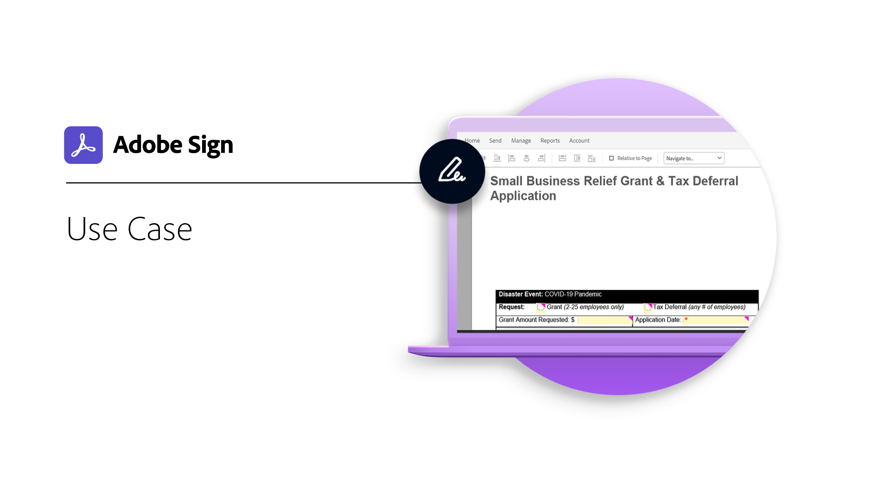

# Expand and inspire

See how you can transform customer and employee e-signing experiences by exploring use cases and inspirational ideas.

<table>
<tr>
  <td>
    
    

    <a href="use-case.md"><strong>Use case</strong></a>
     
  </td>
  <td>
    
    

    <a href="innovation-series.md"><strong>Innovation Series</strong></a>
     
  <td>
    
    

     
  </td>
</tr>
</table>
