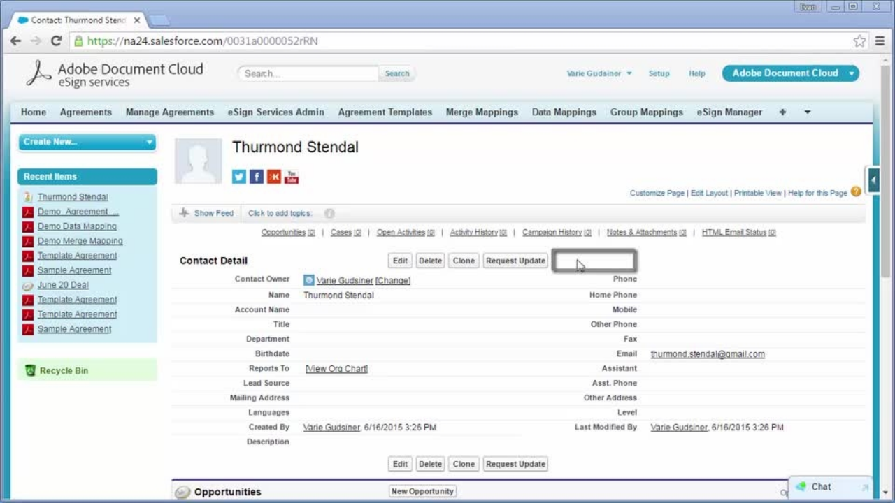

# Integrate overview

We partner with other companies, so you can use Adobe Sign with other applications your organization already uses, such as Microsoft, Salesforce, and Workday to name a few. Check out how you can simplify your e-signature workflows through the processes in these integration tutorials. 

>[!NOTE]
> If you're having trouble accessing any of these features, check with your organization's administrator to ensure the integration is enabled.

## Microsoft integrations tutorials

<table>
<tr>
  <td>
    
    

    <a href="fill-and-sign-doc-microsoft-outlook.md"><strong>Filling and Signing in Microsoft Outlook</strong></a>
    

     
  </td>
  <td>
    
    

    <a href="send-for-signature-with-outlook.md"><strong>Sending in Outlook</strong></a>
    

     
  </td>
  <td>
    
    

    <a href="send-for-signature-with-sharepoint-online.md"><strong>Sending in SharePoint Online</strong></a>
    

     
  </td>
</tr>
<tr>
  <td>
    
    

    <a href="track-an-agreement-with-sharepoint-online.md"><strong>Tracking SharePoint Online</strong></a>
    

     
  </td>
   <td>
    
    

     
  </td>
  <td>
    
    

     
  </td>
</tr>
</table>

## Salesforce integrations tutorials

<table>
<tr>
  <td>
    
    

    <a href="create-an-agreement-template.md"><strong>Creating a Document Template in Adobe Sign for Salesforce</strong></a>
    

     
  </td>
  <td>
    
    

    <a href="set-up-data-mapping.md"><strong>Setting up Data Mapping</strong></a>
    

     
  </td>
  <td>
    
    

    <a href="set-up-merging-map.md"><strong>Setting up Merge Mapping<strong></a>
    

     
  </td>
</tr>
<tr>
  <td>
    
    

    <a href="create-a-custom-button.md"><strong>Creating a Custom Button</strong></a>
    

     
  </td>
  <td>
    
    

     
  </td>
  <td>
    
    

     
  </td>
</tr>
</table>

## Workday

<table>
<tr>
  <td>
    
    

    <a href="workday.md"><strong>Configuring Adobe Sign with Workday</strong></a>
    

     
  </td>
   <td>
    
    

     
  </td>
  <td>
    
    

     
  </td>
</tr>
</table>

## Marketo Configuration Guides

<table>
<tr>
  <td>
    
    

    <a href="marketo-salesforce-reminder.md"><strong>Send reminders using Adobe Sign for Salesforce and Marketo</strong></a>
    

     
  </td>
  <td>
    
    

    <a href="marketo-salesforce-sms.md"><strong>Send notifications using Adobe Sign for Salesforce and Marketo</strong></a>
    

     
  </td>
  <td>
    
    

    <a href="marketo-dynamics-reminder.md"><strong>Send reminders using Adobe Sign for Microsoft Dynamics and Marketo<strong></a>
    

     
  </td>
</tr>
<tr>
  <td>
    
    

    <a href="marketo-dynamics-sms.md"><strong>Send notifications using Adobe Sign for Microsoft Dynamics and Marketo</strong></a>
    

     
  </td>
  <td>
    
    

     
  </td>
  <td>
    
    

     
  </td>
</tr>
</table>