# Document automation with Adobe Sign for Microsoft Power Platform

Learn how to activate and use the Adobe Sign and Adobe PDF Tools connectors for Microsoft Power Apps. Build workflows that automate business approval and signature processes quickly and securely without any code. There are four parts to this hands-on tutorial outlined in the links below:

<table style="table-layout:fixed">
<tr>
  <td>
    <a href="documentautomation.md#part1">
        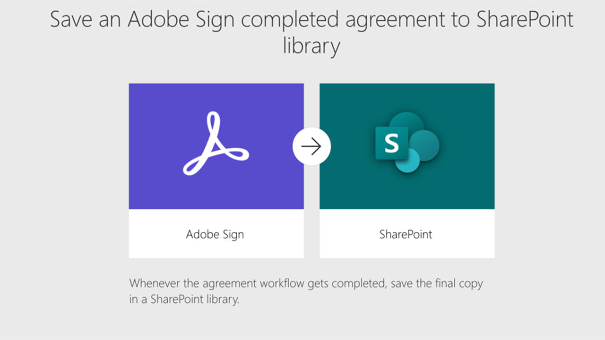
    </a>
    

    <a href="documentautomation.md#part1"><strong>Part 1: Store signed agreement in SharePoint with Adobe Sign</strong></a>
    

  </td>
  <td>
    <a href="documentautomation.md#part2">
        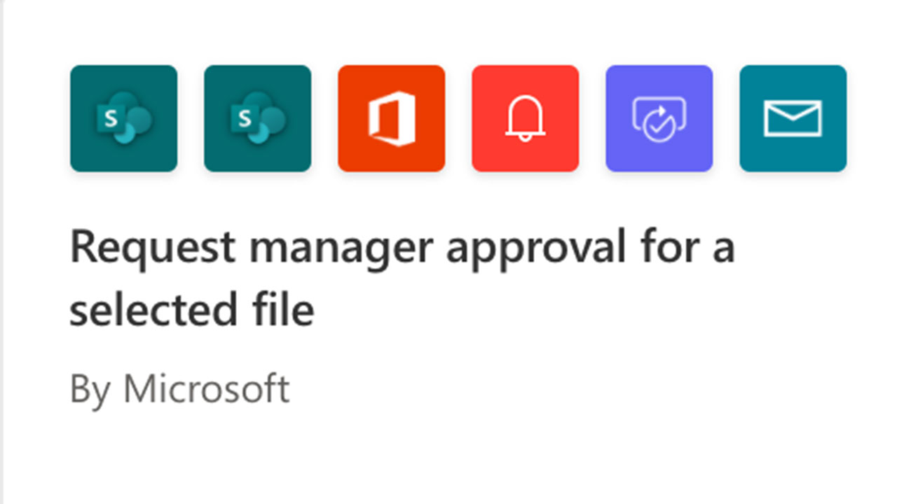
    </a>
    

    <a href="documentautomation.md#part2"><strong>Part 2: Automated approval process to get e-signature with Adobe Sign</strong></a>
    

  </td>
  <td>
   <a href="documentautomation.md#part3">
      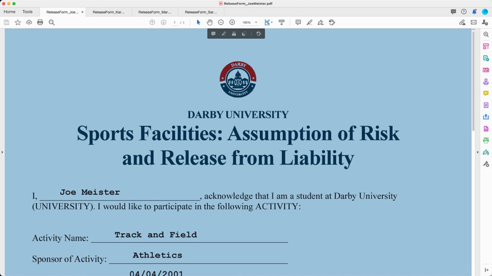
   </a>
    

    <a href="documentautomation.md#part3"><strong>Part 3: Automated document OCR with Adobe PDF Tools</strong></a>
    

  </td>
  <td>
   <a href="documentautomation.md#part4">
      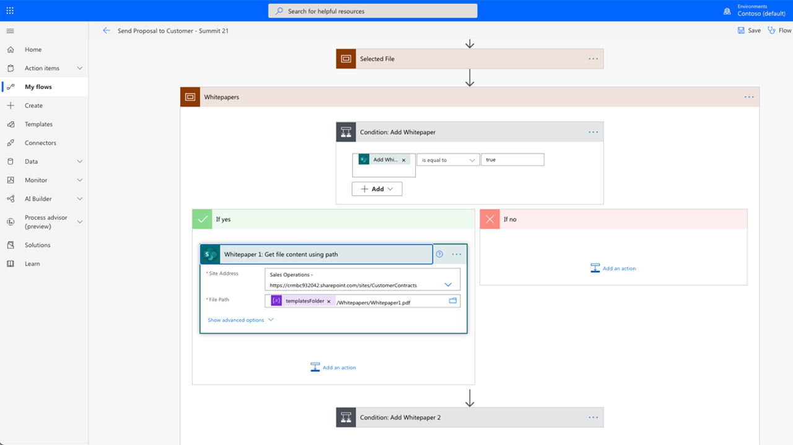
   </a>
    

    <a href="documentautomation.md#part4"><strong>Part 4: Automated document assembly with Adobe PDF Tools</strong></a>
    

  </td>
</tr>
</table>

## Prerequisites

* Microsoft 365 and Power Automate familiarity
* Adobe Sign knowledge
* Microsoft 365 account with access to SharePoint and Power Automate (Basic for Adobe Sign, Premium for Adobe PDF Tools)
* Adobe Sign for enterprise or Adobe Sign developer account

**Exercises 1 and 2**

* Adobe Sign account with access to the API. A developer account or an Enterprise account.
* SharePoint site accessible by Power Automate that you have edit permissions to. Full admin access is recommended.
* Sample document for the Signature approval request and signing.

**Exercises 3 and 4**

Download materials [here](https://github.com/benvanderberg/adobe-sign-pdftools-powerautomate-tutorial)

## Part 1: Store signed agreement in SharePoint with Adobe Sign {#part1}

In part one, you'll use a Power Automate Flow template to set up an automated workflow that will save all signed agreements to your SharePoint Site.

1. Navigate to Power Automate.
1. Search for Adobe Sign.

   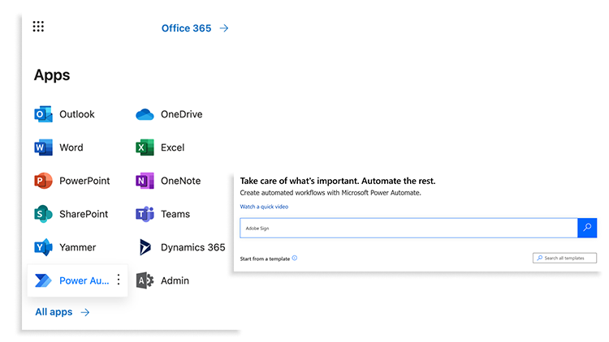
   
1. Choose **Save an Adobe Sign completed agreement to SharePoint library**.

   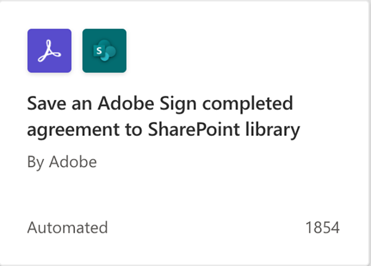

1. Review the screen and configure any needed connections. Enable the Adobe Sign connection.
1. Click the blue `+` symbol.

   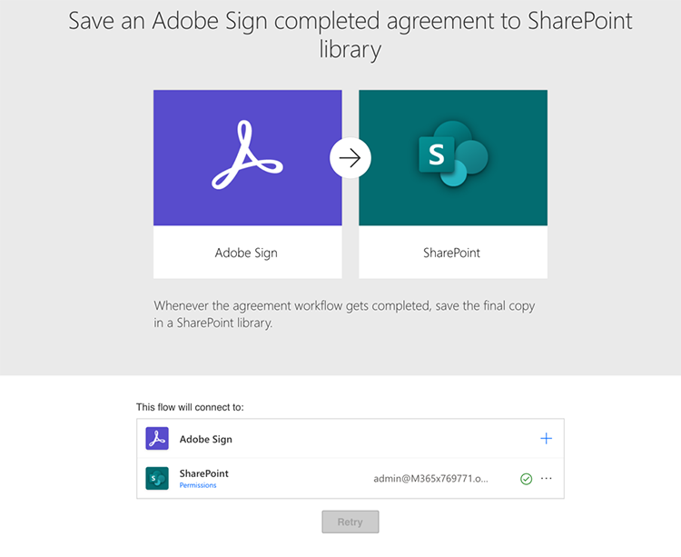

1. Enter your Adobe Sign account email and click the password field in the new window.

   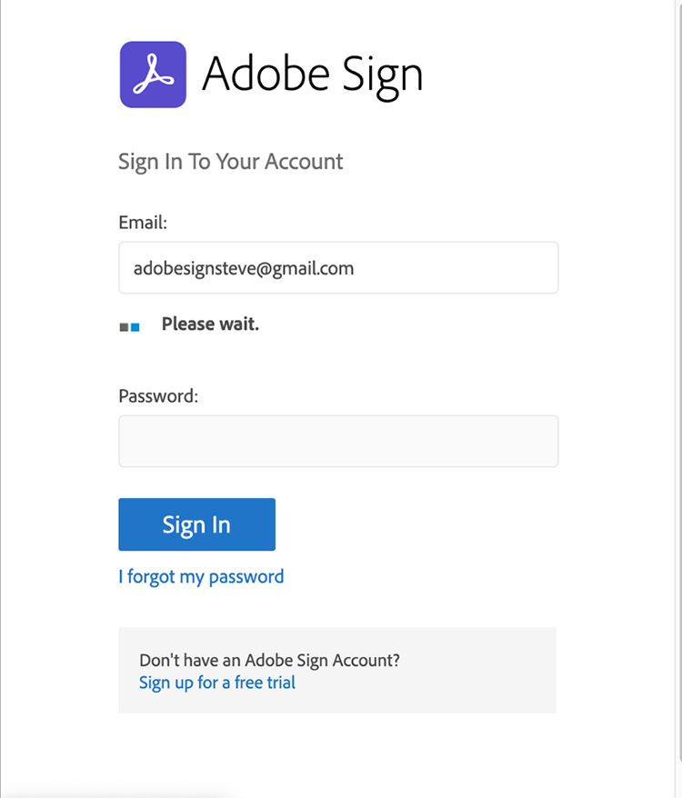

   Wait a moment for Adobe to check your account.

   >[!NOTE]
   >
   >This check will route you to the appropriate login if you are using an Adobe ID or our corporate SSO.

1. Complete login.
1. Click **Continue** to go to the Flow editing screen.
1. Name the trigger.

   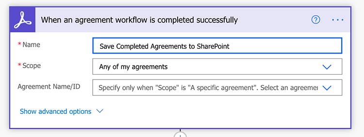

1. Configure your SharePoint settings.

   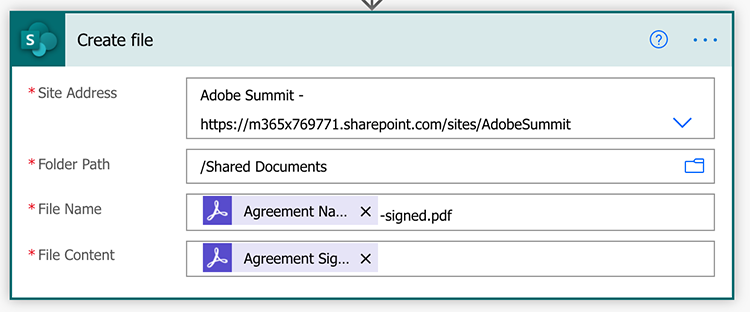

   **Site Address:** Your SharePoint Site
   **Folder Path:** Path to the Shared Documents you want to use
   **File Name:** Accept the default
   **File Content:** Accept the default

1. Save the flow.

   

1. Navigate to the flow overview screen with the blue back arrow. You will test this flow in part 2.

   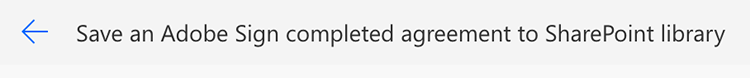

You will test this flow in the next part.

## Part 2: Automated approval process to get e-signature with Adobe Sign {#part2}

In part two, we build off the first part with a more robust Flow and test both Flows to see them in action.

1. Select **Templates** on the left side from the Power Automate interface.

   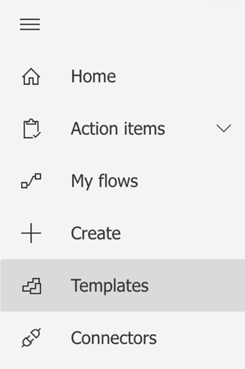

1. Search for “manager approval.”
1. Select **Request manager approval for a selected file**.

   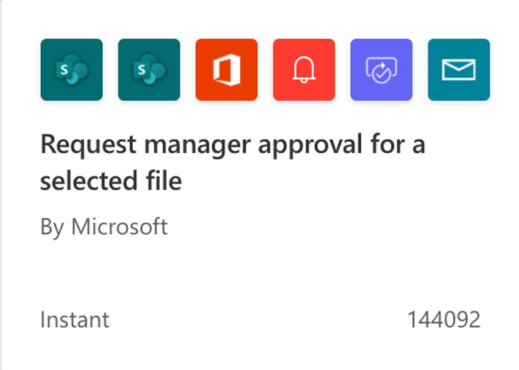

   Review the connections and add any you are missing.

   >[!NOTE]
   >
   >If this is the first flow you are doing with approvals, they will be fully configured when the flow runs.

1. Click **Continue** to go to the flow editing screen.

   This flow has a lot of pre-configured steps including error checking and nested conditional steps.

1. Configure **For a selected file** as follows:
   **Site Address:** Your SharePoint site
   **Library Name:** Your Documents repository
1. Add an input as follows:
   **Type**: Email
   **Name**: Signer Email

   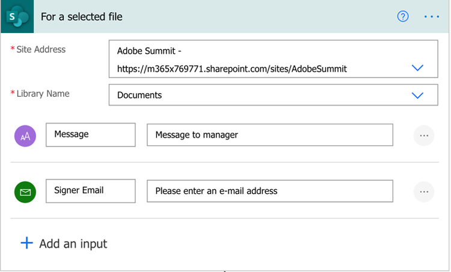

1. Configure **Get File Properties:** as follows:
   **Site Address:** Your SharePoint site
   **Library Name:** Your Documents repository

1. Scroll down and look for **If yes**.

   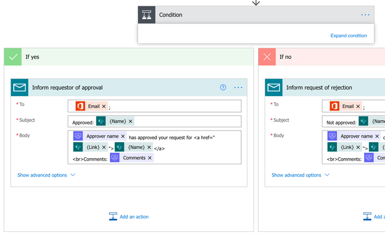

1. Click **Add an action** in the **If yes** box (not the bottom most one) to add the steps to send for signature.

   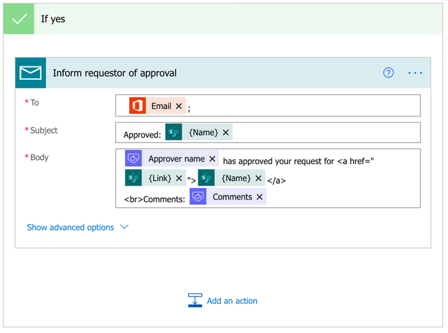

1. Search for **SharePoint get file content** and choose **Get file content**.

   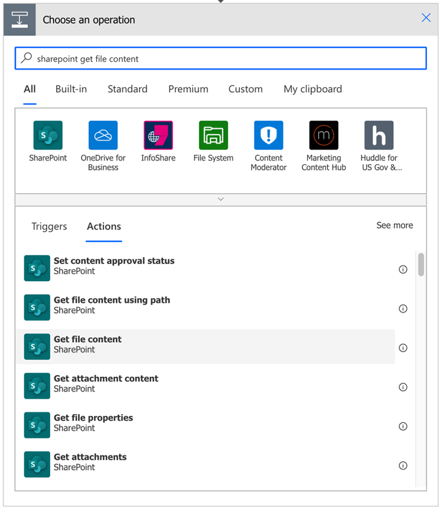

1. Configure the **Get file content** as follows:
   
   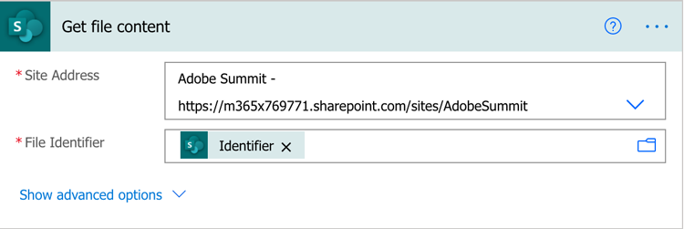

   **Site Address:** Your SharePoint site.
   **File Identifier:** Search for “identifier,” and choose Identifier from the **Get file properties** step.
1. Search for “Adobe” and choose **Adobe Sign** to add another action.

   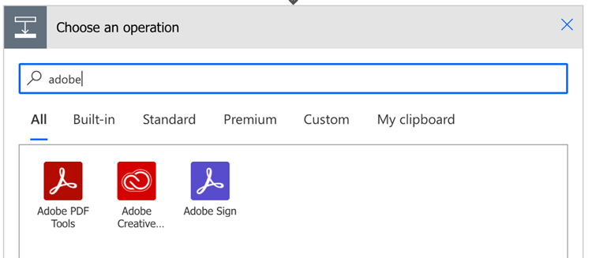

1. Enter “upload” into the search box for Adobe Sign and select **Upload a document and get a document ID**.
1. Search for the dynamic variable **Name** to get the name of the item/document selected in the trigger under **File Name**.
1. Click **Expression** in the variable assistant under **File Content**.

   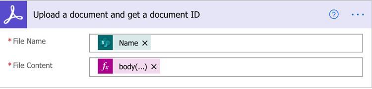

1. Add a single apostrophe, then click back to **Dynamic Content**, delete your apostrophe, select **File Content** and then click **OK**.

   Make sure there are no additional apostrophes and it looks like the sample below.

   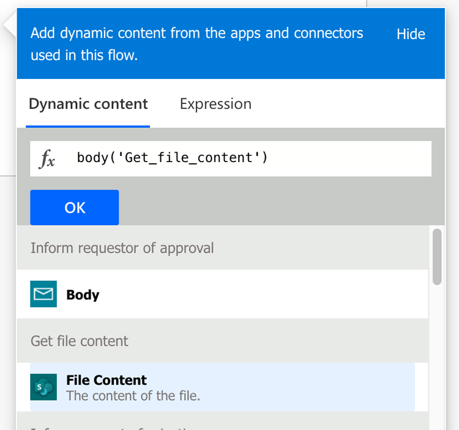

1. Search for “create” in the Adobe Sign search area to add another Adobe Sign action.
1. Select **Create and agreement from an uploaded document and send for signature**.

   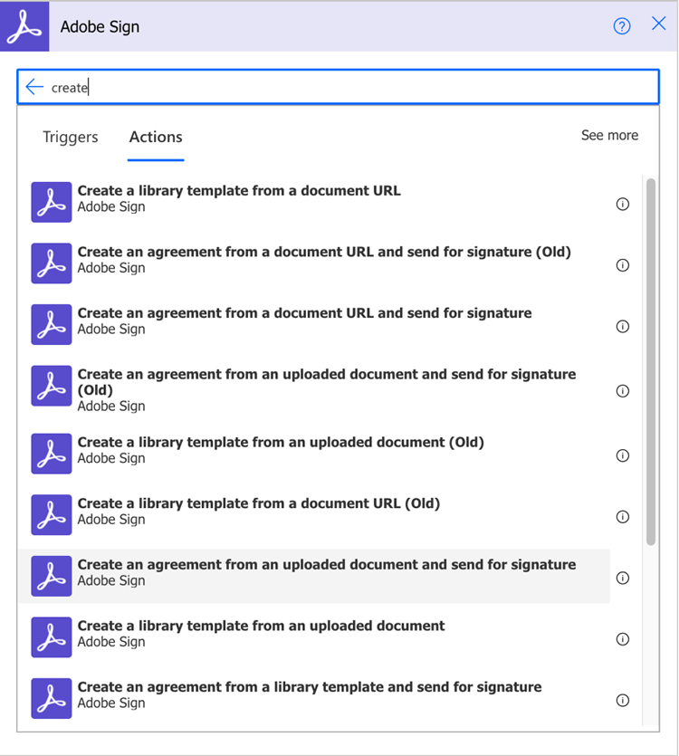

1. Configure the required information:
   Choose **Name** from the dynamic variable assistant in **Agreement Name**. 
   Choose **Document ID** from the dynamic variable assistant in **Document ID**.
   Choose **Signer Email** from the dynamic variable assistant in **Participant Email**.
   Enter “1” in **Participant Order**.
   Choose **Signer** from dropdown in **Participant Role**.

   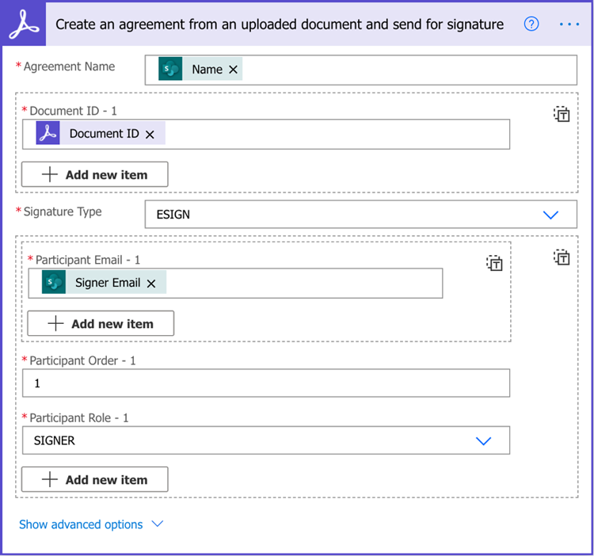

1. **Save** the Flow.

### Test the flow

Go to your SharePoint site’s document repository to test it out.

1. Select the document and choose **Automate** and the **Flow** you just created.

   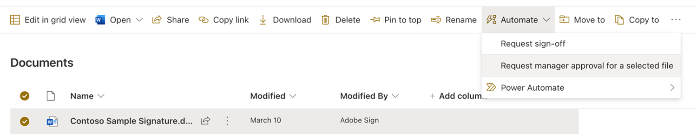

1. Start the flow to validate the connections (first run of flow only).
1. Enter a nice message to the approver in **Message**.
1. Enter email for the document Signer in **Signer Email**.
1. Click **Run flow**.

The configured approver for the user starting the flow will get an approval request. You can approve through email or through the Power Automate Action Items menu. 
Once approved, sign your document. Depending on your user and if they are logged into Sign, you may need to open the signing windows in a private browser window.

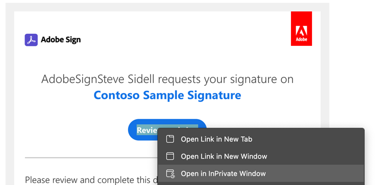

Complete the signing, and then look back in your SharePoint folder.

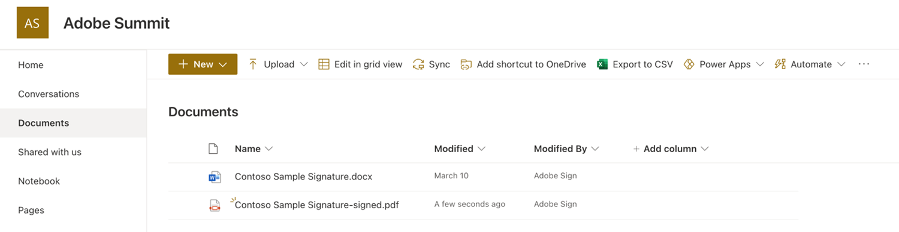

## Part 3: Automated document OCR with Adobe PDF Tools {#part3}

In part three, you'll learn how to automate OCR in PDFs when they are imported into Microsoft SharePoint. This addresses an issue that occurs with scanned PDF documents that are not searchable in SharePoint.

### Setup a folder in SharePoint

Go to Microsoft SharePoint where you would like to store documents.

1. Click **+ New** to create a new folder called “Processed Contracts.”
1. Click **+ New** to create a new folder called “Old Contracts.”

   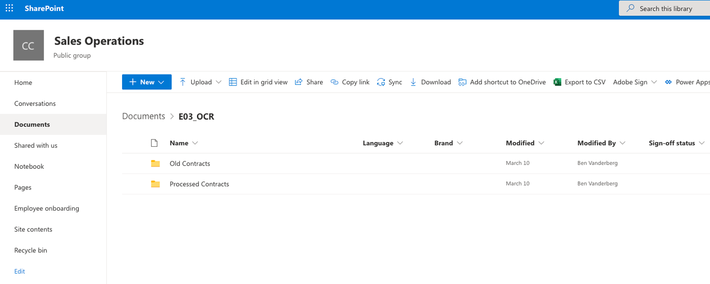

These folders are now referenced as part of your Power Automate flow.

### Create a flow from a template

1. Log in to https://flow.microsoft.com.
1. Click **Templates** in the sidebar.

   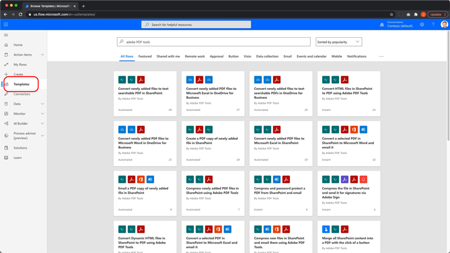

1. Select **Convert newly added files to text searchable PDF in SharePoint**.
1. Click the **+** symbol next to Adobe PDF Tools.

   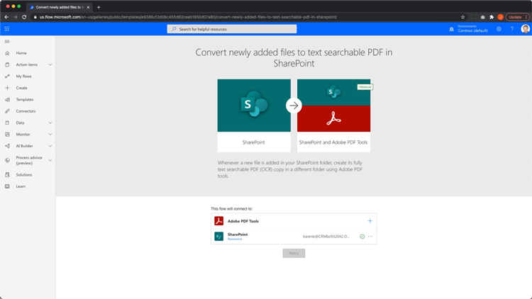

1. Navigate to https://www.adobe.com/go/powerautomate_getstarted in a new tab.
1. Click **Get Started**.

   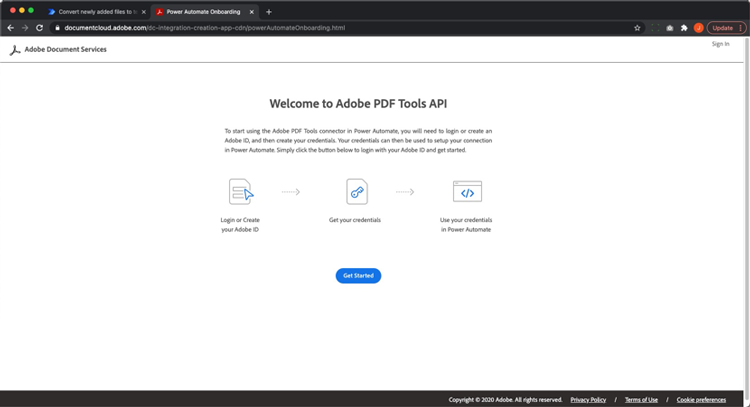

1. Sign in with your Adobe ID.

   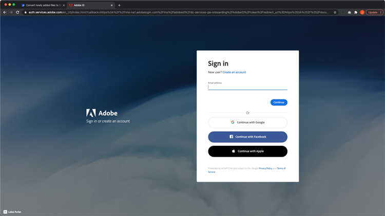

1. Enter Credentials Name and Credentials Description and click **Create Credentials**.

   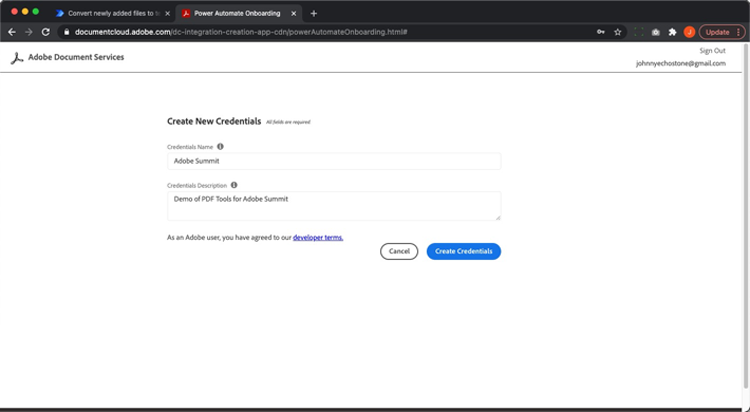

   Keep the window with the credentials open. You will need to enter them into Microsoft Power Automate.

   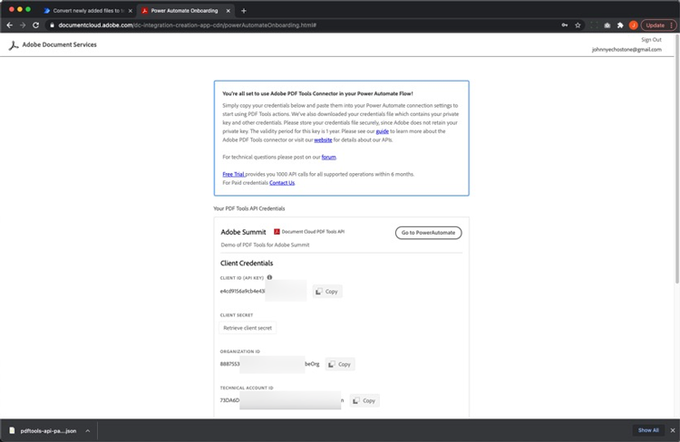

1. Enter the credentials and click **Create in Microsoft Power Automate**.

   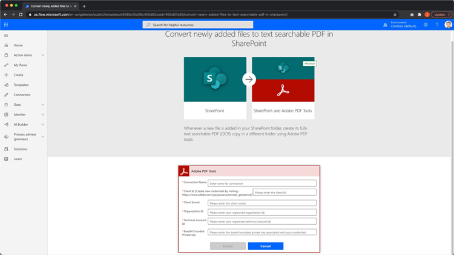

1. Click **Continue**.

   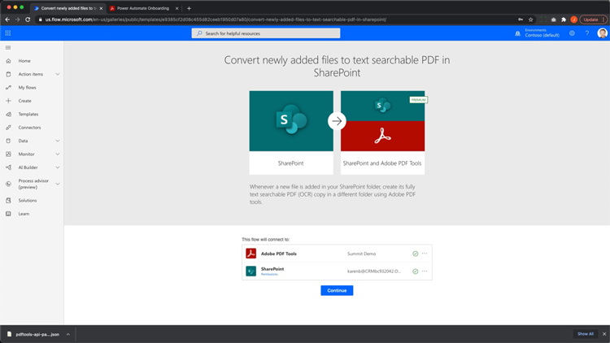

   Now you can see a view of the workflow, and you'll need to configure it for your environment.

1. Select Site Address field and choose which SharePoint site you are using under the trigger called **When a file is created in a folder**.

   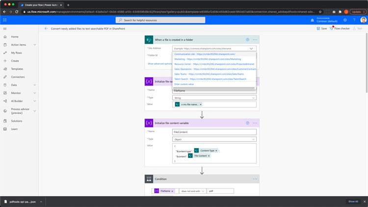

1. Click the folder icon to navigate to the Old Contracts folder located under Folder ID.

   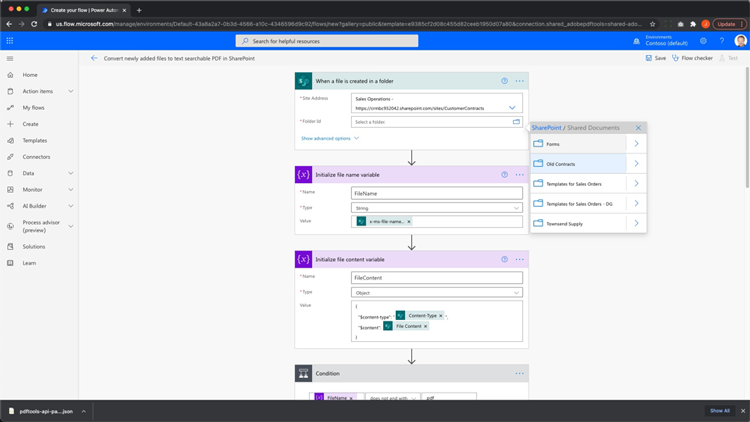

1. Edit the **Create file** action at the bottom of the flow:

   Change **Site Address** to your site address.
   Specify the location of the Processed Contracts folder in the Folder Path.

1. Click **Save** in the top right corner.
1. Click **Test**. 
1. Select **Manually**.
1. Click **Test**.

   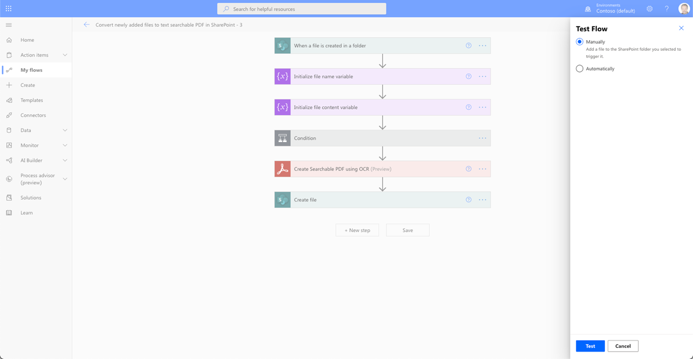

### Try your new flow

1. Navigate to the Old Contracts folder in SharePoint.
1. Navigate into E03/Old Contracts in the exercise files you downloaded.
1. Copy the ReleaseFormXX.pdf files into the Old Contracts folder in SharePoint.

   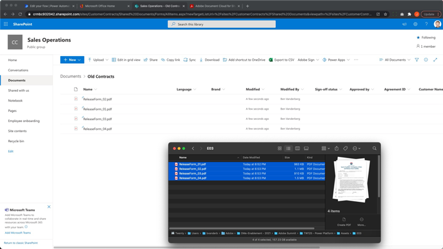

Now if you navigate to the Processed Contracts folder, you can see your PDFs available after the flow is given a few moments to run. If you open the PDFs, you can see that the text is selectable.
In addition, SharePoint indexes the document, allowing you to search the content of your documents from the search bar in SharePoint.

## Part 4: Automated document assembly with Adobe PDF Tools {#part4}

In part four, you'll learn how to merge many documents together based on information provided while selecting and starting a flow from Microsoft SharePoint. In this scenario, the flow will:

* Ask for information to choose what to include in a package for a customer.
* Based on the information provided, it merges many documents together. These documents include a cover page and optional whitepapers.
* The merged document is saved to SharePoint.

### Import exercise files into SharePoint

1. Open the E04 folder in the Exercise files.
1. Import the Proposal, Templates, and Generated Docs folders into SharePoint.

   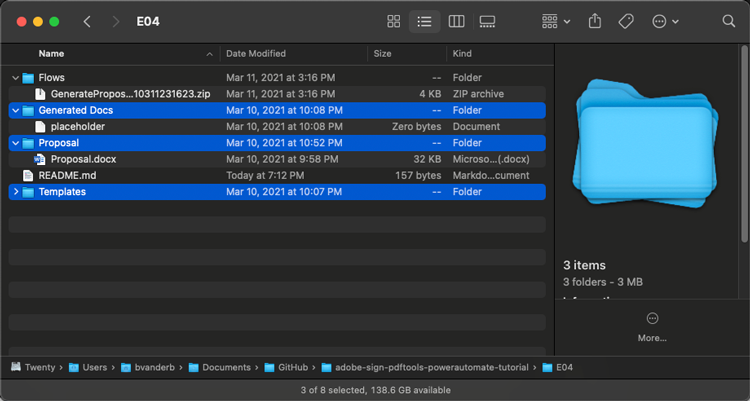

These folders will be used for reference. In particular, you will use the Proposal.docx file for your proposal. 

In the Templates folder, there is a Covers folder that includes cover page designs for different cities. There is also a Whitepapers folder that contains optional additional whitepapers that will be attached to the end if selected.

### Import the flow into Microsoft Power Automate

1. Log in to Microsoft Power Automate (https://flow.microsoft.com).
1. Click **My Flows**.

   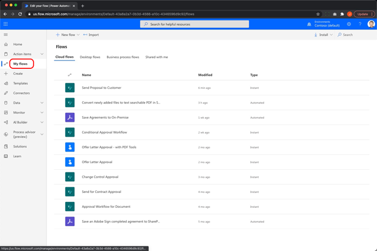

1. Click **Import**.

   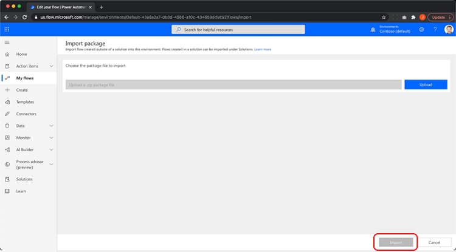

1. Click **Upload** and choose the GenerateProposal_20210311231623.zip folder in E04/Flows/.

   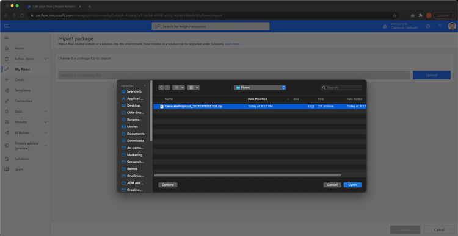

1. Click **Import**.

1. Click the Wrench icon under Action next to **Send Proposal to Customer**.

   

1. Select **Create as new** under Setup.
1. Set the name of the flow under Resource Name.
1. Click **Save**.

   Repeat this for the other Related resources and select your connection.

   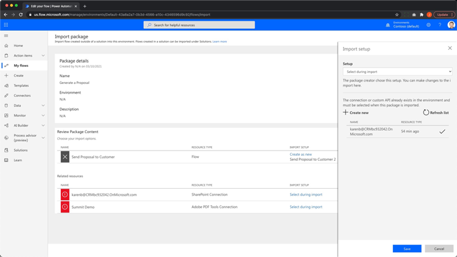

1. Click **Import** after you have made all your connections.

### Set For a selected file

Now that the flow is created, do the following:

1. Click **Edit**.

   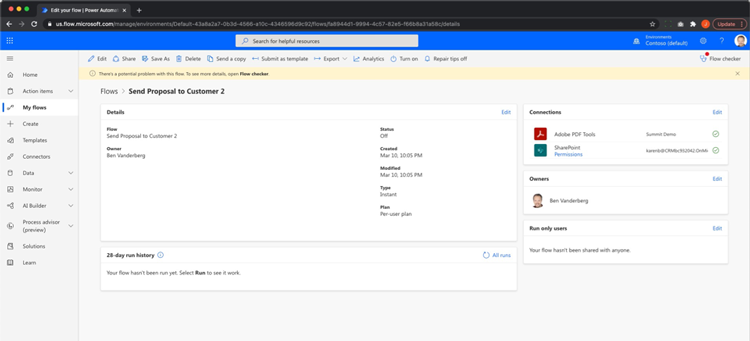

1. Select the trigger **For a selected file**.

   Add your SharePoint site in the Site Address.
   Add your Library in Library.

   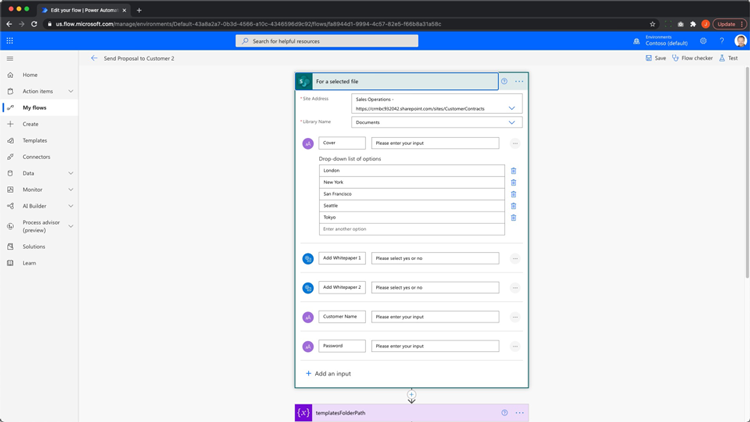

### Set templateFolderPath

1. Click the templateFolderPath variable.
1. Set the path to where the Templates folder is located inside the SharePoint site that you imported.

### Set Cover Get File Content

1. Click **Cover** action, which expands the Scope.
1. Expand **Cover: Get File Content**.

   Set Site Address to your SharePoint site.

   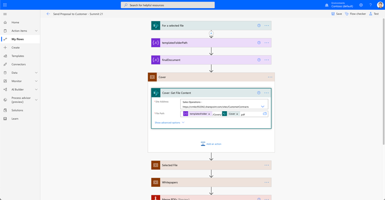

### Set Selected File

1. Expand the **Selected File** scope action.

   Change the Site Address and Library Name to your SharePoint site and Library respectively under **Get file properties**.
   Change the Site Address to your SharePoint site under **Get file content**.

   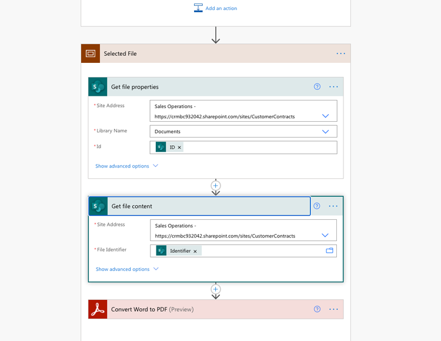

### Set Whitepapers

1. Click **Whitepapers** action.
1. Expand **Condition: Add Whitepaper**.

   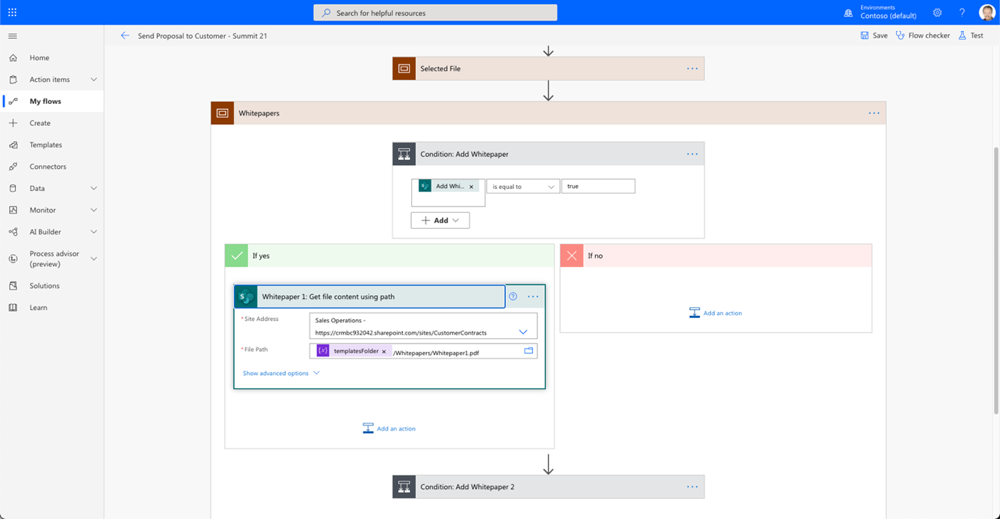

1. Expand **Whitepaper 1: Get file content using path**.
   Edit the Site Address to your specified SharePoint site.

Repeat the same steps for **Condition: Add Whitepaper 2**.

### Set Create File

1. Expand **Create File**.

   Edit Site Address and Folder Path to the SharePoint site and path where the Generated Docs folder is located.

1. Click **Save**.

### Test your flow

1. Navigate to the Proposal folder in SharePoint.
1. Select Proposal.docx folder.

   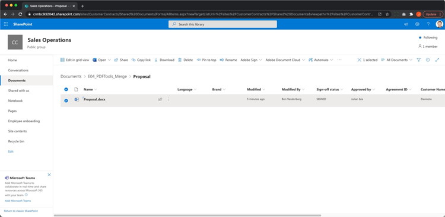

1. Select your flow under the **Automate** menu.

   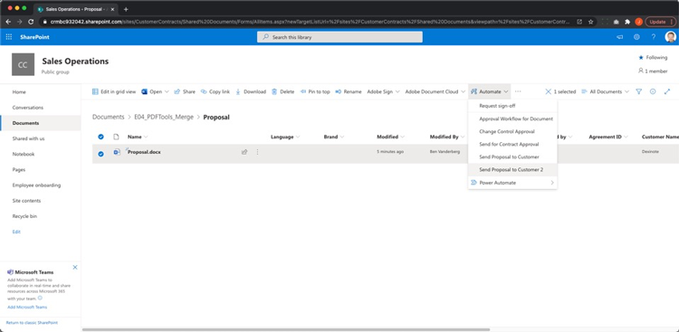

1. Click **Continue** to begin the flow.

   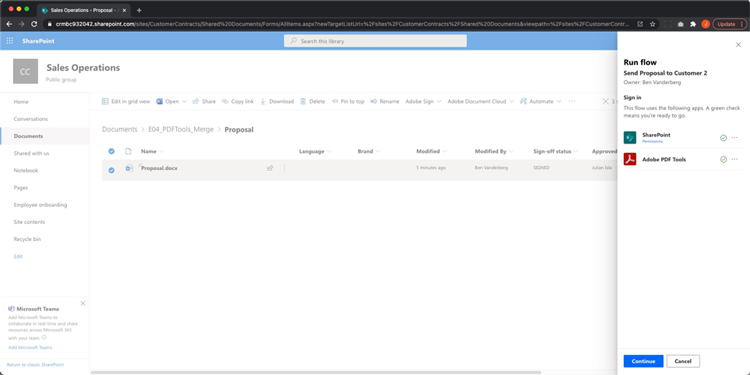

1. Choose your Cover and the whitepapers you want to append.
1. Click **Run flow**.

   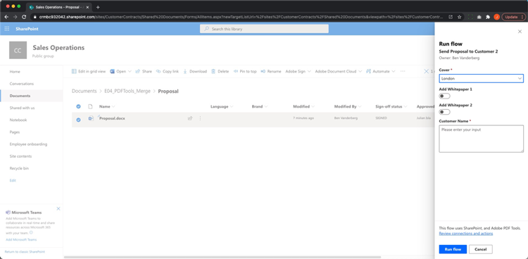

Navigate to the Generate Docs folder. You should now see your generated PDF file.

   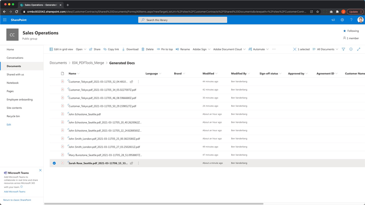

### Adding Protect and other actions to flow

Now that you have successfully created a flow, you are going to edit your flow to encrypt the PDF document with a password. This also walks through how you can utilize other actions.

1. Navigate back to the end of your flow. 
1. Click the **+** symbol between **Merge PDFs** and **Create file**.

   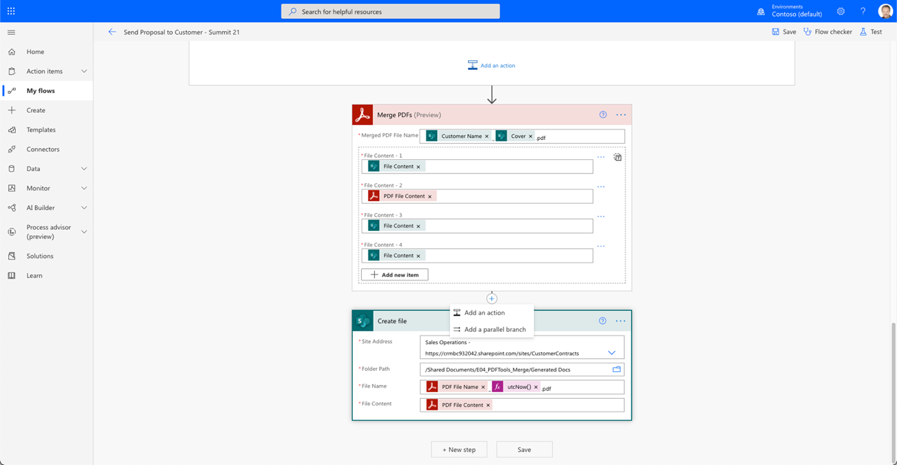

1. Select **Add an action**.
1. Search for "Adobe PDF Tools".

   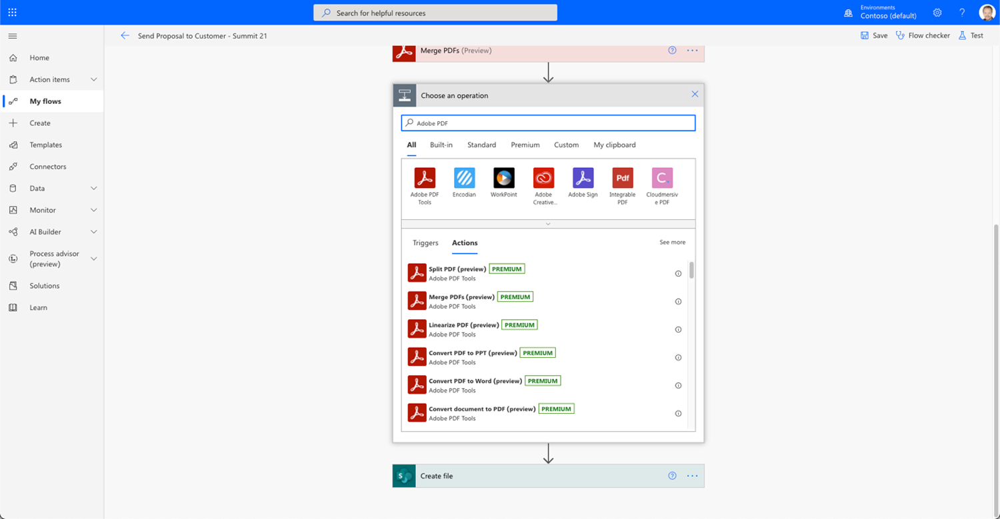

1. Select **Protect PDF from Viewing**.
1. Use Dynamic Content to set the File Name field to **PDF File Name from Merge PDF**.

   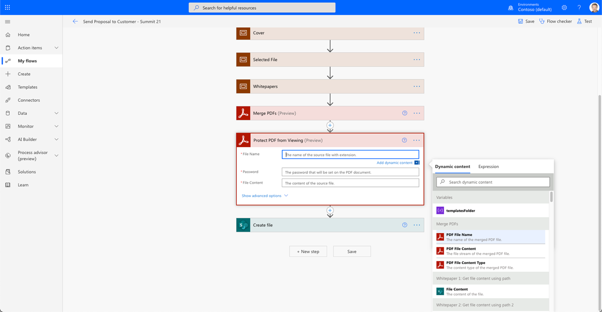

   In the trigger, there is a Password field that is part of the initiation form. We can use that here. 

1. Search for **Password field** using Dynamic content, and place it in the Password field.

   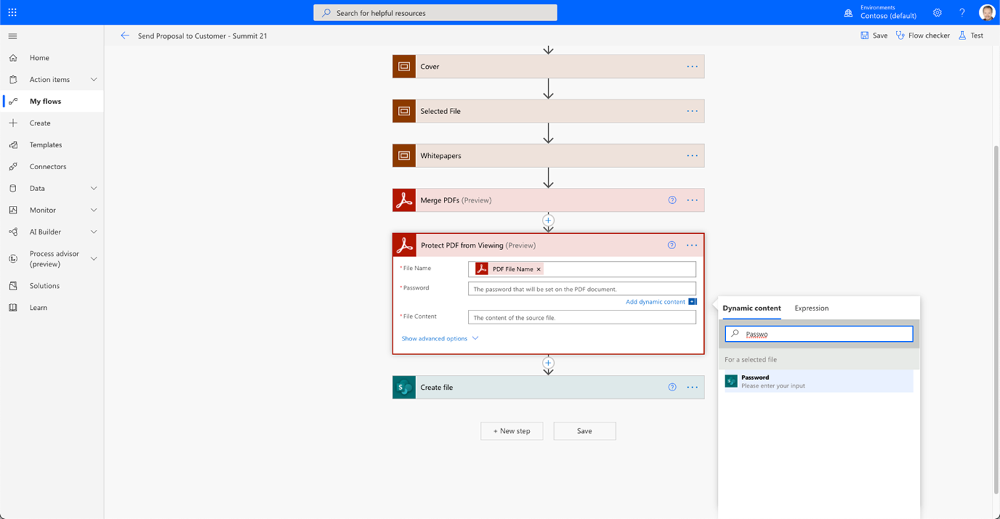

1. Use Dynamic content to set it to **PDF File Content from Merge PDFs** in the File Content field.
1. Change the **Create file** to get the file content from Protect PDF rather than Merge PDFs.
1. Expand **Create file**.
1. Clear the File Content field.
1. Use Dynamic Content to place **PDF File Content** from **Protect PDF from Viewing**.

### Test your flow

1. Navigate to the Proposal folder in SharePoint.
1. Select Proposal.docx.

   

1. Select **Automate** to choose your flow.

   

1. Click **Continue** to begin the flow.

   

1. Choose the Cover and the whitepapers you want to append.
1. Set the Password field to the Password you would like to set.
1. Click **Run flow**.

   

1. Navigate to the Generate Docs folder.
   You should see your generated PDF file. Open the PDF file and it prompts you to enter your PDF password.

   
