# Integrations overview

You can use Acrobat Sign inside other applications your organization already uses, such as Microsoft, Salesforce, Workday, and Marketo to name a few. Learn how you can simplify your e-signature workflows in these integration guides and tutorials. 

>[!NOTE]
> If you're having trouble accessing any of these features, check with your organization's administrator to ensure that the integration is enabled.

## What's new

* [Live Sign in Adobe Acrobat Sign for [!DNL Microsoft Teams]](live-sign-microsoft-teams.md)
  Learn how to create an online signing experience that resembles in-person signing during a [!DNL Microsoft Teams] meeting
* [Create an advanced workflow with [!DNL Power Automate]](advanced-workflow-power-automate.md)
   Learn how to create an advance workflow using [!DNL Power Automate] connectors
* [Create a simple workflow with [!DNL Power Automate]](simple-workflow-power-automate.md)
  Learn how to create a simple workflow using [!DNL Power Automate] connectors

## Microsoft integrations tutorials

<table style="table-layout:fixed">
<tr>
  <td>
    <a href="fill-and-sign-doc-microsoft-outlook.md">
      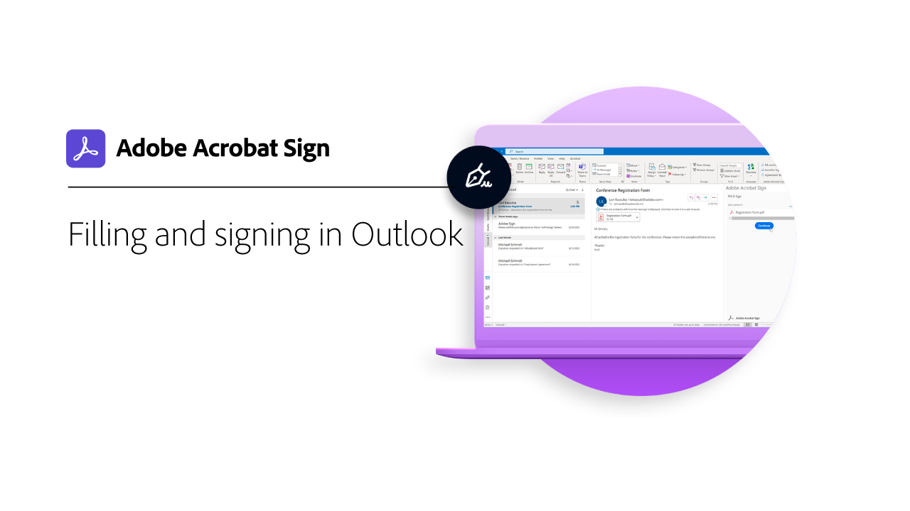
    </a>
    

    <a href="fill-and-sign-doc-microsoft-outlook.md"><strong>Filling and signing in Microsoft Outlook</strong></a>
    

    <em>Fill out and sign a form directly within Microsoft Outlook</em>
     
  </td>
  <td>
    <a href="send-for-signature-with-outlook.md">
      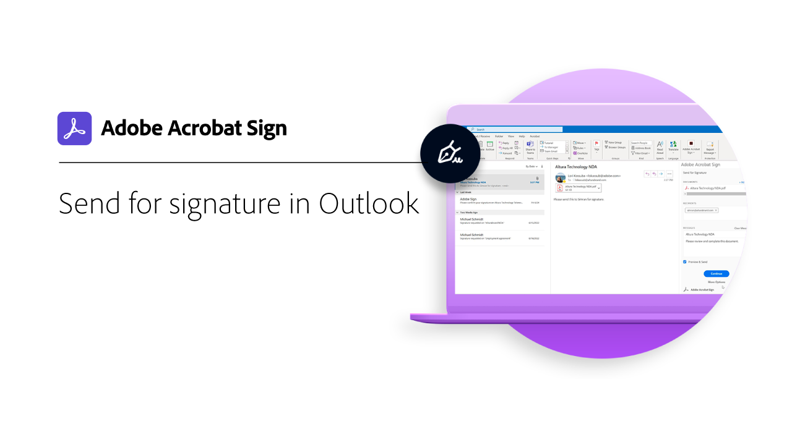
    </a>
    

    <a href="send-for-signature-with-outlook.md"><strong>Send for signature in Outlook</strong></a>
    

    <em>Send a document for signature directly within Microsoft Outlook</em>
     
  </td>
  <td>
    <a href="send-for-signature-with-sharepoint-online.md">
      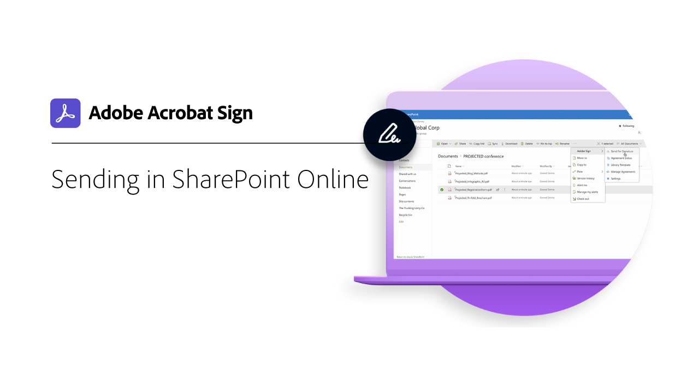
    </a>
    

    <a href="send-for-signature-with-sharepoint-online.md"><strong>Send for signature in SharePoint Online</strong></a>
    

    <em>Send a document for signature directly within Sharepoint Online</em>
     
  </td>
   <td>
    <a href="track-an-agreement-with-sharepoint-online.md">
      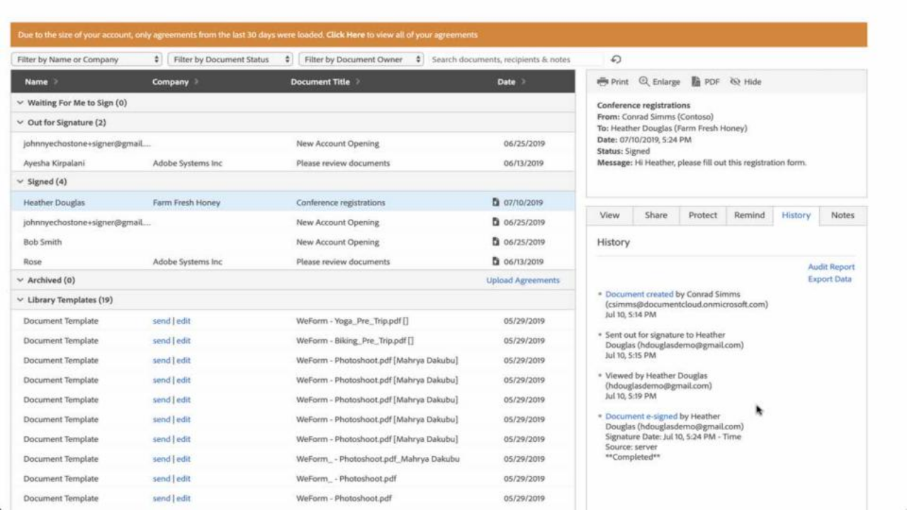
    </a>
    

    <a href="track-an-agreement-with-sharepoint-online.md"><strong>Tracking in SharePoint Online</strong></a>
    

    <em>Track the progress of an agreement directly within Microsoft Sharepoint</em>
     
  </td>
</tr>
<tr>
  <td>
    <a href="integrate-web-form-sharepoint-online.md">
      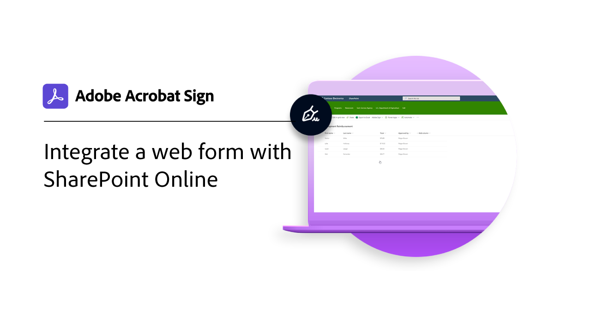
    </a>
    

    <a href="integrate-web-form-sharepoint-online.md"><strong>Integrate a web form with [!DNL SharePoint Online]</strong></a>
    

    <em>Learn how to map data collected from a web form into a [!DNL SharePoint] list</em>
     
  </td>
  <td>
    <a href="auto-archive-sharepoint-power-automate.md">
      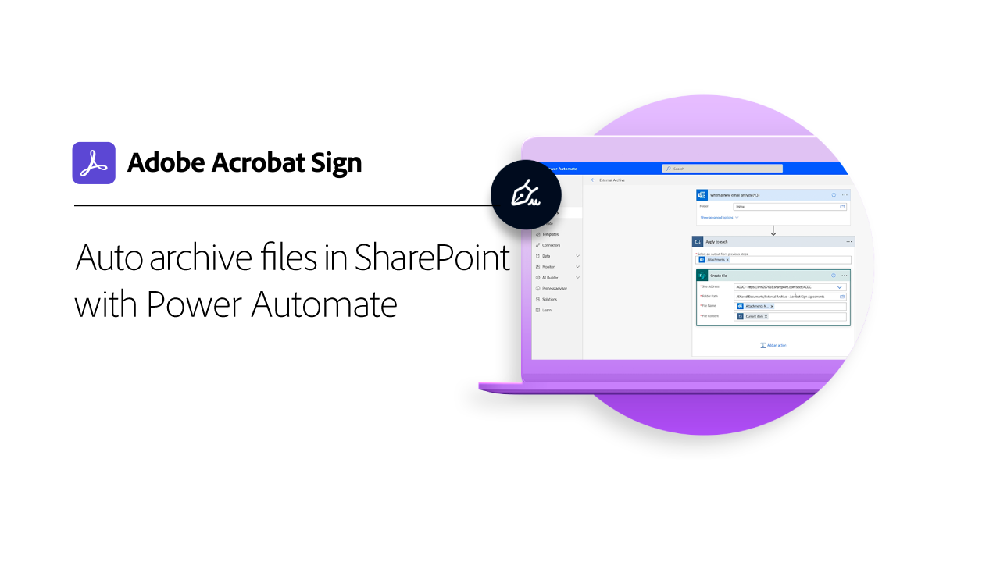
    </a>
    

    <a href="auto-archive-sharepoint-power-automate.md"><strong>Auto archive files in [!DNL SharePoint] with [!DNL Power Automate]</strong></a>
    

    <em>Learn how to automatically archive signed documents to a [!DNL SharePoint] library using [!DNL Power Automate]</em>
     
  </td>
  <td>
    <a href="documentautomation.md">
      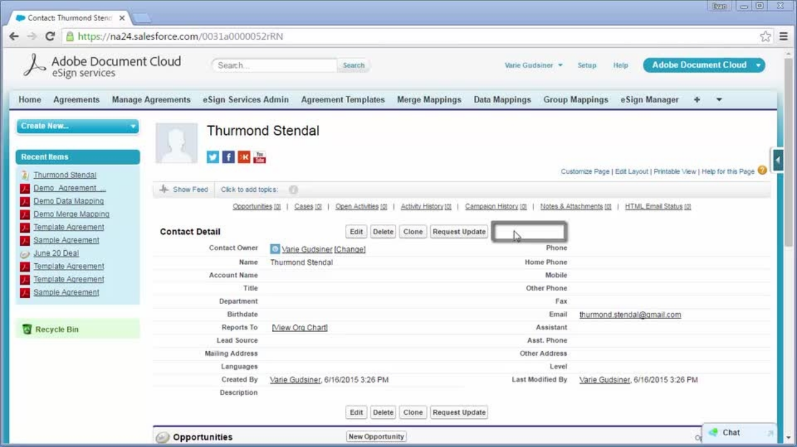
    </a>
    

    <a href="documentautomation.md"><strong>Document automation with [!DNL Acrobat Sign for Microsoft Power Platform]</strong></a>
    

    <em>Learn how to activate and use the [!DNL Acrobat Sign] and [!DNL Adobe PDF Tools] connectors for [!DNL Microsoft Power] apps</em>
     
  </td>
   <td>
    <a href="adobe-sign-teams-mortgage.md">
      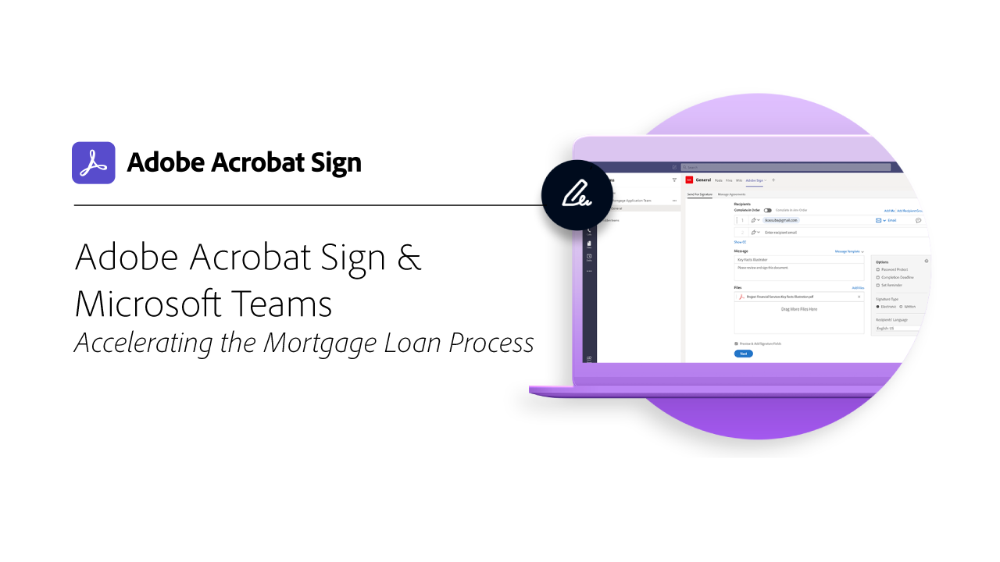
    </a>
    

    <a href="adobe-sign-teams-mortgage.md"><strong>Send for signature in [!DNL Microsoft Teams]</strong></a>
    

    <em>Send documents for signature directly within [!DNL Microsoft Teams]</em>
     
  </td>
</tr>
<tr>
  <td>
    <a href="live-sign-microsoft-teams.md">
      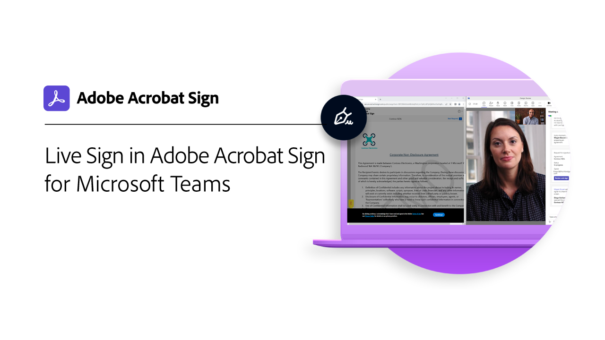
    </a>
    

    <a href="live-sign-microsoft-teams.md"><strong>Live Sign in Adobe Acrobat Sign for [!DNL Microsoft Teams]</strong></a>
    

    <em>Learn how to create an online signing experience that resembles in-person signing during a [!DNL Microsoft Teams] meeting</em>
     
  </td>
   <td>
    
    

    <a href="simple-workflow-power-automate.md"><strong>Create a simple workflow with Power Automate</strong></a>
    

    <em>Learn how to create a simple workflow using [!DNL Power Automate] connectors</em>
     
  </td>
  <td>
    <a href="advanced-workflow-power-automate.md">
      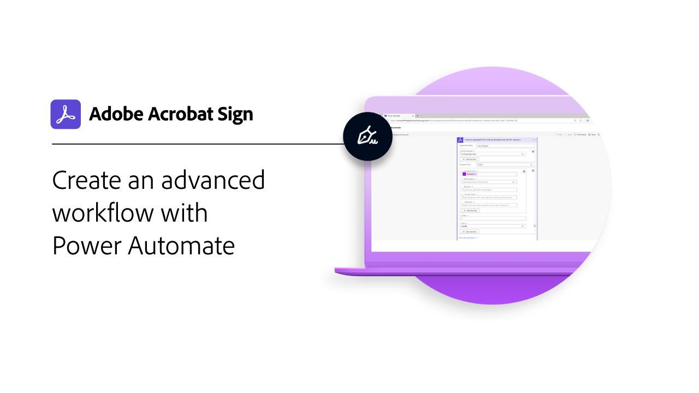
    </a>
    

    <a href="advanced-workflow-power-automate.md"><strong>Create an advanced workflow with Power Automate</strong></a>
    

    <em>Learn how to create an advanced workflow using [!DNL Power Automate] connectors</em>
     
  </td>
  <td>
    <a href="dynamics-customer-service.md">
      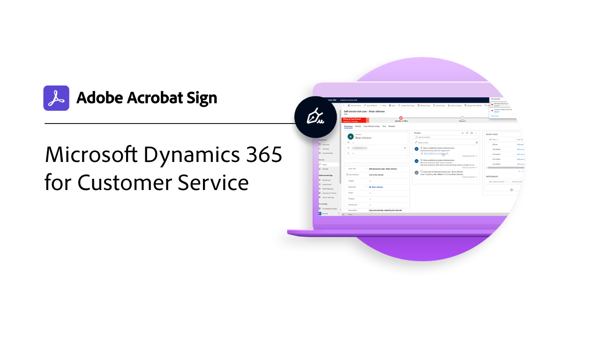
    </a>
    

    <a href="dynamics-customer-service.md"><strong>Microsoft Dynamics 365 for Customer Service</strong></a>
    

    <em>Learn how Acrobat Sign and [!DNL Microsoft Dynamics 365] for Customer Service are used to improve customer satisfaction on a self-service customer web portal</em>
     
  </td>
<tr>
  <td>
    <a href="dynamics-field-service.md">
      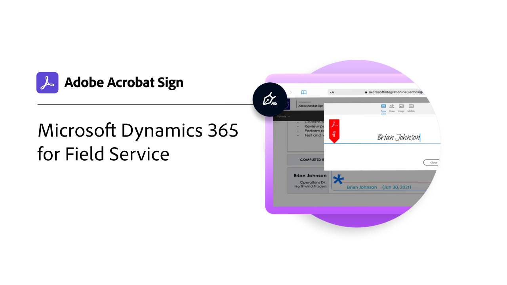
    </a>
    

    <a href="dynamics-field-service.md"><strong>Microsoft Dynamics 365 for Field Service</strong></a>
    

    <em>Learn how Acrobat Sign, [!DNL Power Automate], and [!DNL Microsoft Dynamics 365] for Field Service are used to streamline customer on-site engagements</em>
     
  </td>
  <td>
    <a href="dynamics-sales.md">
      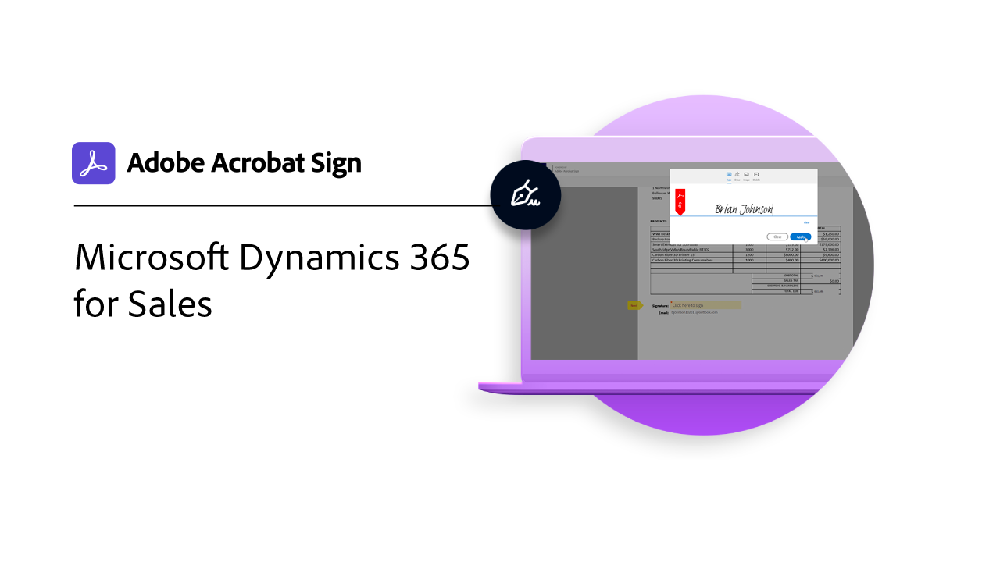
    </a>
    

    <a href="dynamics-sales.md"><strong>Microsoft Dynamics 365 for Sales</strong></a>
    

    <em>Learn how Acrobat Sign and [!DNL Microsoft Dynamics 365] for Sales are used to automate the sales quote signing process</em>
     
  </td>
  <td>
    
    

     
  </td>
  <td>
    
    

     
  </td>
</tr>
</table>

## [!DNL Notarize] integration tutorials

<table style="table-layout:fixed">
<tr>
  <td>
    <a href="send-document-notarize.md">
      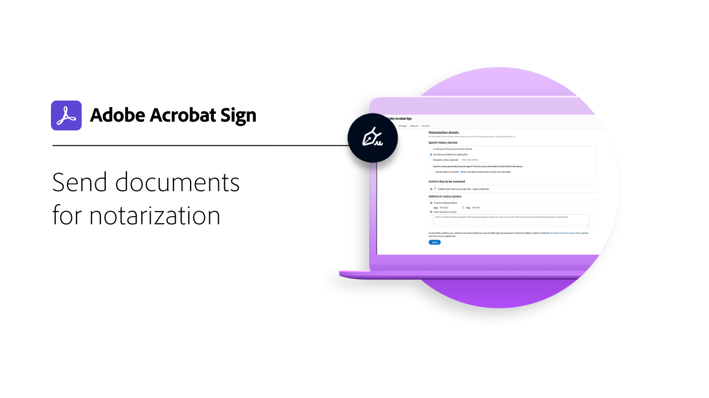
    </a>
    

    <a href="send-document-notarize.md"><strong>Send documents for notarization</strong></a>
    

    <em>Learn how to send a document for notarization</em>
     
  </td>
  <td>
    
    

     
  </td>
  <td>
    
    

     
  </td>
  <td>
    
    

     
  </td>
</tr>
</table>

## Salesforce integrations tutorials

<table style="table-layout:fixed">
<tr>
  <td>
    
    

    <a href="create-an-agreement-template.md"><strong>Document Builder for [!DNL Salesforce]</strong></a>
    

    <em>Learn how to create a reusable document template using Document Builder for [!DNL Salesforce]</em>
     
  </td>
  <td>
    
    

    <a href="set-up-data-mapping.md"><strong>Setting up data mapping</strong></a>
    

    <em>Pull data back into Salesforce after an agreement has been signed</em>
     
  </td>
  <td>
    <a href="set-up-merging-map.md">
      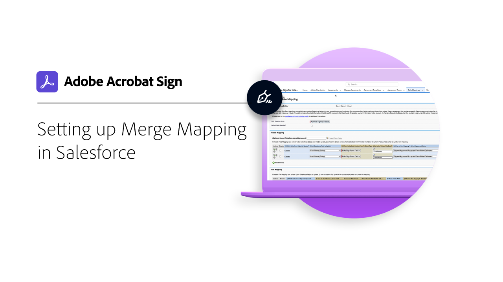
    </a>
    

    <a href="set-up-merging-map.md"><strong>Setting up Merge Mapping in Salesforce</strong></a>
    

    <em>Learn how to merge data from Salesforce directly into an Acrobat Sign document</em>
     
  </td>
  <td>
    
    

    <a href="create-a-custom-button.md"><strong>Creating a custom button</strong></a>
    

    <em>Create a custom button that starts the sending process and auto populates an agreement inside Salesforce</em>
     
  </td>
</tr>
</table>

## Workday integration tutorials

<table style="table-layout:fixed">
<tr>
 <td>
    <a href="acrobat-sign-workday-onboarding.md">
      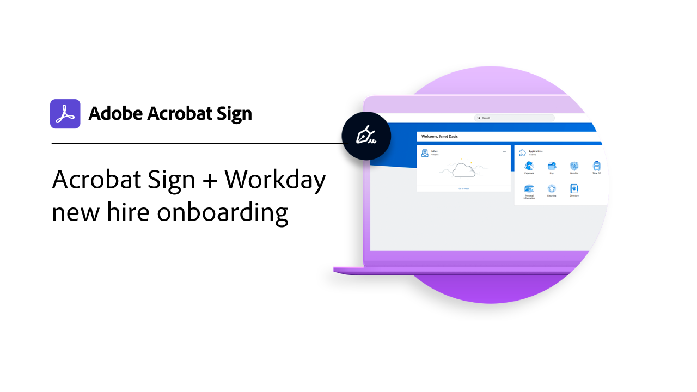
    </a>
    

    <a href="acrobat-sign-workday-onboarding.md"><strong>Acrobat Sign + Workday new hire onboarding</strong></a>
    

    <em>Learn how to streamline onboarding workflows with Acrobat Sign + Workday</em>
     
  </td>
 <td>
    
    

     
  </td>
  <td>
    
    

     
  </td>
  <td>
    
    

     
  </td>
</tr>
</table>

## Marketo integration tutorials & configuration guides

<table style="table-layout:fixed">
<tr>
  <td>
    <a href="marketo-salesforce-sms.md">
      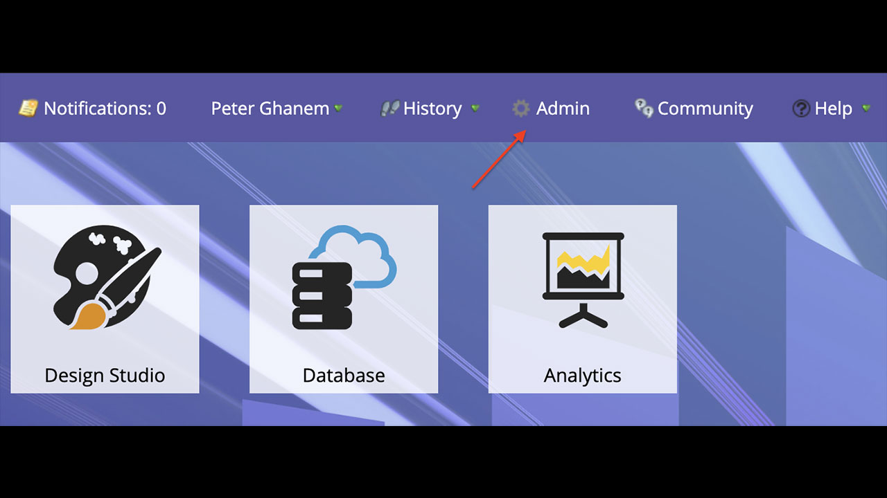
    </a>
    

    <a href="marketo-salesforce-sms.md"><strong>Send notifications using Acrobat Sign for Salesforce and Marketo</strong></a>
    

    <em>Learn how to send a text message, email, or push notification to let the signer know an agreement is on its way</em>
     
  </td>
  <td>
    <a href="marketo-salesforce-reminder-video.md">
      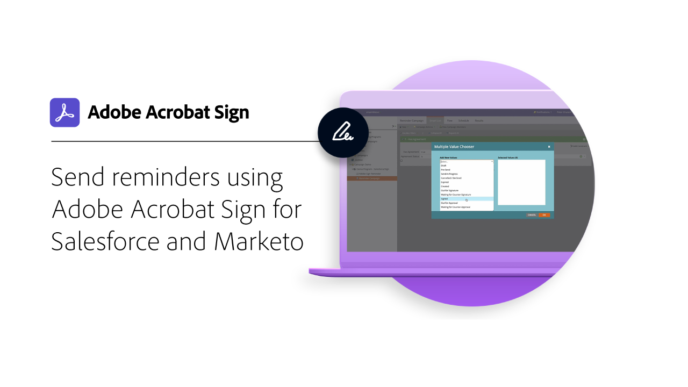
    </a>
    

    <a href="marketo-salesforce-reminder.md"><strong>Send reminders using Adobe Sign for Salesforce and Marketo video tutorial</strong></a>
    

    <em>Learn how to send an email reminder from Marketo when an agreement remains unsigned after a period of time</em>
     
  </td>
  <td>
    <a href="marketo-salesforce-reminder.md">
      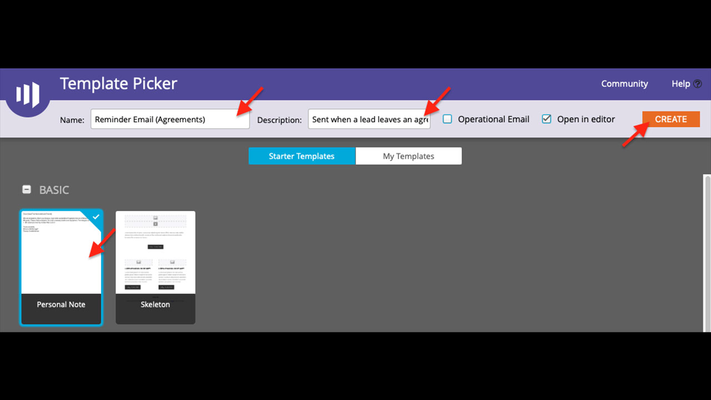
    </a>
    

    <a href="marketo-salesforce-reminder.md"><strong>Send reminders using Acrobat Sign for Salesforce and Marketo configuration guide</strong></a>
    

    <em>Read how to send an email reminder from Marketo when an agreement remains unsigned after a period of time</em>
     
  </td>
   <td>
    <a href="marketo-dynamics-reminder.md">
      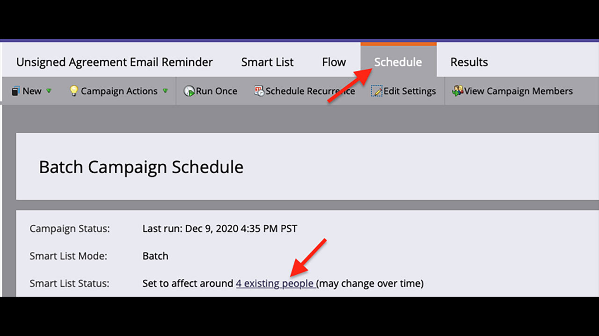
    </a>
    

    <a href="marketo-dynamics-reminder.md"><strong>Send reminders using Acrobat Sign for Microsoft Dynamics and Marketo</strong></a>
    

    <em>Learn how to send an email reminder when an agreement remains unsigned after a period of time</em>
     
  </td>
</tr>
<tr>
  <td>
    <a href="marketo-dynamics-sms.md">
      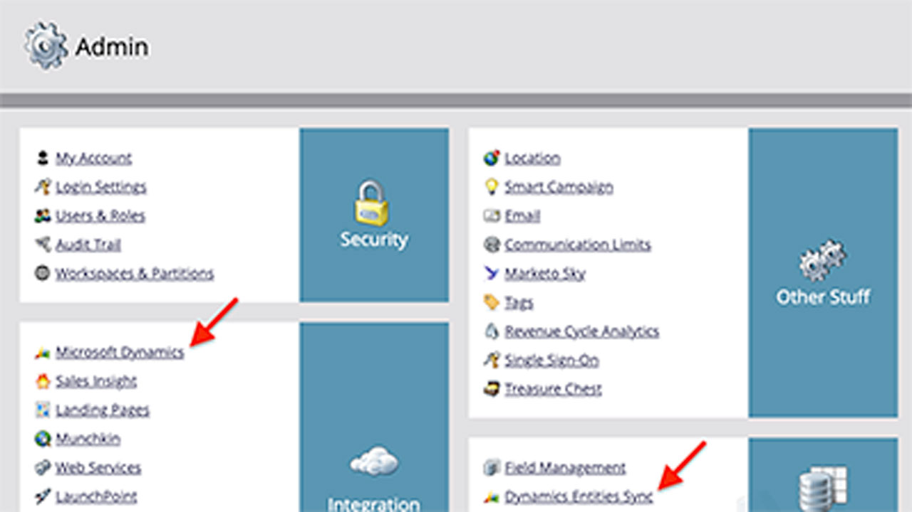
    </a>
    

    <a href="marketo-dynamics-sms.md"><strong>Send notifications using Acrobat Sign for Microsoft Dynamics and Marketo</strong></a>
    

    <em>Learn how to send a text message, email, or push notification to let the signer know an agreement is on its way</em>
     
  </td>
  <td>
    
    

     
  </td>
  <td>
    
    

     
  </td>
  <td>
    
    

     
  </td>
</tr>
</table>
