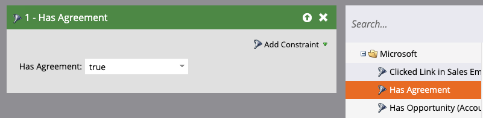
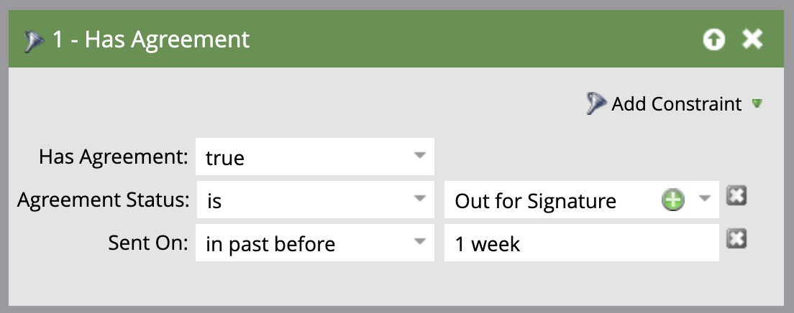

# Send reminders using Adobe Sign for Microsoft Dynamics 365 and Marketo

Learn how to send an email reminder when an agreement remains unsigned after a period of time. This integration uses Adobe Sign, Adobe Sign for Microsoft Dynamics, Marketo, and the Marketo Microsoft Dynamics Sync. 

## Prerequisites 

1. Install the Marketo Microsoft Dynamics Sync. 

    Information and the latest plugin for Microsoft Dynamics Sync is available [here.](https://experienceleague.adobe.com/docs/marketo/using/product-docs/crm-sync/microsoft-dynamics/marketo-plugin-releases-for-microsoft-dynamics.html)

1. Install [Adobe Sign for Microsoft Dynamics](https://appsource.microsoft.com/en-us/product/dynamics-365/adobesign.f3b856fc-a427-4d47-ad4b-d5d1baba6f86).

    Information about this plugin is available [here.](https://helpx.adobe.com/ca/sign/using/microsoft-dynamics-integration-installation-guide.html)

## Find the custom object

Once the Marketo Microsoft Dynamics Sync and Adobe Sign for Dynamics configurations are complete, two new options appear in the Marketo Admin Terminal.


1. Click **[!UICONTROL Dynamics Entities Sync]**. 

    Sync must be disabled before syncing custom entities. Click **Sync Schema** if this is your first time. Otherwise, click **Refresh Schema**.

    

## Sync the custom object

1. On the right side, locate [!UICONTROL Lead], [!UICONTROL Contact], and [!UICONTROL Account]-based custom objects. 

    * **Enable Sync** for the objects under **[!UICONTROL Lead]** if you want to send a reminder when a [!UICONTROL Lead] has not signed an agreement in Dynamics.

    * **Enable Sync** for the objects under **[!UICONTROL Contact]** if you want to send a reminder when a [!UICONTROL Contact] has not signed an agreement in Dynamics.

    * **Enable Sync** for the objects under **[!UICONTROL Account]** if you want to send a reminder when an [!UICONTROL Account] has not signed an agreement in Dynamics.

    * **Enable Sync** for the agreement object under the desired **[!UICONTROL Parent]** ([!UICONTROL Lead], [!UICONTROL Contact], or [!UICONTROL Account]).

    

1. In the new window, select the properties you want under Agreement, then enable the boxes under **Constraint** and **Trigger** to expose them to your Marketing Activities.

    

    

1. Reactivate the sync after enabling sync on the custom objects. 

    Go back to the Admin Terminal, click **Microsoft Dynamics**, then click on **Enable Sync**.

    

    

## Create the program and token

1. In the Marketing Activities section of Marketo, right-click on **Marketing Activities** on the left bar. 

    Select **New Campaign Folder**, and give it a name.

    

1. Right-click on the created folder, select **New Program**, and give it a name. 

    Leave everything else as default, then click **Create**.

    

    

1. Click on **My Tokens**, then drag **Email Script** over to the canvas.

    

1. Give it a name, then click on **Click to Edit**.

    

1. Expand **[!UICONTROL Custom Objects]** on the right-hand side, then expand the **[!UICONTROL Agreement]** object. 

    Find and drag [!UICONTROL Name], Agreement Status, Sent on, and Current Signer Url onto the canvas.

1. Write a Velocity script using these tokens to display the agreement URL of an agreement that goes unsigned for a week. Here is an example that compares the current date to Sent On: 

    ```
    #foreach($agreement in $adobe_agreementList)
        #if($agreement.adobe_esagreementstatus == "Out for Signature")
            #set($todayCalObj = $date.toCalendar($date.toDate("yyyy-MM-dd",$date.get('yyyy-MM-dd'))) )
            #set($dateSentCalObj = $date.toCalendar($date.toDate("yyyy-MM-dd",$agreement.adobe_datesent)) )
            #set($dateDiff = ($todayCalObj.getTimeInMillis() - $dateSentCalObj.getTimeInMillis()) / 86400000 )
            
            #if($dateDiff >= 7)
                #set($agreementName = $agreement.adobe_name)
                #set($agreementURL = $agreement.adobe_currentsignerurl.substring(8))
                #break
            #else
            #end
        #else
        #end
    #end

    #if(${agreementName})
        <a href="https://${agreementURL}">${agreementName}</a>
    #else
        Please contact us. 
    #end
    ``` 

1. Click **[!UICONTROL Save]**.

## Create the reminder and add personalization

Examples of personalization include: the name of the signer, the name of the agreement, a link to the agreement, etc.

1. Right-click on the program you created and click **[!UICONTROL New Local Asset]**, then select **[!UICONTROL Email]**.

    

1. In the new tab, enter a **[!UICONTROL Name]** and **[!UICONTROL Description]** for the email and select a template from the template picker. 

    

1. Click **[!UICONTROL Create]**.

1. Set the **[!UICONTROL From Name]** and **[!UICONTROL From Address]**. 

    

1. Click on the message body to activate the Editor. 

    Click on the **[!UICONTROL Insert Token]** button, find the custom Agreement URL token you created, then click **[!UICONTROL Insert]**. Finish customizing your email, and click **[!UICONTROL Save]**.

    

1. Preview using a profile that has an agreement assigned to it. 

    You should see a link to the URL with the Agreement Name as the label. 

    

## Set up the Smart Campaign Filter

1. Right-click on the program you created, then click **[!UICONTROL New Smart Campaign]**.

    

1. Give it a name of your choosing, then click **[!UICONTROL Create]**.

    

1.  Search for, then click and drag **[!UICONTROL Has Agreement]** to the Smart List.

    

    The fields you exposed to the trigger should be available in **[!UICONTROL Add Constraint]**. 

1. Select **[!UICONTROL Agreement Status]** and any other fields you wish to filter by. 

    For each field added, define the values to filter by. In this case, it only triggers when the **[!UICONTROL Agreement Status]** is *Out for Signature* and **[!UICONTROL Sent On]** is *in past before 1 week*.

    

    >[!NOTE]
    >
    > Add a unique identifier to the constraints, like **Name**, if you want this campaign to only run for certain agreements.

1. Confirm the campaign audience and see who will qualify in the Schedule tab.

    

## Set up the Smart Campaign Flow

Because the campaign filter **Days Until Expires** was used, you can use a scheduled recurrence for the campaign.

1. Click the **[!UICONTROL Flow]** tab in the [!UICONTROL Smart Campaign]. 

    Search for and drag the **Send Email** flow onto the canvas and select the reminder email you created in the previous section.

    

1. Click the **[!UICONTROL Schedule]** tab in the Smart Campaign. Ensure that the campaign flow is limited to only run once per person in the **Smart Campaign Settings**. Then, click on the **Schedule Recurrence** tab.

    

1. Set the **Schedule** to _Daily_. Choose a start day and time and end date for the campaign if necessary.

    

>[!TIP]
>
>This tutorial is part of the course [Accelerate sales cycles with Adobe Sign for Microsoft Dynamics and Marketo](https://experienceleague.adobe.com/?recommended=Sign-U-1-2021.1) that is available for free on Experience League!