# Send reminders using Adobe Sign for Salesforce and Marketo Configuration Guide

Learn how to send an email reminder from Marketo when an agreement remains unsigned after a period of time. This integration uses Adobe Sign for Salesforce, Marketo, and the Marketo and Salesforce sync.

## Prerequisites

1. Install the Marketo and Salesforce sync. Information about Salesforce sync installation is available [here.](https://docs.marketo.com/display/public/DOCS/Salesforce+Sync)

1. Install Adobe Sign for Salesforce. Information about this plugin is available [here.](https://helpx.adobe.com/ca/sign/using/salesforce-integration-installation-guide.html)

## Find the custom object

If the Marketo - Salesforce Sync and Adobe Sign for Salesforce configurations are complete,  several new options will appear for Salesforce in the Marketo Admin Terminal.

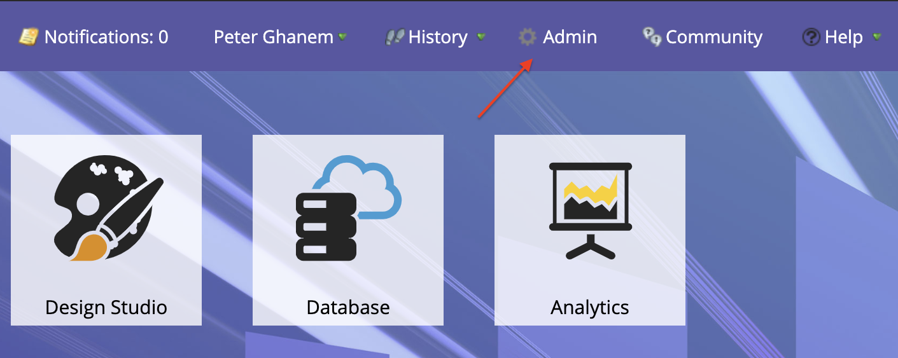

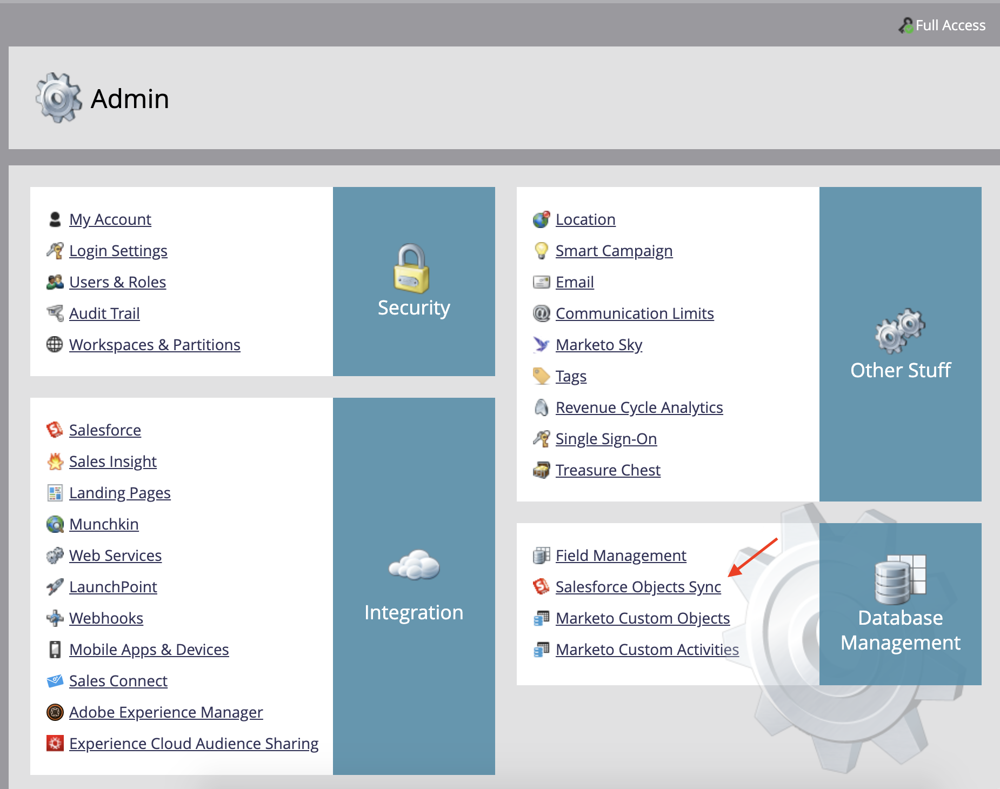

1. Click **Sync Schema** if this is your first time. Otherwise, click **Refresh Schema**.

    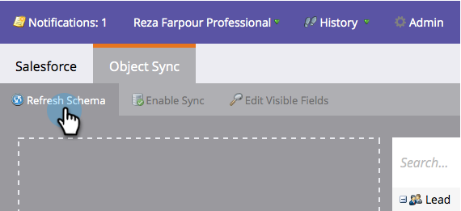

1. If global sync is running, disable by clicking **Disable Global Sync**.

    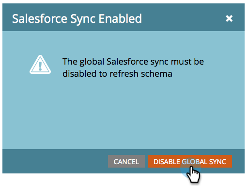

1. Click **Refresh Schema**.

    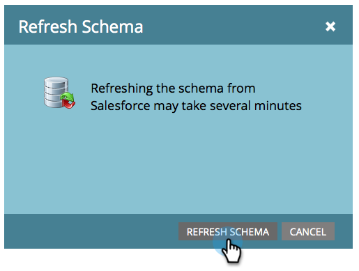

## Sync the custom object

On the right side, see Lead, Contact, and Account-based custom objects. 

**Enable Sync** for the objects under Lead if you want to send a reminder when a Lead has not signed an agreement in Salesforce.

**Enable Sync** for the objects under Contact if you want to send a reminder when a Contact has not signed an agreement in Salesforce.

**Enable Sync** for the objects under Account if you want to send a reminder when an Account has not signed an agreement in Salesforce.

1. **Enable Sync** for the **Agreement** object shown under the desired Parent (Lead, Contact, or Account). Do this for any other custom objects you'd like to sync.

    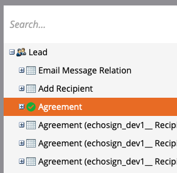

1. The following assets show how to **Enable Sync**.

    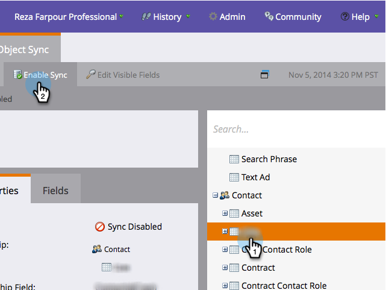

    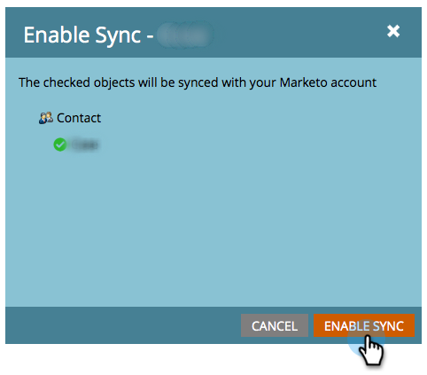

## Expose the custom object fields to triggers

1. While the Global Sync is deactivated, select the Agreement custom object you enabled sync for, then **Edit Visible Fields**.

1. Check the "Agreement Name" field in the trigger column to expose it to your Campaign Action Triggers. Check any other fields you want to filter by, then **Save**.

    

    

1. When finished enabling sync on the custom objects and exposing the trigger values, remember to reactivate the ync:

    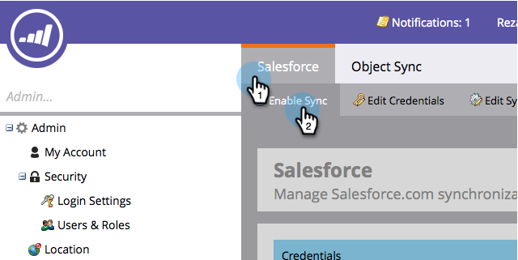

## Create the program and token

1. In the Marketing Activities section of Marketo, right-click on **Marketing Activities** on the left bar, select **New Campaign Folder**, and give it a name.

    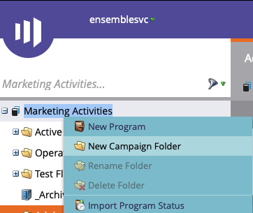

1. Right-click on the created folder, select **New Program**, and give it a name. Leave everything else as default, then click **Create**.

    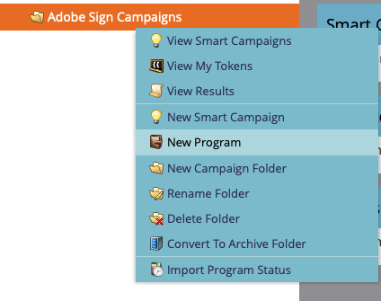

    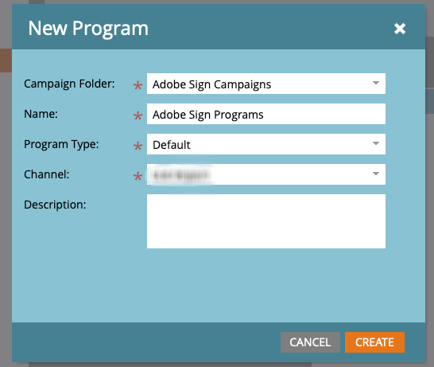

1. Click on **My Tokens**, then drag  **Email Script** over to the canvas.

    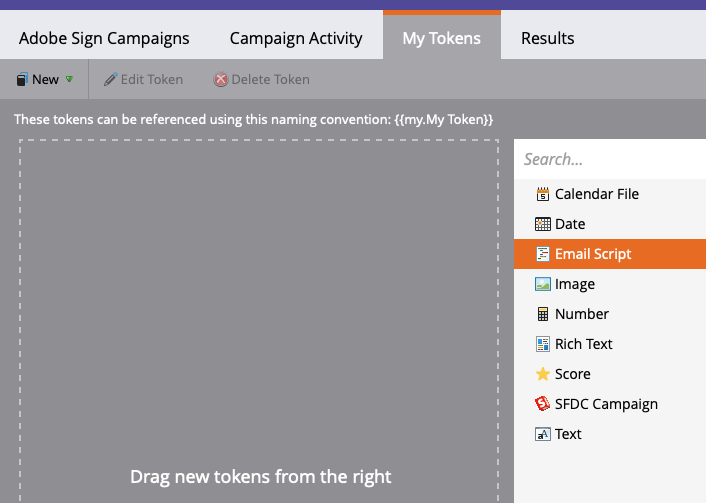

1. Give it a name, then click on **Click to Edit**.

    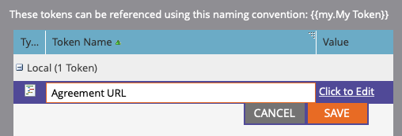

1. Expand **Custom Objects** on the right-hand side, then expand the **Agreement** object. Find and drag Agreement Name, Agreement Status, Date Signed, and Signing URL onto the canvas.

1. Write a Velocity script using these tokens to display the agreement URL of an agreement that goes unsigned for a week. Here is an example that compares the current date to Date Sent: 

    ```
    #foreach($agreement in $echosign_dev1__SIGN_Agreement__cList)
        #if($agreement.echosign_dev1__Status__c == "Out for Signature")
            #set($todayCalObj = $date.toCalendar($date.toDate("yyyy-MM-dd",$date.get('yyyy-MM-dd'))) )
            #set($dateSentCalObj = $date.toCalendar($date.toDate("yyyy-MM-dd",$agreement.echosign_dev1__DateSent__c)) )
            #set($dateDiff = ($todayCalObj.getTimeInMillis() - $dateSentCalObj.getTimeInMillis()) / 86400000 )
            
            #if($dateDiff >= 7)
                #set($agreementName = $agreement.Name)
                #set($agreementURL = $agreement.echosign_dev1__Signing_URL__c.substring(8))
                #break
            #else
            #end
        #else
        #end
    #end

    #if(${agreementName})
        <a href="https://${agreementURL}">${agreementName}</a>
    #else
        Please contact us. 
    #end
    ``` 

1. Click **Save**.

## Create the reminder and add personalization

Examples of personalization include: the name of the signer, the name of the agreement, a link to the agreement, etc.

1. Right-click on the program you created and click **New Local Asset**, then select **Email**.

    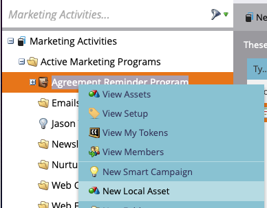

1. In the new tab, enter a **Name** and **Description** for the email and select a template from the template picker. Click **Create**.

    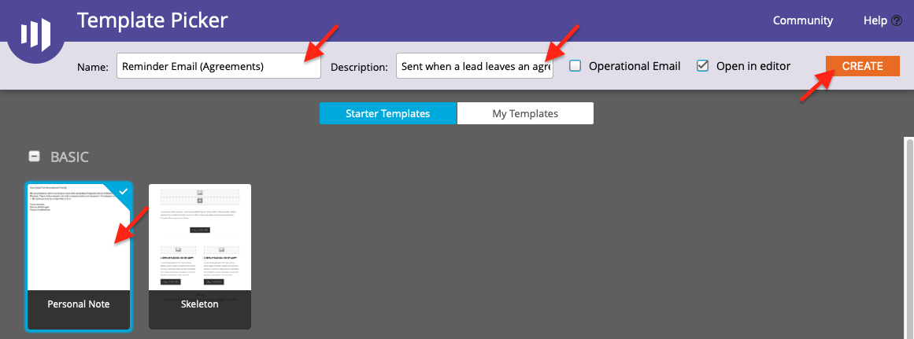

1. Set the **From Name** and **From Address**. 

    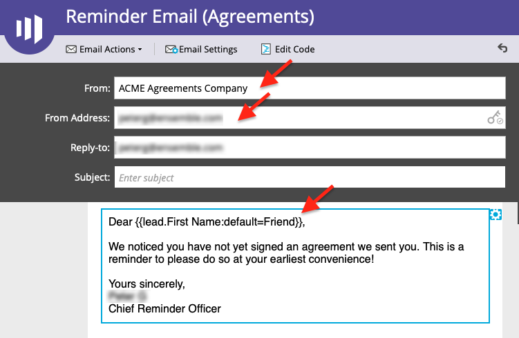

1. Click on the message body to activate the Editor. Click on the **Insert Token** button, find the custom Agreement URL token you created, then click **Insert**. Finish customizing your email, and click **Save**.

    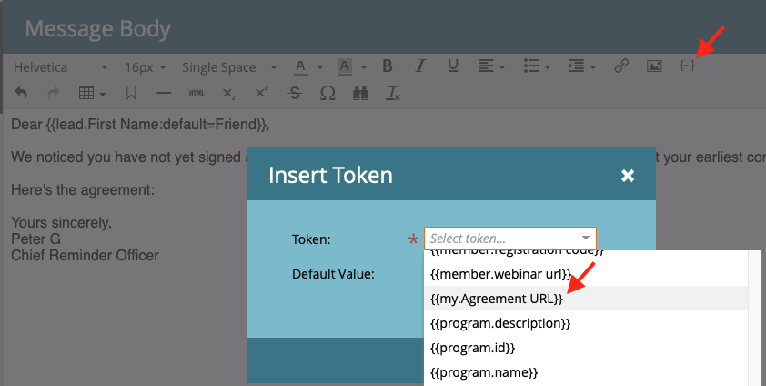

1. Preview using a profile that has an agreement assigned to it. You should see a link to the URL with the Agreement Name as the label. 

    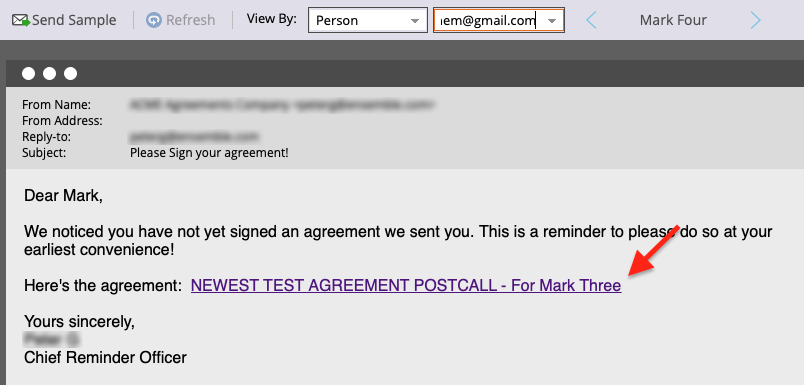

## Set up the Smart Campaign Filter

1. Right-click on the program you created, then click **New Smart Campaign**.

    

1. Give it a name of your choosing, then click **Create**.

    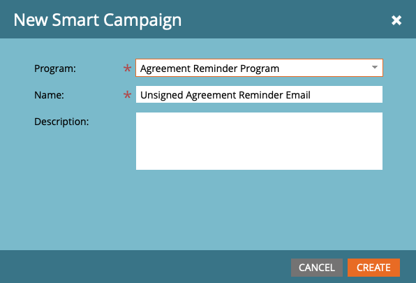

1. Search for, then click and drag **Has Agreement** to the Smart List.

    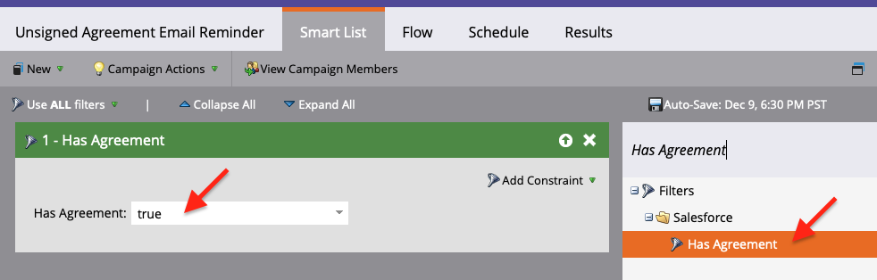

1. The fields you exposed to the trigger should now be available in **Add Constraint**. Select **Agreement Status** and any other fields you wish to filter by. For each field added, define the values to filter by. In this case, it will only trigger when the **Agreement Status** is Out for Signature and **Date Sent** is in past before 7 days. 

    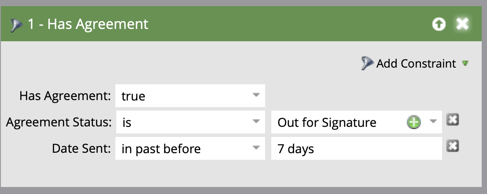

    >[!NOTE]
    >
    > d a unique identifier to the constraints, like **Agreement Name**, if you want this campaign to only run for certain agreements.

1. Confirm the campaign audience and see who will qualify in the Schedule tab.

    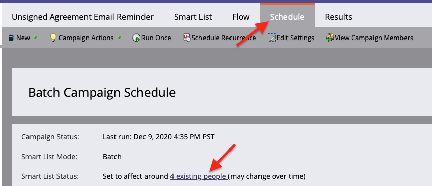

## Set up the Smart Campaign Flow

Because the campaign filter **Days Unsigned** was used, you can use a scheduled recurrence for the campaign.

1. Click on the **Flow** tab in the Smart Campaign. Search for and drag the **Send Email** flow onto the canvas and select the reminder email you created in the previous section.

    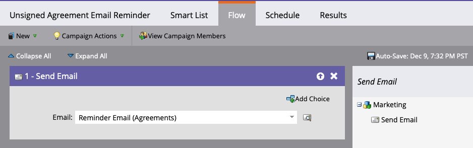

1. Click on the **Schedule** tab in the Smart Campaign. Ensure that the campaign flow is limited to only run once per person in the **Smart Campaign Settings**. Then, click on the **Schedule Recurrence** tab.

    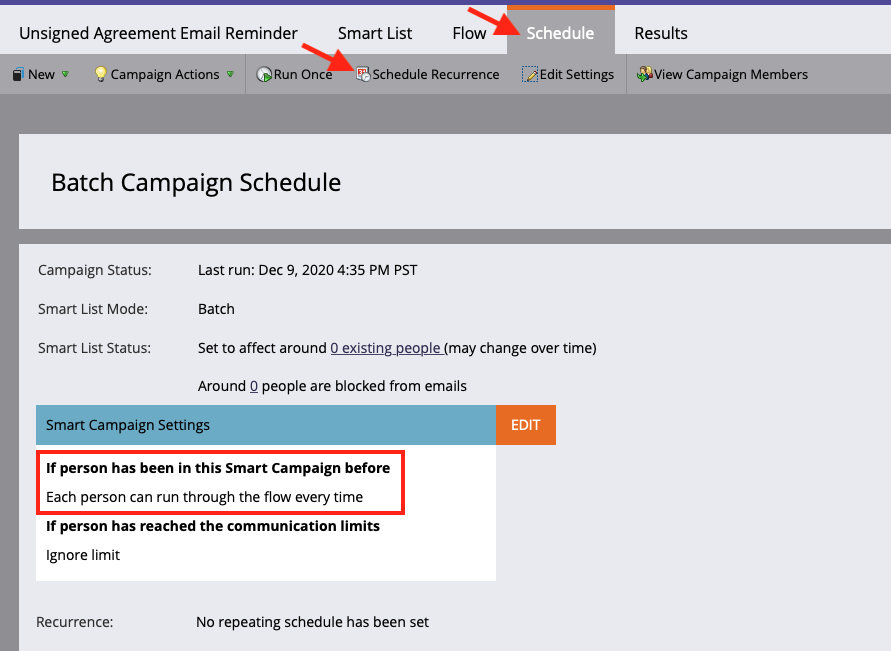

1. Set the **Schedule** to Daily, choose a start day and time, and an end date for the campaign if necessary.

    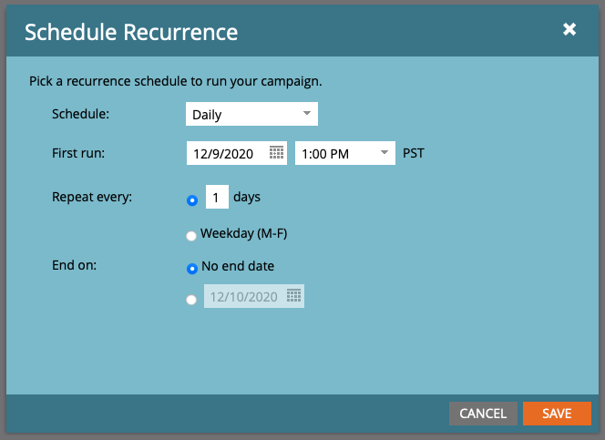
