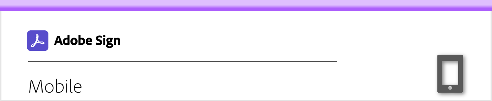

# Mobile overview

Send documents for signature, track e-signing progress, and get real-time updates all on your mobile device.

<table style="table-layout:fixed">
<tr>
  <td>
    
    

    <a href="https://itunes.apple.com/us/app/adobe-sign/id481082197?mt=8"><strong>Download Adobe Sign Mobile app for iOS</strong></a>
     
  </td>
  <td>
    
    

    <a href="https://play.google.com/store/apps/details?id=com.adobe.echosign&hl=en"><strong>Download Adobe Sign Mobile app for Android</strong></a>
     
  </td>  
  <td>
    
    

     
  </td>
</tr>
</table>
