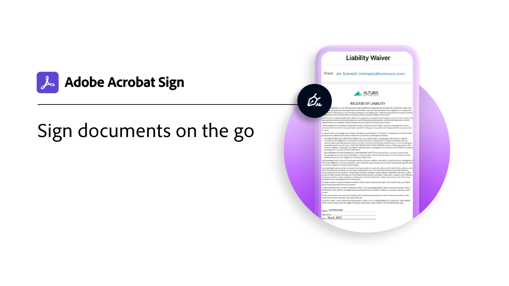
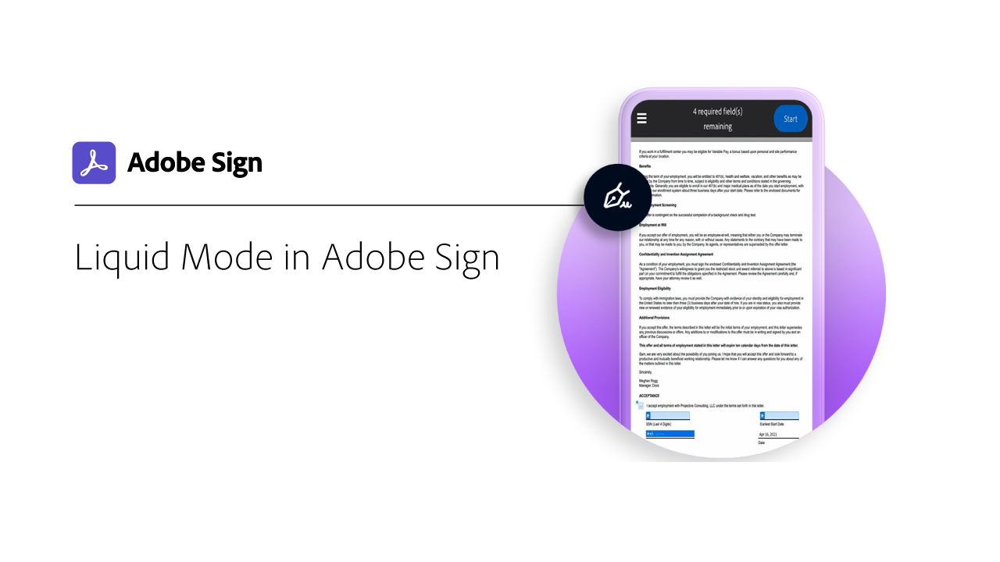
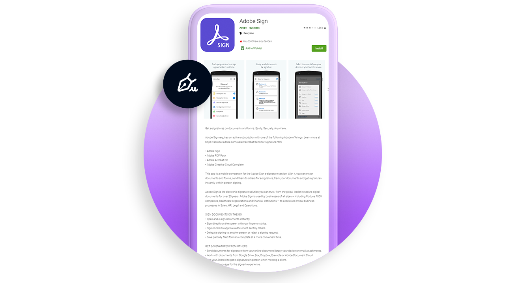

# Mobile overview

Send documents for signature, track e-signing progress, and get real-time updates all on your mobile device.

<table style="table-layout:fixed">
<tr>
  <td>
    
    

    <a href="sign-mobile.md"><strong>Sign documents on the go</strong></a>
    

    <em>Learn how to sign documents using the Acrobat Sign mobile app</em>
     
  </td>
  <td>
    
    

    <a href="liquidmode.md"><strong>Liquid Mode in Acrobat Sign</strong></a>
    

    <em>Learn how Liquid Mode improves the mobile signing experience</em>
     
  </td>
  <td>
    
    

    <a href="https://apps.apple.com/us/app/adobe-sign/id481082197" target="_blank"><strong>Download Acrobat Sign Mobile app for iOS</strong></a>
     
  </td>
  <td>
    
    

    <a href="https://play.google.com/store/apps/details?id=com.adobe.echosign&hl=en" target="_blank"><strong>Download Acrobat Sign Mobile app for Android</strong></a>
     
  </td>
</tr>
</table>
