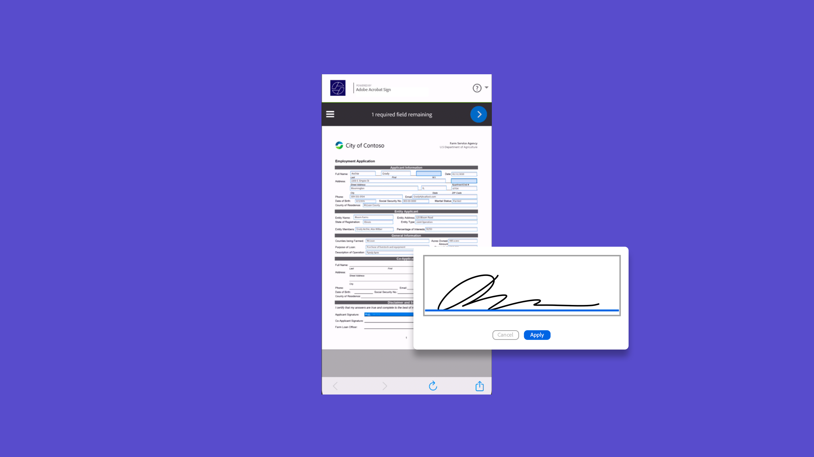
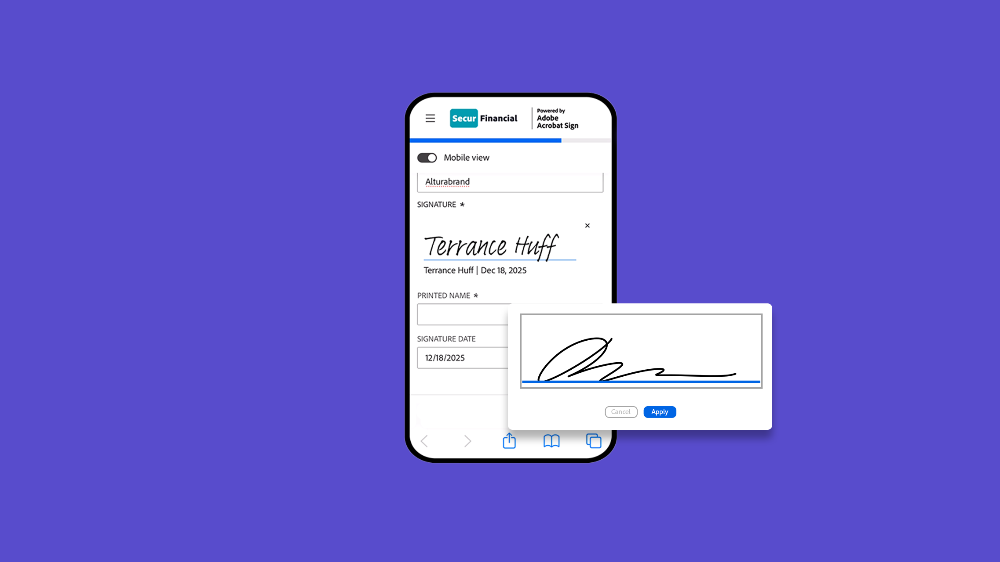
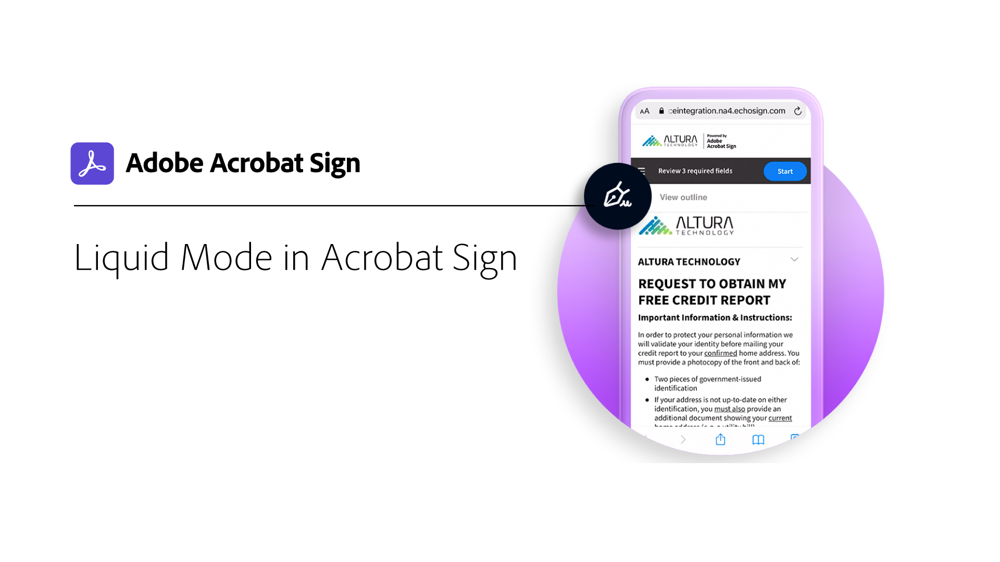

# Mobile overview

Send documents for signature, track e-signing progress, and get real-time updates all on your mobile device.

## What's new

>[!BEGINTABS]

>[!TAB Mobile-friendly view]

Learn how to use [mobile-friendly view](mobile-friendly.md) to complete forms on your mobile device.

>[!ENDTABS]

<table style="table-layout:fixed">
<tr>
  <td>
    
    

    <a href="sign-mobile.md"><strong>Sign documents on the go</strong></a>
    

    <em>Learn how to sign documents using the Acrobat Sign mobile app</em>
     
  </td>
  <td>
    
    

    <a href="mobile-friendly.md"><strong>Mobile-friendly view</strong></a>
    

    <em>Learn how to use mobile-friendly view to complete forms on your mobile device</em>
     
  </td>  
  <td>
    
    

    <a href="liquidmode.md"><strong>Liquid Mode in Acrobat Sign</strong></a>
    

    <em>Learn how Liquid Mode improves the mobile signing experience</em>
     
  </td>
   <td>
    
    

    <a href="https://apps.apple.com/us/app/adobe-acrobat-sign/id481082197_blank"><strong>Download Acrobat Sign mobile app for iOS</strong></a>
    

    <em>Download Acrobat Sign mobile app from the App Store</em>
     
  </td>
</tr>
<tr>
  <td>
    
    

    <a href="https://play.google.com/store/apps/details?id=com.adobe.echosign&hl=en&pli=1_blank"><strong>Download Acrobat Sign mobile app for Android</strong></a>
    

    <em>Download Acrobat Sign mobile app from Google Play</em>
     
  </td>
  <td>
    
    

     
  </td>
  <td>
    
    

     
  </td>
  <td>
    
    

     
  </td>
</tr>
</table>