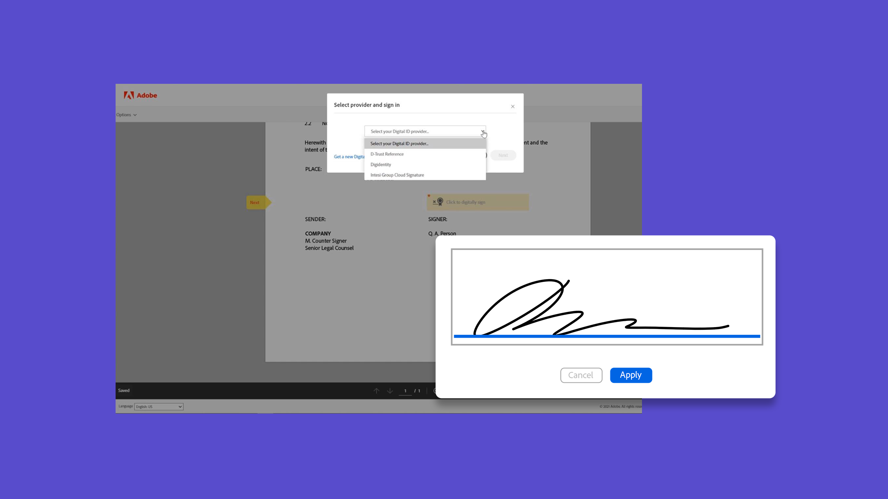
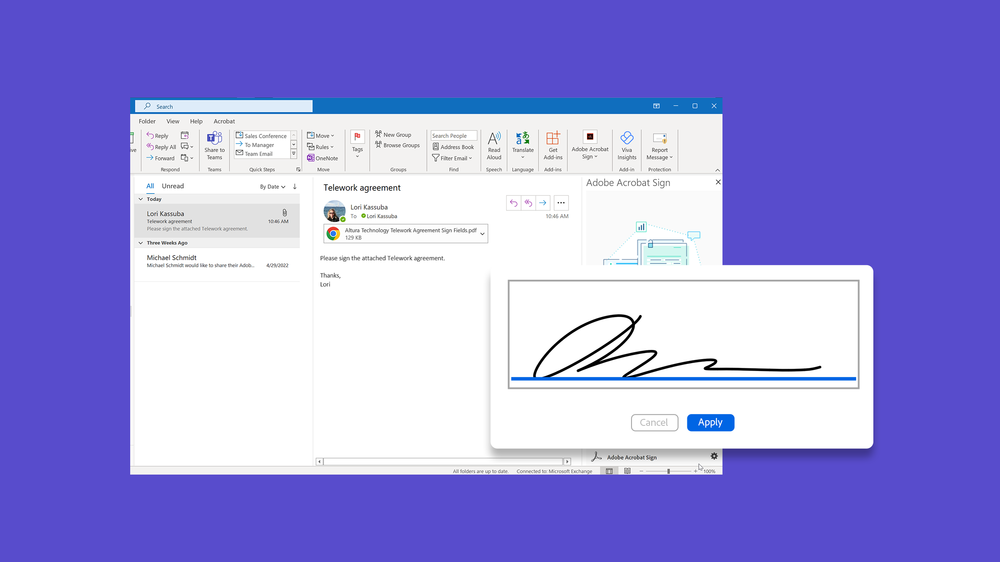
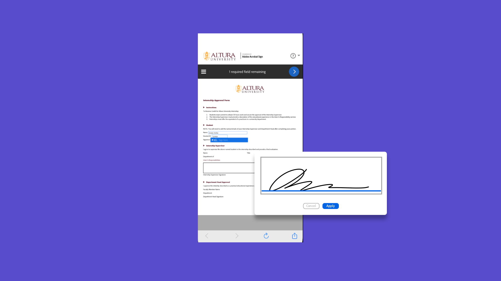

# Acrobat Sign tutorials

Acrobat Sign, an Adobe Document Cloud solution, scales to meet your organization's needs with integrations, APIs, advanced authentication, additional admin features, and more. Here you can find a wide range of learning experiences designed to quickly bring both beginners and administrators up-to-speed on Acrobat Sign.

## Learning paths

<table style="table-layout:fixed">
<tr>
  <td>
    
    

    <a href="sign-beginner-tutorials/beginner-users-overview.md"><strong>Getting started</strong></a>
    

    Get up-to-speed on how to send, sign, and track documents
     
  </td>
  <td>
    
    

    <a href="sign-advanced-users/advanced-users-overview.md"><strong>Advanced tasks</strong></a>
    

    Go beyond the basics with specific tasks and automation
     
  </td>
   <td>
    
    

    <a href="admin/intro-admin-overview.md"><strong>Administrators</strong></a>
    

    Basic to advanced set-up tips for your organization
     
  </td>
   <td>
    
    

    <a href="digitalid/digitalid-overview.md"><strong>Digital ID</strong></a>
    

    Learn how to use digital IDs from around the world in Acrobat Sign
     
  </td>
</tr>
<tr>
    <td>
    
    

    <a href="integrations/integrations-overview.md"><strong>Integrations</strong></a>
    

    Add Acrobat Sign directly inside another application
     
    </td>
  <td>
    
    

    <a href="sign-usecase/expand-inspire-overview.md"><strong>Industries and departments</strong></a>
    

    Explore real-world industry and department use cases
     
  </td>
  <td>
    
    

    <a href="develop/develop-overview.md"><strong>Develop</strong></a>
    

    Get development resources on Acrobat Sign I/O
     
  </td>
  <td>
    
    

    <a href="deploy-overview.md"><strong>Deploy</strong></a>
    

    Insight and best practices for deploying Acrobat Sign within your organization
     
  </td>
</tr>
<tr>
  <td>
    
    

    <a href="mobile/mobile-overview.md"><strong>Mobile</strong></a>
    

    Send, sign, and get real-time updates on your mobile device
     
  </td>
</tr>
</table>