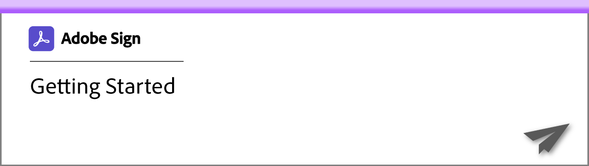
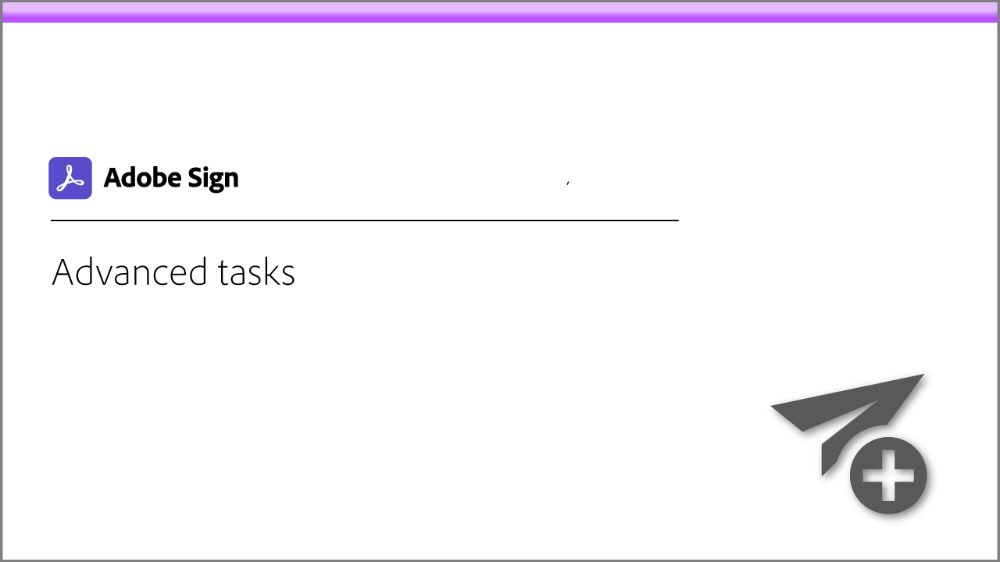
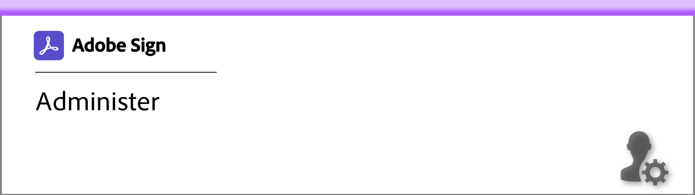
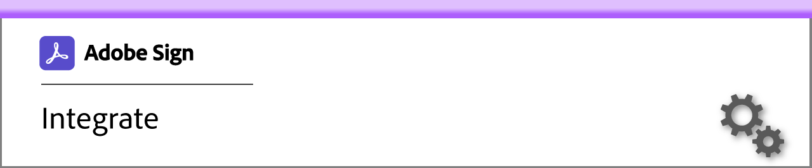
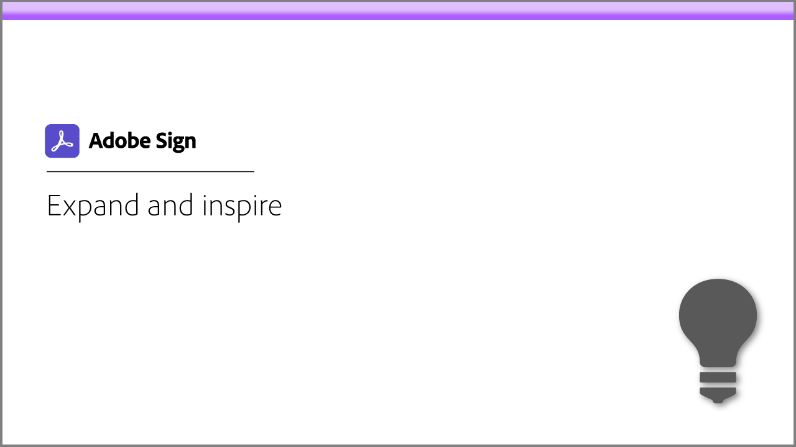
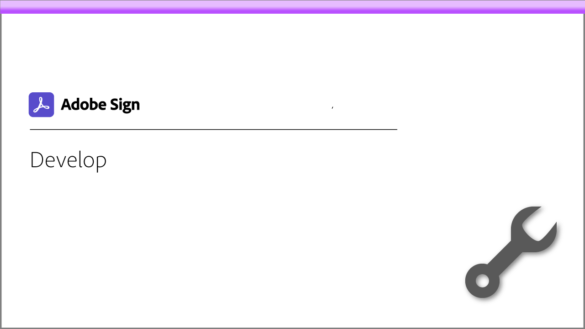
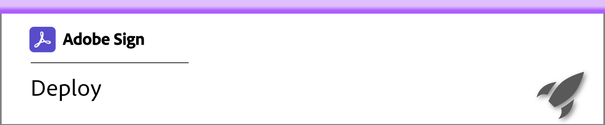
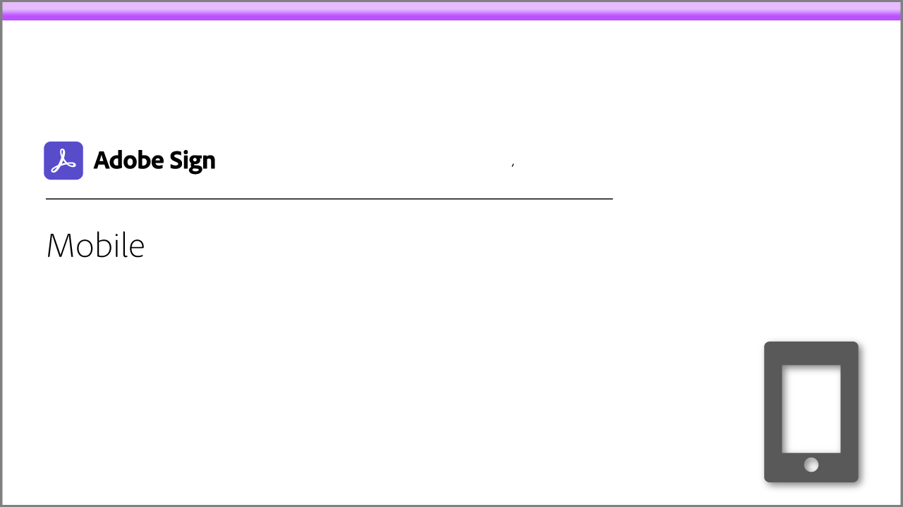

# Adobe Sign Learning Hub

Welcome to the Adobe Sign Learning Hub. You'll find a wide range of learning experiences focused on Adobe Sign. Our tutorials, webinars, and use cases are designed to quickly bring both beginners and administrators up-to-speed on Adobe Sign.

## Learning paths

<table>
<tr>
  <td>
    
    

    <a href="sign-beginner-tutorials/beginner-users-overview.md"><strong>Getting Started</strong></a>
    

    <em>Get up-to-speed on how to send, sign, and track documents</em>
     
  </td>
  <td>
    
    

    <a href="sign-advanced-users/advanced-users-overview.md"><strong>Advanced Tasks</strong></a>
    

    <em>Go beyond the basics with specific tasks and automation</em>
     
  <td>
    
    

    <a href="intro-admin-overview.md"><strong>Administer</strong></a>
    

    <em>Basic to advanced set up tips for your organization</em>
     
  </td>
</tr>
<tr>
  <td>
    
    

    <a href="integrations/integrations-overview.md"><strong>Integrate</strong></a>
    

    <em>Add Adobe Sign directly inside other applications your organization already uses</em>
     
  </td>
  <td>
    
    

    <a href="sign-usecase/expand-inspire-overview.md"><strong>Expand and Inspire</strong></a>
    

    <em>Explore real-world use cases and recipes redefining what's possible with e-signatures</em>
     
  <td>
    
    

    <a href="develop-overview.md"><strong>Develop</strong></a>
    

    <em>Get development resources on Adobe Sign I/O</em>
     
  </td>
</tr>
<tr>
  <td>
    
    

    <a href="deploy-overview.md"><strong>Deploy</strong></a>
    

    <em>Insight and best practices for deploying Adobe Sign within your organization</em>
     
  </td>
  <td>
    
    

    <a href="mobile-overview.md"><strong>Mobile</strong></a>
    

    <em>Send, track, and get real-time updates on your mobile device</em>
     
  <td>
   
    

     
  </td>
</tr>
</table>

