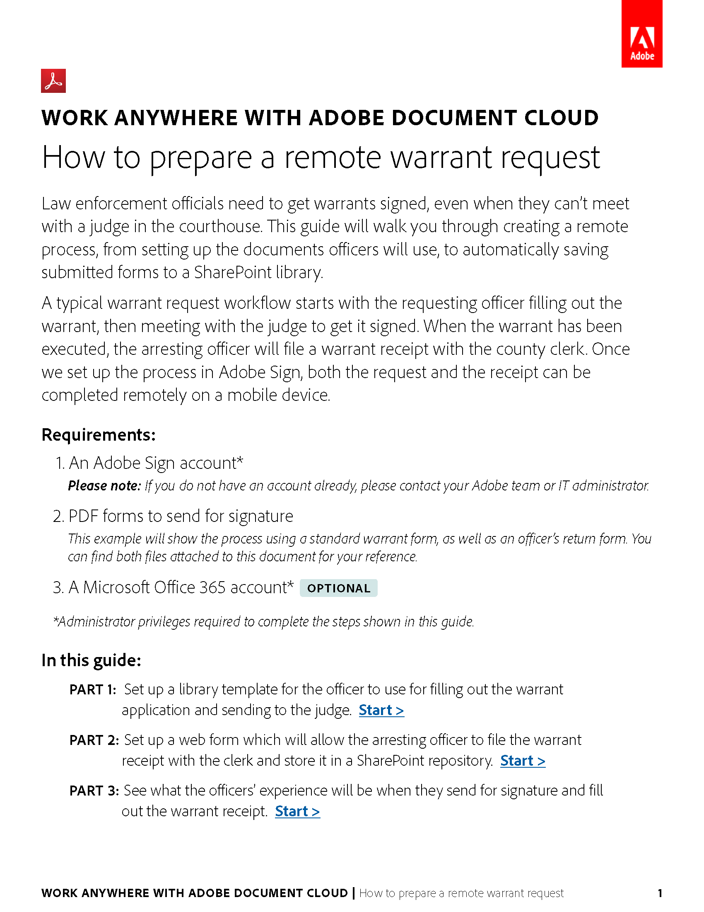

# Recipes

Download the PDF recipes for these e-signature use cases.

<table>
<tr>
  <td>
    
    

    <a href="assets/UseCaseRecipe-EN-Remote-Warrant-Request.pdf"><strong>Remote Warrant Request</strong></a>
    

    <em>Use e-signatures and web conferencing together to reduce the time it takes to request and secure warrants from judges.</em>
     
  </td>
  <td>
    
    

     
  </td>
  <td>
    
    

     
  </td>
</tr>
</table>
