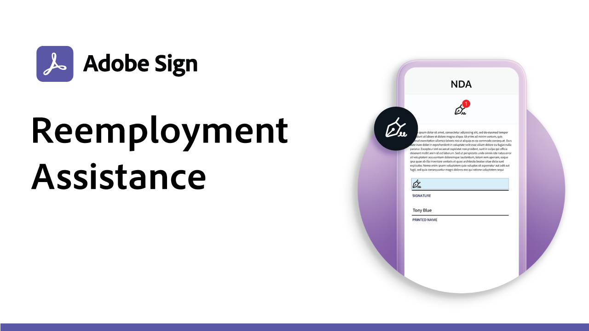
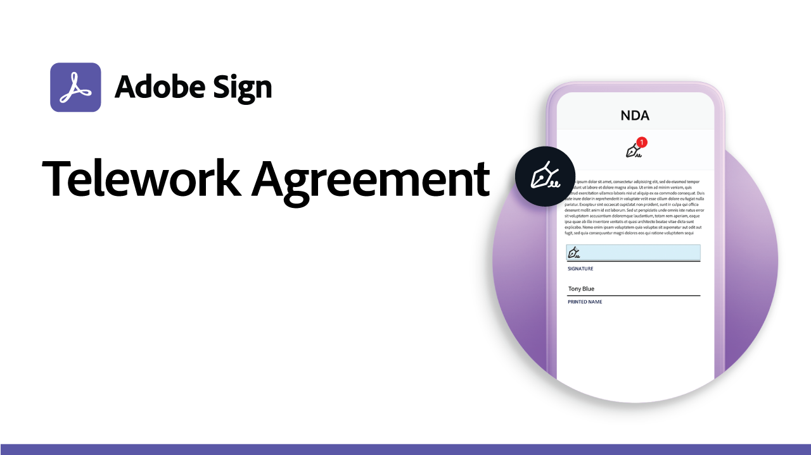
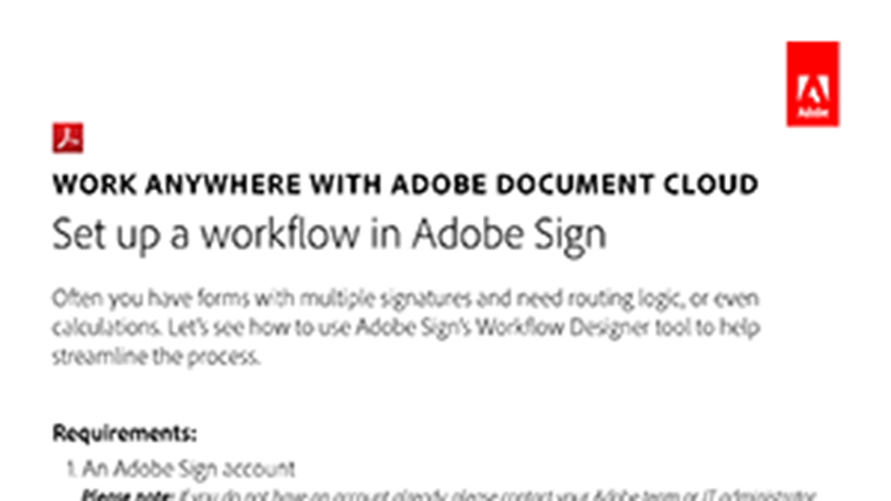
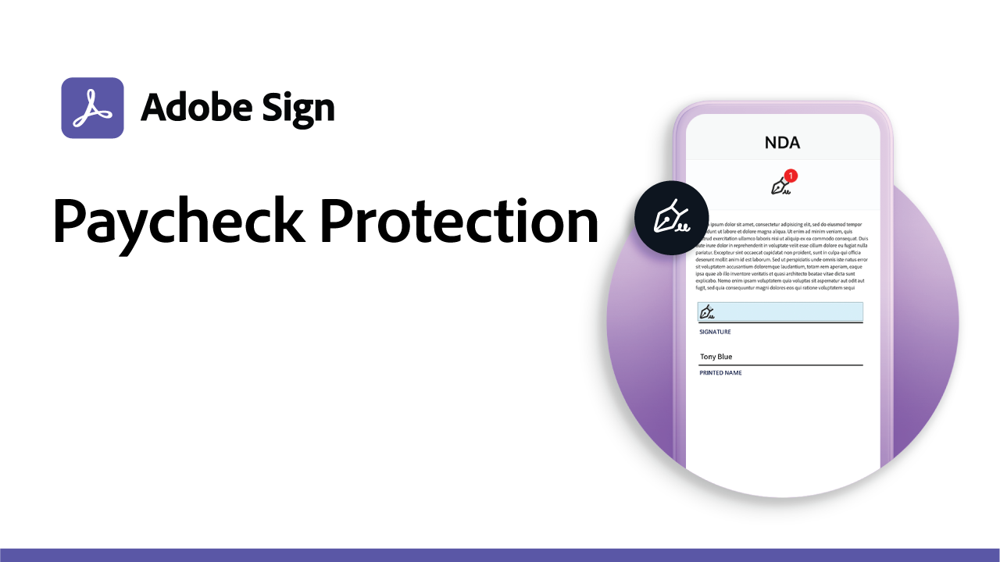
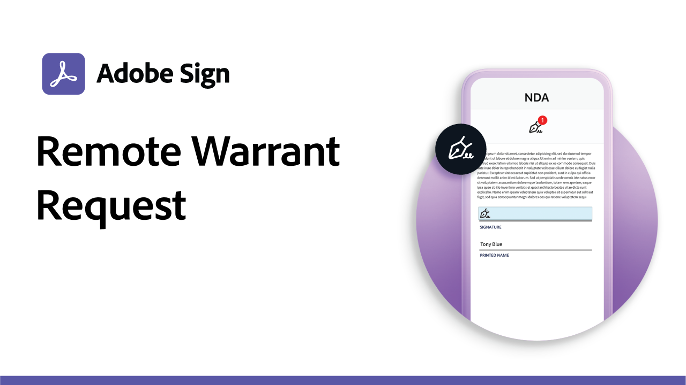

# Recipes

Download a PDF recipe or click to view how to set up these e-signature use cases.

<table>
<tr>
  <td>
    
    

    <a href="assets/UseCaseRecipe-EN-CreatingWebForms.pdf"><strong>Business Grants and Loans</strong></a>
    

    <em>Provide fast assistance to businesses by providing self-serve access to grant, loan, and tax deferral request forms.</em>
     
  </td> 
  <td>
    
    

    <a href="assets/UseCaseRecipe-EN-UsingMegaSign.pdf"><strong>Telework Agreement</strong></a>
    

    <em>Efficiently collect signatures from all your employees on telework agreements, policy updates, and more.</em>
     
  </td>
  <td>
    
    

    <a href="assets/UseCaseRecipe-EN-UsingWorkflowDesigner.pdf"><strong>Contracts and Requisition Forms</strong></a>
    

    <em>Quickly replace paper processing with compliant digital workflows, complete with audit reports.</em>
     
  </td>
</tr>
<tr>
  <td>
    
    

    <a href="assets/UseCaseRecipe-EN-CreatingWebForms-Reemployment.pdf"><strong>Reemployment Assistance</strong></a>
    

    <em>Help citizens get the help they need without standing in line with all-digital application forms that can go live in days.</em>
     
  </td>
  <td>
    
    

    <a href="https://acrobatusers.com/paycheck-protection-program-resource-hub/walkthrough/"><strong>Paycheck Protection</strong></a>
    

    <em>See how you can use Adobe Sign to convert the Payment Protection Program form into an online interactive form.</em>
     
  </td>
  <td>
    
    

    <a href="assets/UseCaseRecipe-EN-Remote-Warrant-Request.pdf"><strong>Remote Warrant Request</strong></a>
    

    <em>Use e-signatures and web conferencing together to reduce the time it takes to request and secure warrants from judges.</em>
     
  </td>
</tr>
</table>