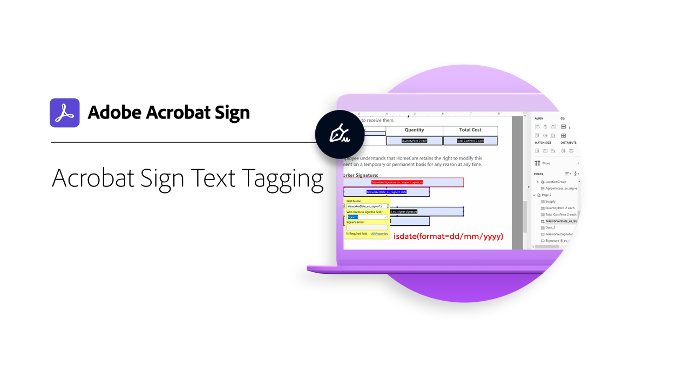

# Adobe Sign Text Tagging

In this recorded webinar with Q&A, you'll learn how to build Adobe Sign form fields with text tagging using Adobe Acrobat DC. Text tagging significantly reduces the time it takes to build and revise documents with many form fields. Individuals sending documents don't need to place individual fields on every document they send out—-another significant time saver. Other benefits include form field validation (accurate and error free data collection) and professional form design consistency.

[Watch Session](https://event.on24.com/wcc/r/2338276/415BE4603F60A61A546C0A91528B444F)