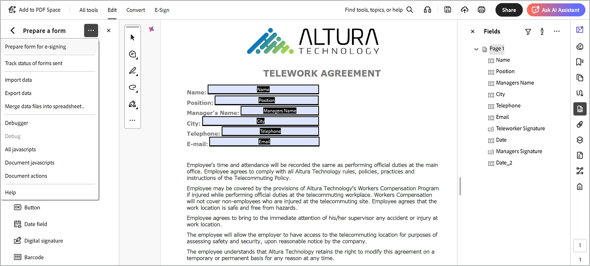

# Acrobat Sign Text Tagging

Learn how to build Acrobat Sign form fields with text tagging. Text tags can be added directly to authoring tools like Microsoft Word, Adobe InDesign, or if you have a PDF — in Acrobat. They can significantly reduce the effort involved in preparing documents used in Acrobat Sign. After uploading a tagged document in Acrobat Sign, it can be set up as a template — eliminating the need for anyone to add fields to their documents.

## Get started

Text tags are uniquely formatted pieces of text placed anywhere within a document that are
automatically recognized as fields when uploaded to Acrobat Sign.

    

Text tags can be added directly to authoring tools like Microsoft Word, Adobe InDesign, or if
you have a PDF — Acrobat. Text tags significantly reduce the effort involved in preparing
documents used in Acrobat Sign.

## Add tags in Microsoft Word

To add text tags to a Microsoft Word document, check out this [video tutorial](text-tagging-word.md).

## Add tags in Acrobat

Adobe Acrobat has a robust drag-and-drop form authoring environment. Applying text tags in Acrobat allows you to tap into additional capability available in Acrobat Sign. 

1. Open your form in Acrobat.

1. Select **[!UICONTROL Prepare a Form]** from the **[!UICONTROL All Tools]** panel.

1. Select **[!UICONTROL Create form]**.

1. Select **[!UICONTROL Prepare form for e-signing]** from the **[!UICONTROL Options]** panel dropdown.

    

1. Select **[!UICONTROL Next]** to confirm.

    

1. Double click on a field to bring up the **[!UICONTROL Properties]** dialog.

    Use the syntax detailed in [Acrobat Sign Text Tag Guide](https://helpx.adobe.com/sign/using/text-tag.html) to change the form field name.

1. For example, you can type *OInt_es_:signer1:optinitials* in the field name to make an initial field optional.

    

    Text Tags are added to the form field name, and unlike the syntax you would use in Microsoft Word (or other authoring tools), the curly brackets are not included.

    Text tags can also be added in the Fields panel by simply renaming the form field.

    

1. Save and close the file.

1. Upload the file in Acrobat Sign and create a reusable template as outlined in the next section.

## Create a reusable template

After creating a tagged document, set it up as a reusable template — eliminating the need for anyone to add fields to their documents.

To create a reusable template, check out this [video tutorial](../sign-advanced-users/create-a-template.md).
