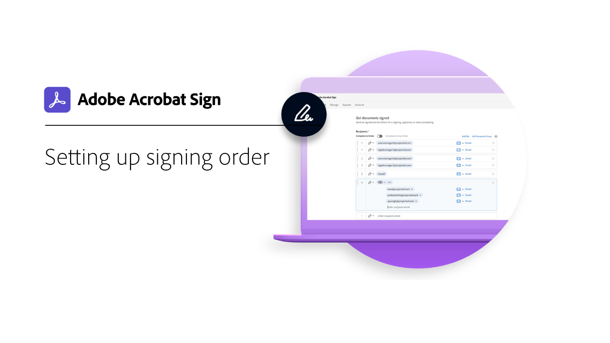
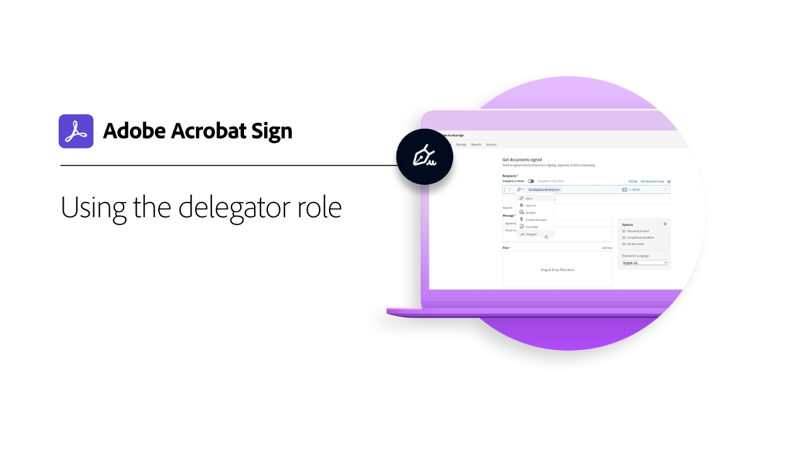
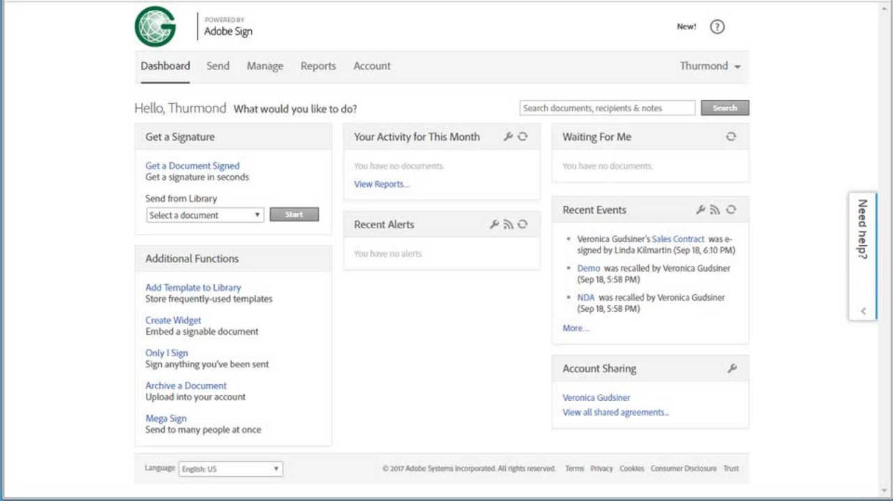

# Advanced tasks overview

Learn how to send a document out for signature to 100s of recipients at once, set up a signature-ready document for your website, manage signature transactions, and create and manage document templates. These tutorials are for anyone who's already familiar with the basics of sending and requesting signatures, and wants to learn more ways Adobe Sign can work for them.

## Sending

<table style="table-layout:fixed">
<tr>
  <td>
    
    

    <a href="setting-up-routing.md"><strong>Setting up Routing Order</strong></a>
    

     
    <em>Setup the routing order for multiple signers</em>
  </td>
  <td>
      
    

    <a href="delegate-signature.md"><strong>Delegating to Someone Else</strong></a>
    

     
    <em>Use the delegator role to send a document to an intermediary who can then route the document for signature</em>
  </td>
  <td>
    
    

    <a href="add-an-approver.md"><strong>Adding an Approver</strong></a>
    

     
    <em>Add an approver role to your contract approval process</em>
  </td>
</tr>
<tr>
  <td>
    
    

    <a href="megasign.md"><strong>Collecting Signatures in Bulk</strong></a>
    

     
    <em>Collect hundreds of signatures at once for any document in just a few short steps</em>
  </td>
  <td>
    
    

    <a href="webform.md"><strong>Setting Up a Web Form</strong></a>
    

     
    <em>Create a document that can be signed electronically directly on your website</em>
  </td> 
  <td>
    
    

    <a href="adobe-sign-text-tagging.md"><strong>Adobe Sign Text Tagging</strong></a>
    

     
    <em>Build Adobe Sign form fields by text tagging using Adobe Acrobat DC</em>
  </td> 
</table>

## Managing

<table style="table-layout:fixed">
<tr>
  <td>
    
    

    <a href="edit-a-template.md"><strong>Managing Document Templates</strong></a>
    

     
    <em>Edit or delete a template from your library</em>
  </td>  
  <td>
    
    

     
  </td>
  <td>
    
    

     
  </td>
</tr>
</table>
