# Advanced tasks overview

Learn how to send out a document for signature to 100s of recipients at once, set up a signature-ready document for your website, manage signature transactions, and create and manage document templates. These tutorials are for anyone who's already familiar with the basics of sending and requesting signatures, and wants to learn more ways Acrobat Sign can work for them.

## What's new

>[!BEGINTABS]

>[!TAB Build a custom workflow]

>[!TAB Send in Bulk]

Learn how to [collect thousands](megasign.md) of signatures at once for any document in just a few short steps.

>[!TAB Authentication methods in Acrobat Sign]

Learn about the range of methods available in Acrobat Sign to [authenticate](authentication-methods.md) the identity of someone signing a document.

>[!ENDTABS]

## Send

<table style="table-layout:fixed">
<tr>
  <td>
    <a href="setting-up-routing.md">
      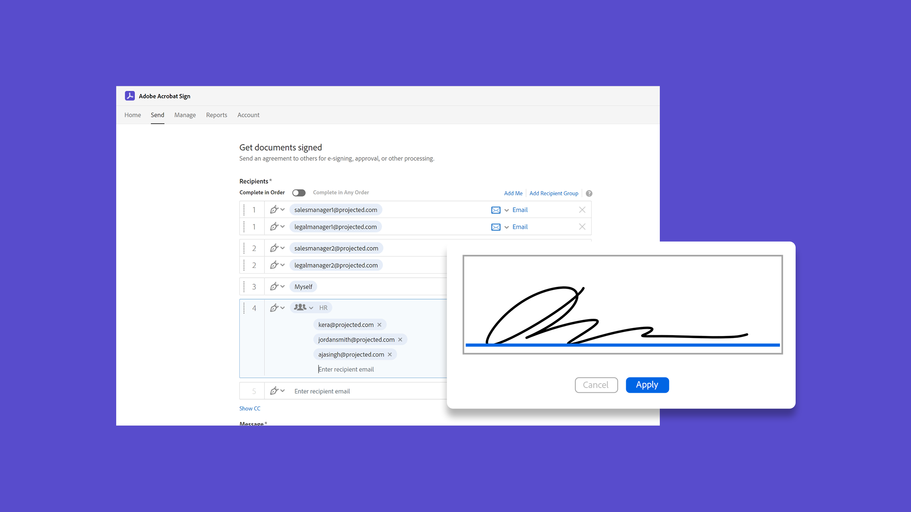
    </a>
    

    <a href="setting-up-routing.md"><strong>Setting up signing order</strong></a>
    

    <em>Set up the signing order for multiple signers</em>
     
  </td>
  <td>
    <a href="delegate-signature.md">
      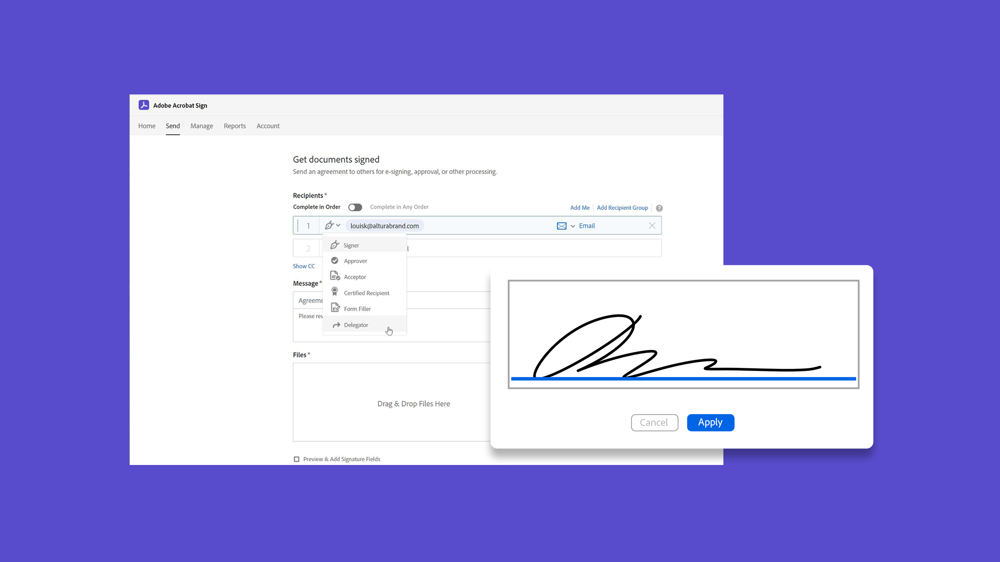
    </a>  
    

    <a href="delegate-signature.md"><strong>Using the delegator role</strong></a>
    

    <em>Use the delegator role to send a document to an intermediary who can then route the document for signature</em>
     
  </td>
  <td>
    <a href="add-an-approver.md">
      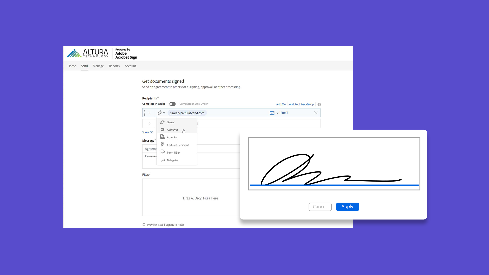
    </a>
    

    <a href="add-an-approver.md"><strong>Using the approver role</strong></a>
    

    <em>Add an approver role to your contract approval process</em>
     
  </td>
  <td>
      <a href="megasign.md">
        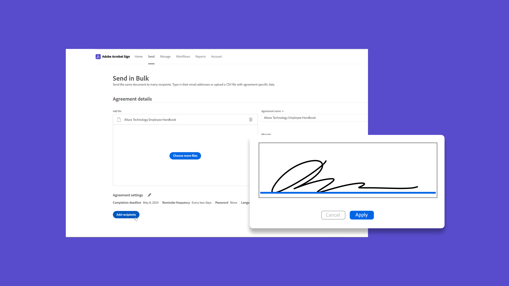
      </a>
      

      <a href="megasign.md"><strong>Send in Bulk</strong></a>
      

      <em>Collect hundreds of signatures at once for any document in just a few short steps</em>
       
  </td>
</tr>
<tr>
  <td>
      
      

      <a href="webform.md"><strong>Creating a web form</strong></a>
      

      <em>Learn how to create a document that can be signed electronically directly on your website</em>
       
  </td>
  <td>
      <a href="building-a-custom-workflow.md">
        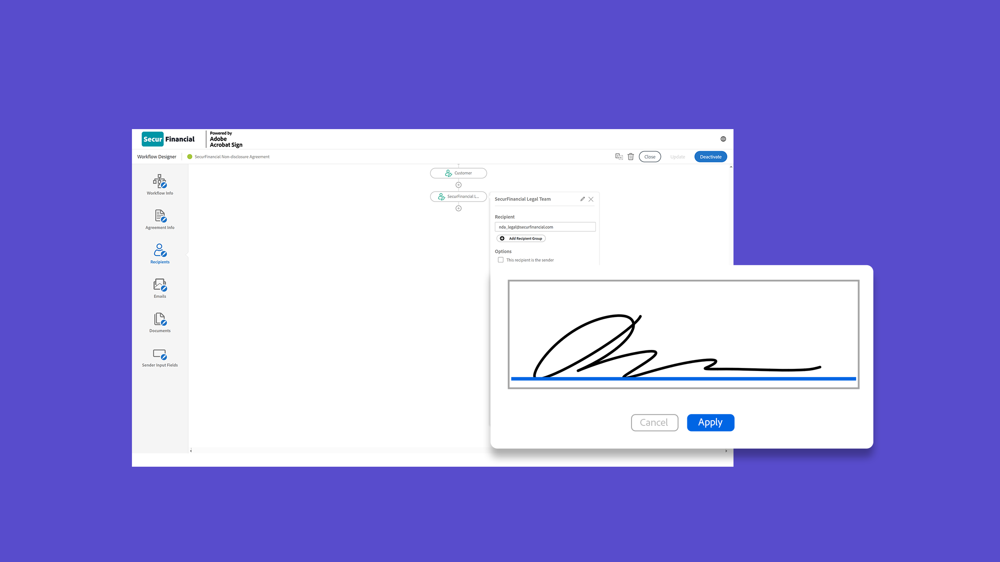
      </a>
      

      <a href="building-a-custom-workflow.md"><strong>Build a custom workflow</strong></a>
      

      <em>Learn how to create and use custom workflows to speed up the process of creating and sending an agreement</em>
       
  </td>
  <td>
      <a href="set-up-online-payments.md">
        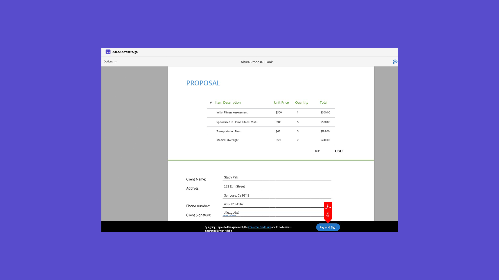
      </a>
      

      <a href="set-up-online-payments.md"><strong>Set up online payments</strong></a>
      

      <em>Learn how to set up and accept online payments in your documents</em>
       
  </td>
  <td>
      <a href="authentication-methods.md">
        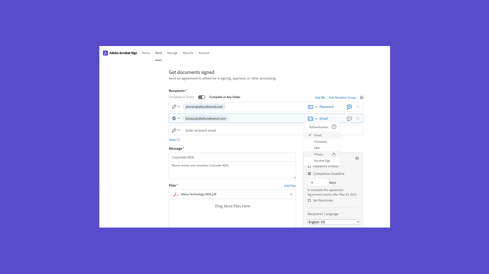
      </a>
      

      <a href="authentication-methods.md"><strong>Authentication methods in Acrobat Sign</strong></a>
      

      <em>Learn about the range of identity authentications methods available in Acrobat Sign</em>
       
  </td>
</tr>
<tr>
  <td>
      <a href="adobe-sign-text-tagging.md">
        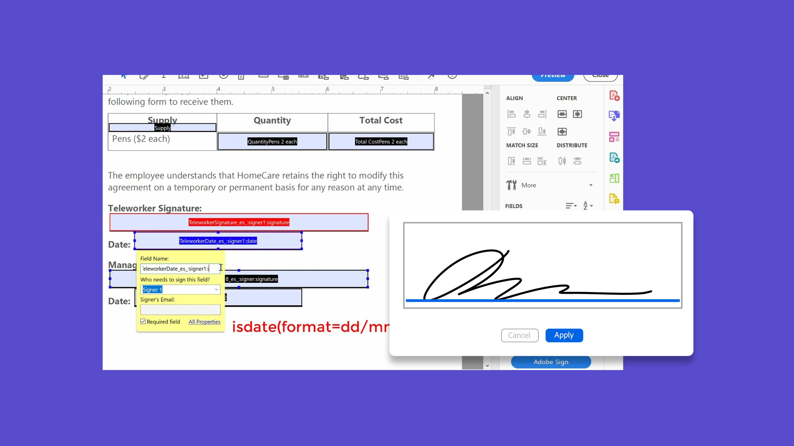
    </a>
      

      <a href="adobe-sign-text-tagging.md"><strong>Acrobat Sign Text Tagging</strong></a>
      

      <em>Build Acrobat Sign form fields by text tagging using Adobe Acrobat</em>
       
    </td>
  <td>
    <a href="text-tagging-word.md">
      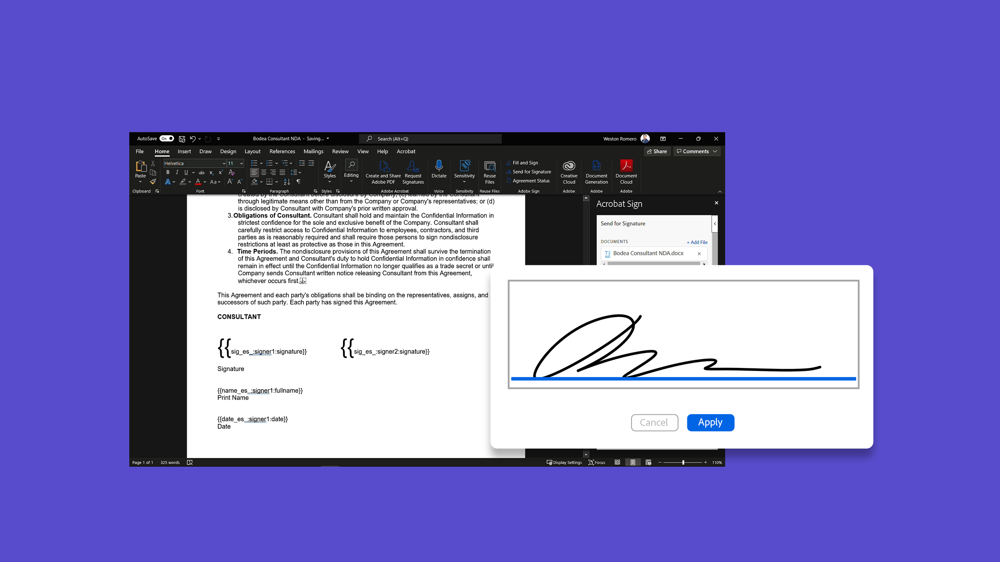
  </a>
    

    <a href="text-tagging-word.md"><strong>Using Text Tagging in [!DNL Microsoft Word]</strong></a>
    

    <em>Learn how to create a reusable document template by adding Acrobat Sign Text Tags in [!DNL Microsoft Word]</em>
     
  </td>
  <td>
    
    

     
  </td>
  <td>
    
    

     
  </td>
</tr>
</table>

## Manage

<table style="table-layout:fixed">
<tr>
<td>
    <a href="creating-a-report.md">
      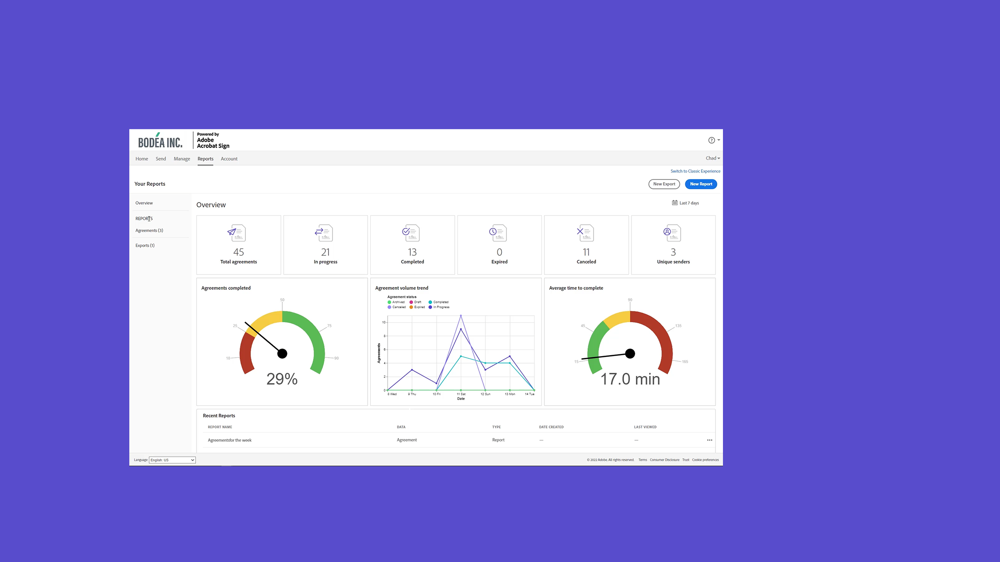
    </a>
    

    <a href="creating-a-report.md"><strong>Reporting and transaction usage</strong></a>
    

    <em>Learn how to generate reports and track transaction usage</em>
     
  </td>
  <td>
    <a href="edit-a-template.md">
      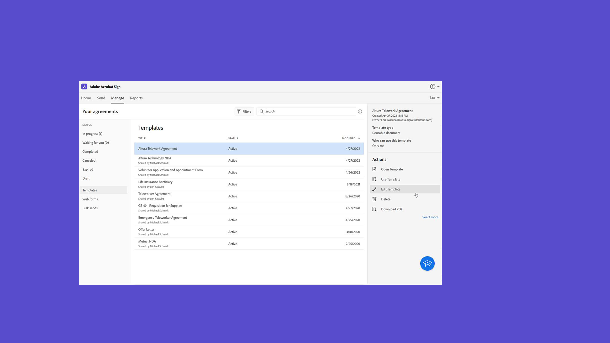
    </a>
    

    <a href="edit-a-template.md"><strong>Manage document templates</strong></a>
    

    <em>Edit or delete a template from your library</em>
     
  </td>
  <td>
    <a href="modify-webform.md">
      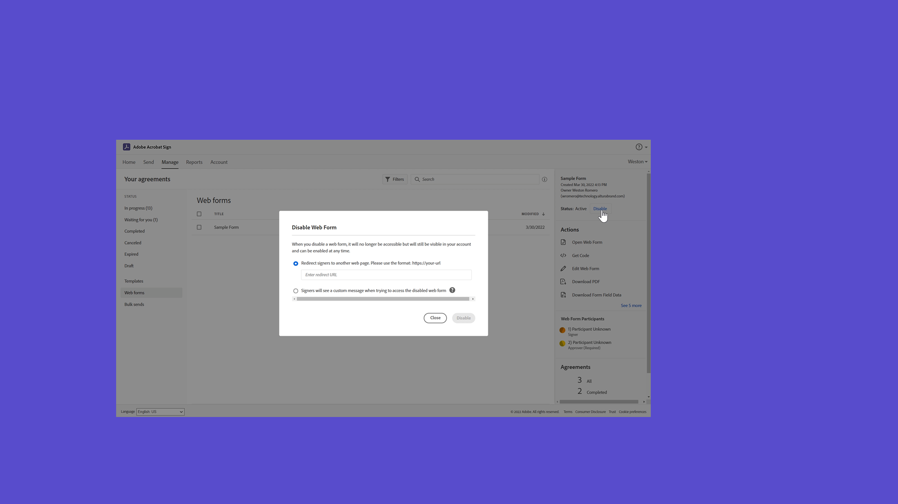
    </a>
    

    <a href="modify-webform.md"><strong>Modify an existing web form</strong></a>
    

    <em>Learn how to disable, edit, and re-enable an existing web form</em>
     
  </td>  
  <td>
    <a href="manage-webform-data.md">
      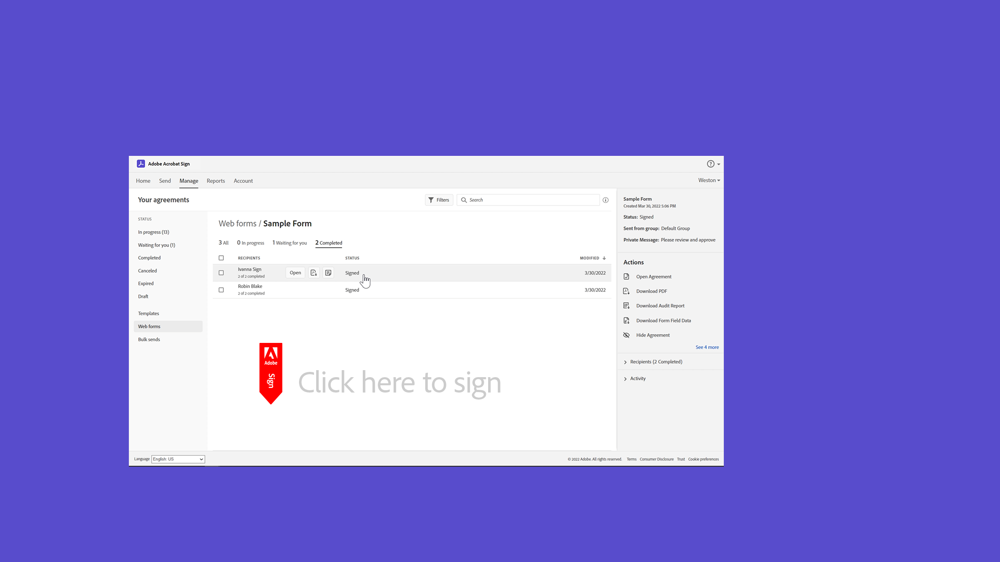
    </a>
    

    <a href="manage-webform-data.md"><strong>Managing web form data</strong></a>
    

    <em>Learn how to track, manage, and export data from a web form</em>
     
  </td>  
</tr>
<tr>
  <td>
      
      

      <a href="manage-form-data.md"><strong>Manage form data</strong></a>
      

      <em>Learn how to consolidate form data from your documents</em>
       
    </td>
    <td>
    
    

     
  </td>
  <td>
    
    

     
  </td>
  <td>
    
    

     
  </td>
</tr>
</table>