# Getting started overview

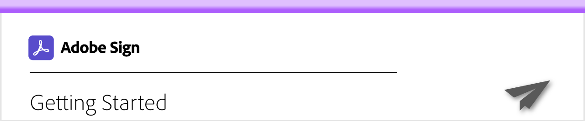

Get up-to-speed on how to send, sign, and track documents with these brief step-by-step tutorials. Get a quick tour of Acrobat Sign and then jump into sending a document to one or more people. This content is designed to ease you into e-signature workflows.

## Sending

<table style="table-layout:fixed">
<tr>
 <td>
    <a href="quick-tour.md">
      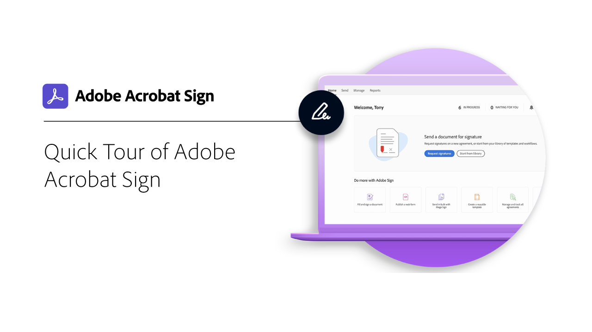
    </a>
    

    <a href="quick-tour.md"><strong>Quick tour of Acrobat Sign</strong></a>
    

    <em>Take a quick tour of the Acrobat Sign interface to get up and running</em>
     
  </td>
  <td>
    <a href="send-to-single-recipient.md">
      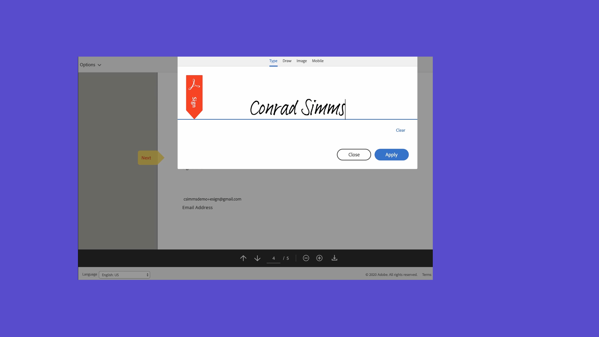
    </a>
    

    <a href="send-to-single-recipient.md"><strong>Sending to a single recipient</strong></a>
    

    <em>Jump in and learn how easy it is send a document out for signature</em>
     
  </td>
  <td>
    <a href="send-to-multiple-recipients.md">
      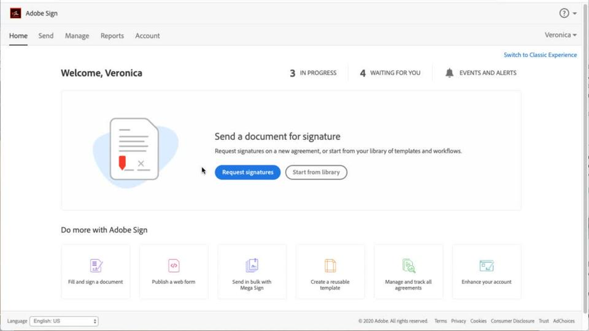
    </a>
    

    <a href="send-to-multiple-recipients.md"><strong>Sending to multiple recipients</strong></a>
    

    <em>Send a document for e-signature to more than one person in exactly the order you want</em>
     
  </td>
</tr>
<tr>
  <td>
    <a href="new-sender.md">
      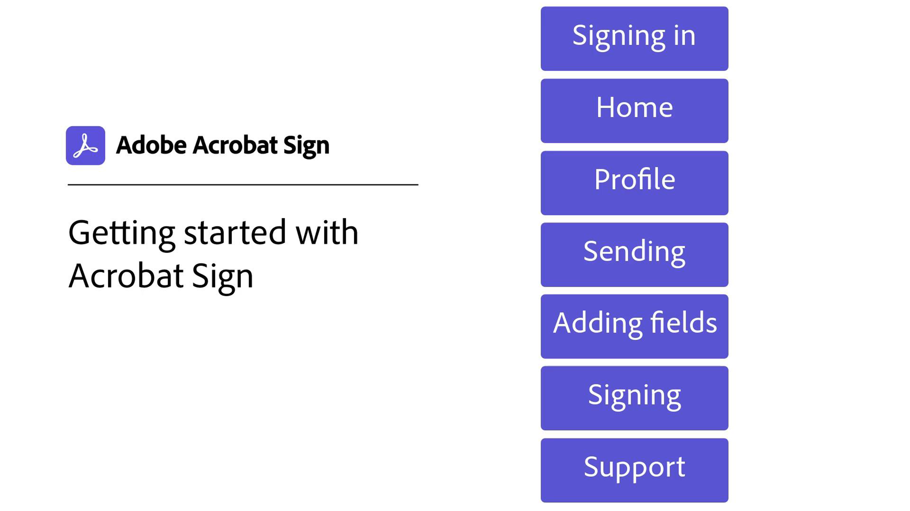
    </a>
    

    <a href="new-sender.md"><strong>Getting started with Acrobat Sign for new senders</strong></a>
    

    <em>This comprehensive tutorial is a great place to start for new senders in Acrobat Sign</em>
     
  </td>
  <td>
    
    

     
  </td>
  <td>
    
    

     
  </td>
</tr>
</table>

## Signing

<table style="table-layout:fixed">
<tr>
  <td>
    <a href="electronically-sign-a-document.md">
      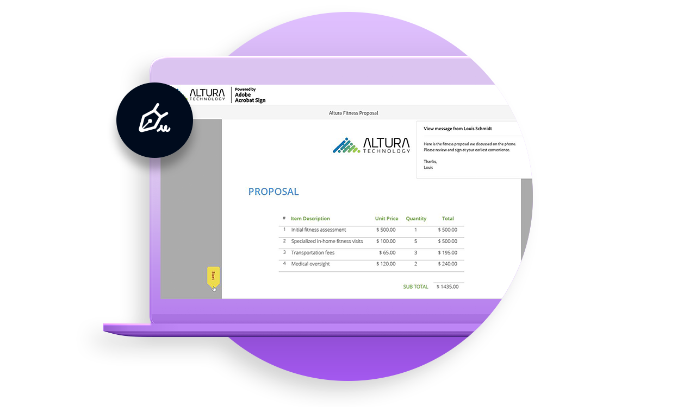
    </a>
    

    <a href="electronically-sign-a-document.md"><strong>Electronically signing a document</strong></a>
    

    <em>Learn how easy it is to sign a document that has been sent to you with Acrobat Sign</em>
     
  </td>
  <td>
    <a href="fill-and-sign.md">
      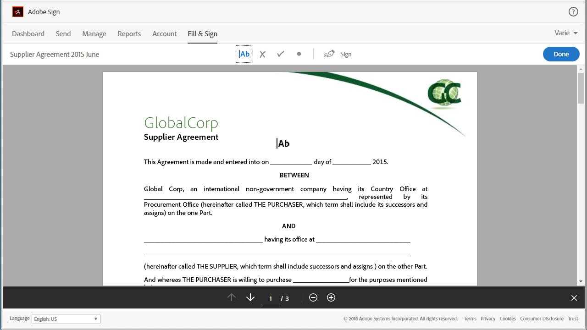
    </a>
    

    <a href="fill-and-sign.md"><strong>Filling and signing a document</strong></a>
    

    <em>Fill in forms and add your electronic signature to documents</em>
     
  </td>
  <td>
    <a href="sign-in-person.md">
      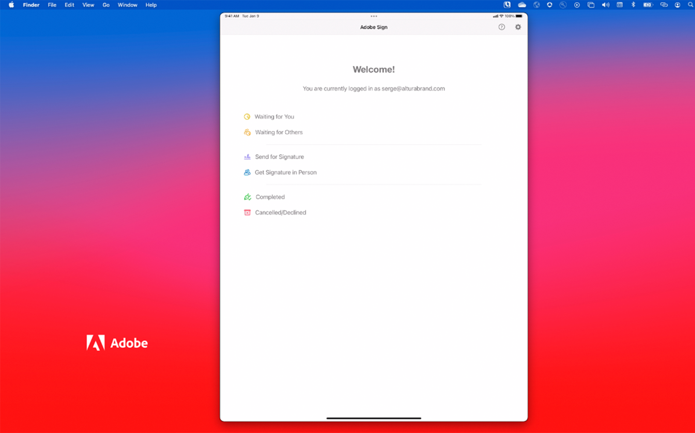
    </a>
    

    <a href="sign-in-person.md"><strong>Getting a signature in person</strong></a>
    

    <em>Get someone else's signature in person using the Acrobat Sign mobile app</em>
     
  </td>
</tr>
<tr>
  <td>
    <a href="sign-with-a-digital-signature.md">
      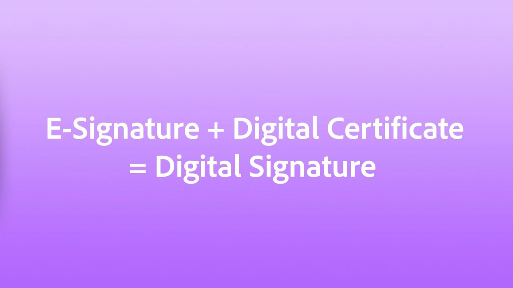
    </a>
    

    <a href="sign-with-a-digital-signature.md"><strong>What's a digital signature</strong></a>
    

    <em>Learn about certificate-based digital signatures</em>
     
  </td>
  <td>
    <a href="sign-with-a-stamp.md">
      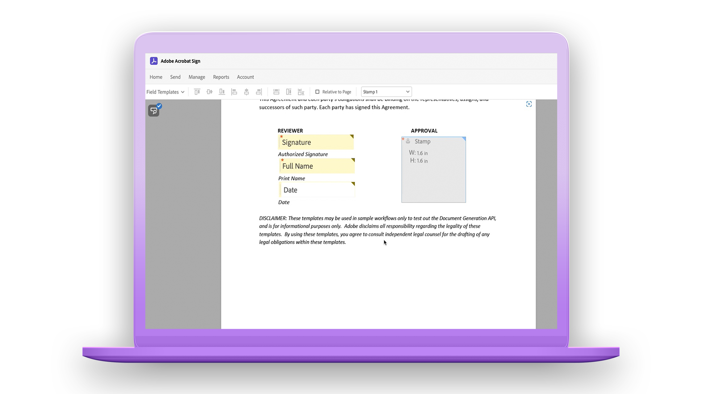
    </a>
    

    <a href="sign-with-a-stamp.md"><strong>Signing using a stamp</strong></a>
    

    <em>Use stamps to mark a document approved or completed</em>
      
  </td> 
  <td>
    
    

     
  </td>
</tr>  
</table>

## Managing

<table style="table-layout:fixed">
<tr>
  <td>
    <a href="manage-and-track.md">
      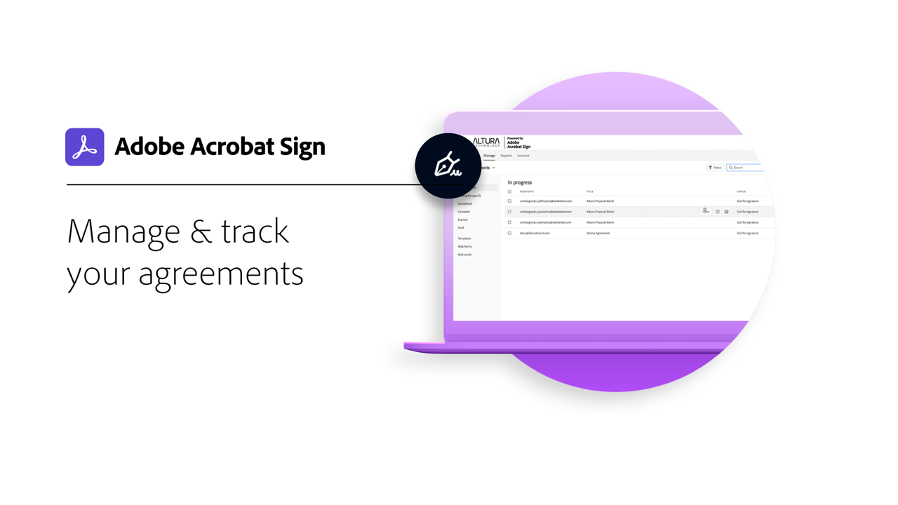
    </a>
    

    <a href="manage-and-track.md"><strong>Manage & track your agreements</strong></a>
    

    <em>Learn how to manage and track agreements sent for signature</em>
     
  </td>
  <td>
    
    

    <a href="../sign-advanced-users/create-a-template.md"><strong>Creating a document template</strong></a>
    

    <em>Create a reusable document template to provide speed and consistency for your organization</em>
     
  </td>
  <td>
    <a href="modify-in-flight.md">
      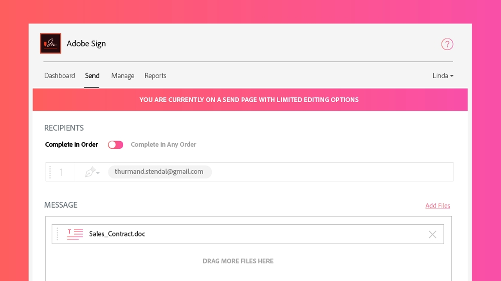
    </a>
    

    <a href="modify-in-flight.md"><strong>Modifying a document already sent for signature</strong></a>
    

     
    <em>Modify the workflow for a document that's already in progress</em>
  </td>
</tr>
</table>
