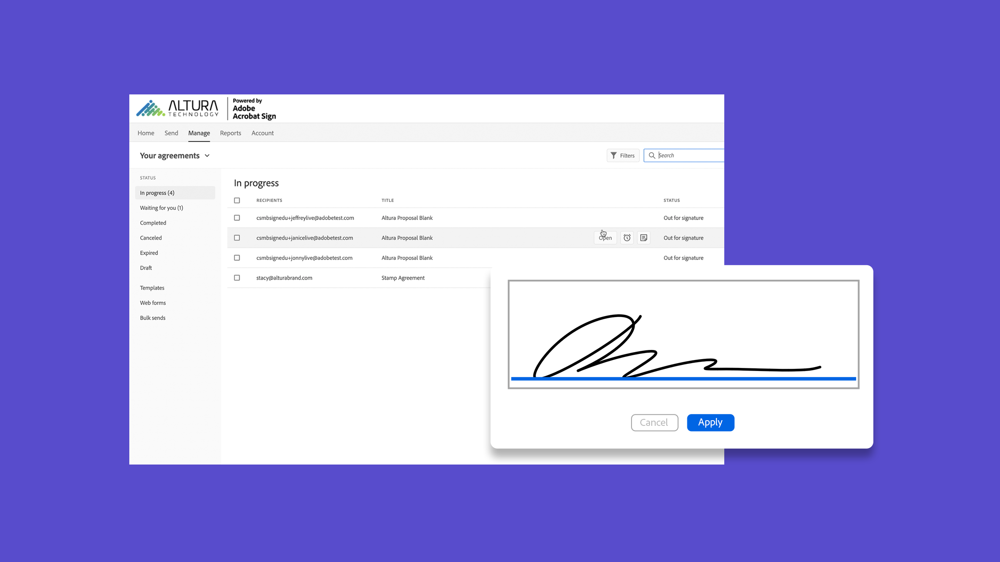

# Getting started overview

Get up-to-speed on how to send, sign, and track documents with these brief step-by-step tutorials. Get a quick tour of Acrobat Sign and then jump into sending a document to one or more people. This content is designed to ease you into e-signature workflows.

## What's new

>[!BEGINTABS]

>[!TAB Create a reusable template]

Learn how to create a [reusable document template](../sign-advanced-users/create-a-template.md).

>[!TAB Configure send options]

Learn how to [configure various options](sending-options.md) when sending a document out for signature.

>[!TAB Send to multiple signers]

Learn how to send a document for e-signature to [more than one person](send-to-multiple-recipients.md) in exactly the order you want.

>[!TAB Send a document to a single signer]

Jump in and learn how easy it is to [send a document out for signature](send-to-single-recipient.md).

>[!TAB Get started with Acrobat Sign]

 Are you new to using Acrobat Sign? This [tutorial](new-sender.md) is a great place to start.

>[!ENDTABS]

## Send

<table style="table-layout:fixed">
<tr>
  <td>
    
    

    <a href="new-sender.md"><strong>Get started with Acrobat Sign</strong></a>
    

    This tutorial is a great place to start for new users in Acrobat Sign
     
  </td>
 <td>
    
    

    <a href="quick-tour.md"><strong>Workspace basics</strong></a>
    

    Take a quick tour of the Acrobat Sign workspace to get up and running
     
  </td>
  <td>
    
    

    <a href="send-to-single-recipient.md"><strong>Send a document to a single signer</strong></a>
    

    Jump in and learn how easy it is to send a document out for signature
     
  </td>
  <td>
    
    

    <a href="send-to-multiple-recipients.md"><strong>Send to multiple signers</strong></a>
    

    Send a document for e-signature to more than one person in exactly the order you want
     
  </td>
</tr>
<tr>
  <td>
    
    

    <a href="sending-options.md"><strong>Configure send options</strong></a>
    

    Learn how to configure various options when sending a document out for signature
     
  </td>
  <td>
    
    

    <a href="adding-fields.md"><strong>Adding fields to your documents</strong></a>
    

    Learn how to add different types of fields to your documents
     
  </td>
  <td>
    
    

    <a href="modify-in-flight.md"><strong>Modifying a document after sending</strong></a>
    

    Modify a document that's already in progress
     
  </td>
  <td>
    
    

    <a href="replace-signer.md"><strong>Replacing a signer</strong></a>
    

    Learn how to change the signer of a document that's already in progress
      
  </td>
</tr>
<tr>
  <td>
      
      

      <a href="set-deadlines-reminders.md"><strong>Set deadlines and reminders</strong></a>
      

      Learn how to send regular email reminders and deadlines to help get your documents signed quickly
       
    </td> 
  <td>
    
    

    <a href="../sign-advanced-users/create-a-template.md"><strong>Create a reusable template</strong></a>
    

    Create a reusable document template to provide speed and consistency for your organization
     
  </td>
    <td>
      
      

       
    </td>
    <td>
      
      

       
    </td>
</tr>
</table>

## Sign

<table style="table-layout:fixed">
<tr>
  <td>
    
    

    <a href="electronically-sign-a-document.md"><strong>Electronically signing a document</strong></a>
    

    Learn how easy it is to sign a document that is sent to you with Acrobat Sign
     
  </td>
  <td>
    
    

    <a href="fill-and-sign.md"><strong>Filling and signing a document</strong></a>
    

    Fill in forms and add your electronic signature to documents
     
  </td>
  <td>
    
    

    <a href="sign-in-person.md"><strong>Getting a signature in person</strong></a>
    

    Get someone else's signature in person using the Acrobat Sign mobile app
     
  </td>
  <td>
    
    

    <a href="delegate-signing.md"><strong>Delegate signing to someone else</strong></a>
    

    Learn how to delegate the signing of a document to someone else
     
  </td>
</tr>
<tr>
  <td>
    
    

    <a href="sign-with-a-digital-signature.md"><strong>What's a digital signature</strong></a>
    

    Learn about certificate-based digital signatures
     
  </td>
  <td>
    
    

    <a href="sign-with-a-stamp.md"><strong>Signing using a stamp</strong></a>
    

    Use stamps to mark a document approved or completed
      
  </td> 
 <td>
    
    

     
  </td>
  <td>
    
    

     
  </td>
</tr>  
</table>

## Manage

<table style="table-layout:fixed">
<tr>
  <td>
    
    

    <a href="manage-and-track.md"><strong>Manage & track your agreements</strong></a>
    

    Learn how to manage and track agreements sent for signature
     
  </td>
  <td>
    
    

     
  </td>
  <td>
    
    

     
  </td>
  <td>
    
    

     
  </td>
</tr>
</table>
