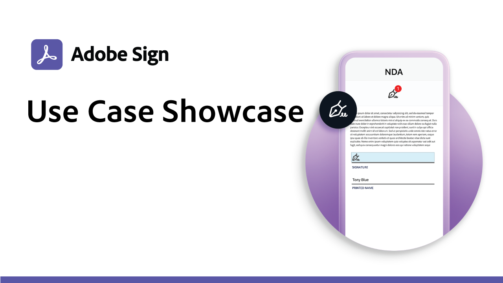

# Expand and inspire overview

Learn how you can transform your organization's e-signing experiences by exploring these real-world use cases and recipes.

<table style="table-layout:fixed">
<tr>
  <td>
    
    

    <a href="use-case-showcase.md"><strong>Use Case Showcase</strong></a>
     
    <em>Watch our live or recorded sessions introducing you to new Adobe Sign use cases and trends</em>
  </td>
  <td>
    
    

    <a href="recipes.md"><strong>Use Case Recipes</strong></a>
     
    <em>Download the resources you need to quickly deploy various e-signature workflows on your own</em>
  </td>
  <td>
    
    

    <a href="innovation-series.md"><strong>Innovation Series</strong></a>
     
    <em>Join us for a 30-minute live session each month discussing new product releases and integrations</em>
  </td>
</tr>
</table>