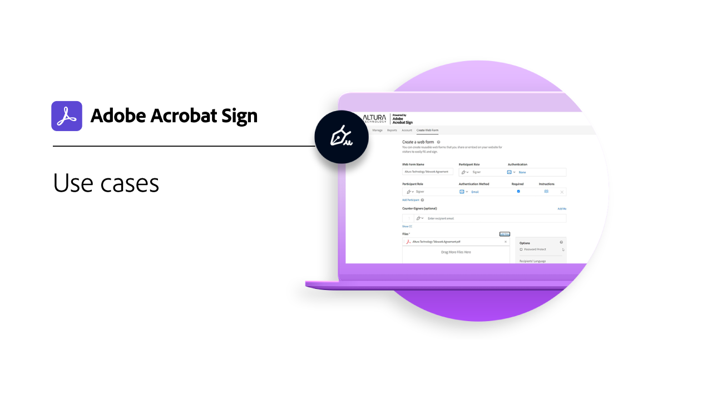

# Industries and departments overview

Learn how you can transform your organization's e-signing experiences by exploring these real-world industry and department use cases, recipes, and webinars.

<table style="table-layout:fixed">
<tr>
  <td>
    
    

    <a href="innovation-series.md"><strong>Skill Builder</strong></a>
    

    <em>Join us for a 30-minute Skill Builder to learn how to put your e-signatures to work—without adding any extra work to your day</em>
     
  </td>
  <td>
    
    

    <a href="recipes.md"><strong>Use cases</strong></a>
    

    <em>Explore how various organizations are using Acrobat Sign with these real-world use cases</em>
     
  </td>
 </td>
  <td>
    
    

     
  </td>
  <td>
    
    

     
  </td>
</tr>
</table>
