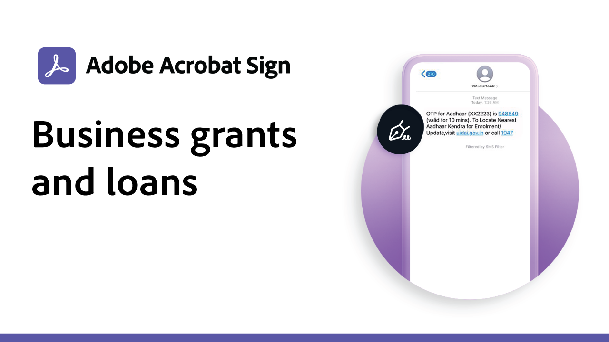
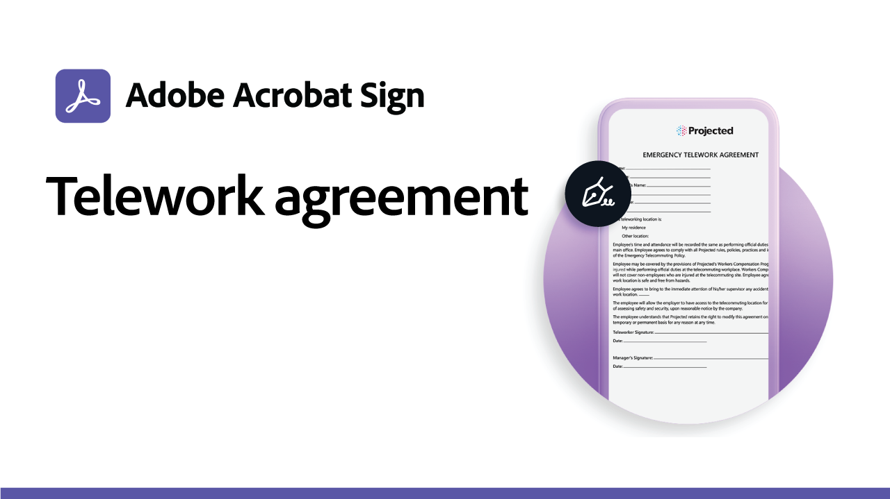
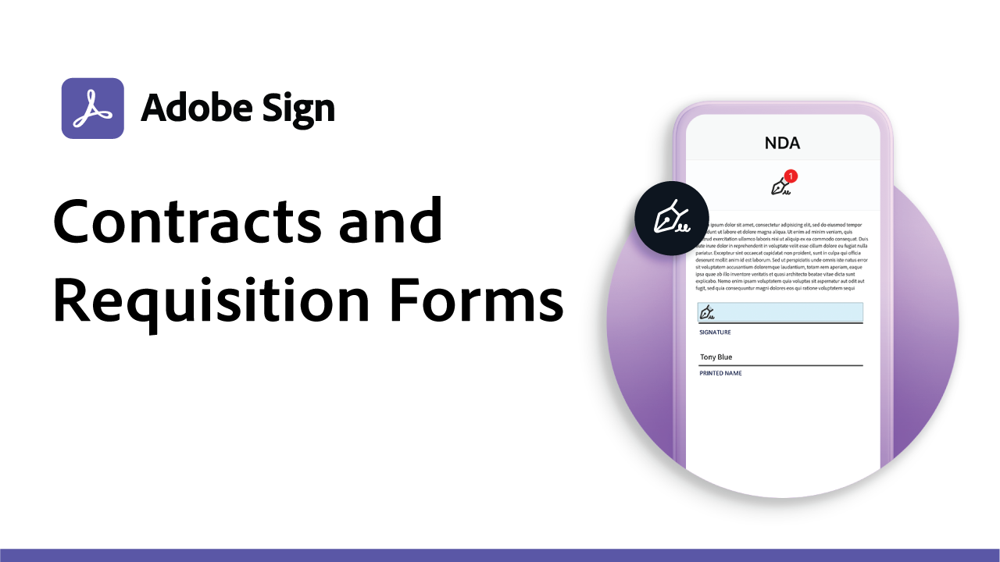
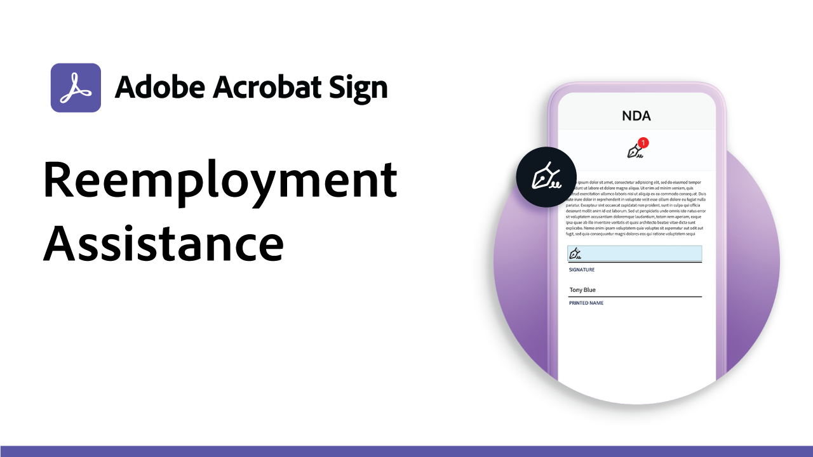
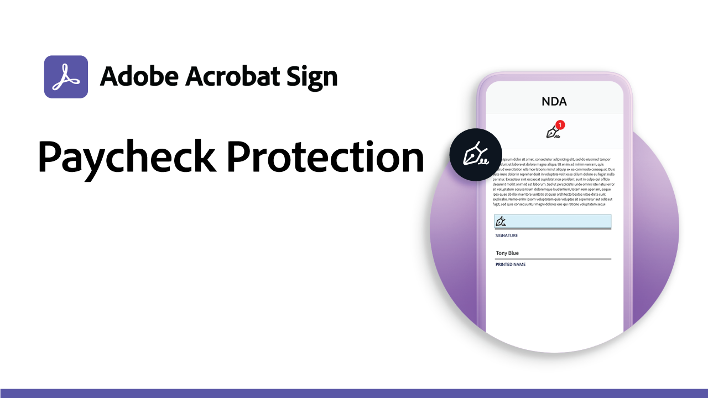
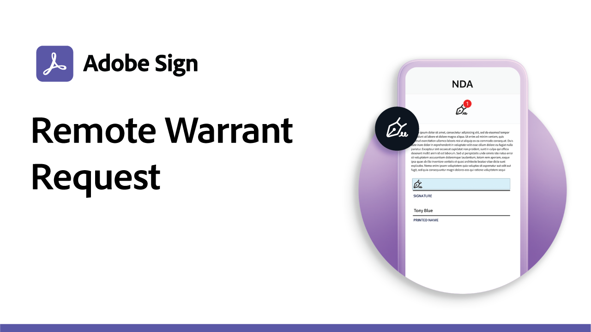
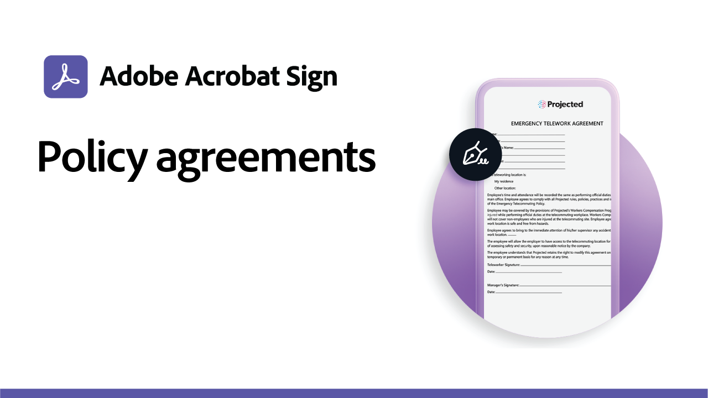

# Use case recipes

Speed up your organization's digital workflows with these government and commercial e-signature examples. Click to view a PDF with resources and details on how to set up these specific e-signature use cases.

## Government use cases

<table style="table-layout:fixed">
<tr>
  <td>
    
    

    <a href="usecasegovgrants.md"><strong>Business grants and loans</strong></a>
    

    <em>Provide fast assistance to businesses by providing self-serve access to grant, loan, and tax deferral request forms</em>
     
  </td> 
  <td>
    
    

    <a href="usecasegovtelework.md"><strong>Telework agreement</strong></a>
    

    <em>Efficiently collect signatures from all your employees on telework agreements, policy updates, and more</em>
     
  </td>
  <td>
    
    

    <a href="usecasegovcontracts.md"><strong>Contracts and requisition forms</strong></a>
    

    <em>Quickly replace paper processing with compliant digital workflows, complete with audit reports</em>
     
  </td>
</tr>
<tr>
  <td>
    
    

    <a href="usecasegovreemployment.md"><strong>Reemployment Assistance</strong></a>
    

    <em>Help citizens get the help they need without standing in line with all-digital application forms that can go live in days</em>
     
  </td>
  <td>
    
    

    <a href="usecasegovpaycheck.md"><strong>Paycheck Protection</strong></a>
    

    <em>See how you can use Adobe Sign to convert the Payment Protection Program form into an online interactive form</em>
     
  </td>
  <td>
    
    

    <a href="usecasegovremote.md"><strong>Remote warrant request</strong></a>
    

    <em>Use e-signatures and web conferencing together to reduce the time it takes to request and secure warrants from judges</em>
     
  </td>
</tr>
</table>

## Commercial use cases

<table style="table-layout:fixed">
<tr>
  <td>
    
    

    <a href="usecasecomcontracts.md"><strong>Contracts and requisition forms</strong></a>
    

    <em>Quickly replace paper processing with compliant digital workflows, complete with audit reports</em>
     
  </td> 
  <td>
    
    

    <a href="usecasecompolicy.md"><strong>Policy agreements</strong></a>
    

    <em>Efficiently collect signatures from all your employees on policy agreements and updates</em>
     
  </td>
  <td>
    
    

    <a href="usecasecomtelework.md"><strong>Telework agreement</strong></a>
    

    <em>Efficiently collect signatures from all your employees on telework agreements</em>
     
  </td>
</tr>
</table>
