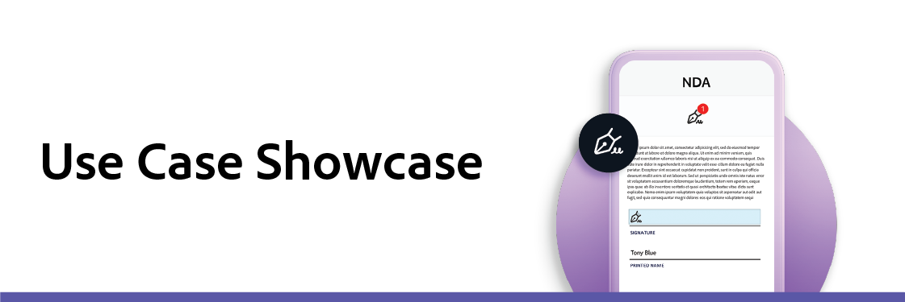

# Use case showcase 

The use case showcase is a livestream session introducing you to new Adobe Sign use cases, trends, and showing how your organization can implement and benefit from them. Each month a new topic is highlighted.

Below are recordings or registration links for the latest sessions:

## 2021 sessions

* **[AbbVie's path to digital transformation](https://use-case-showcase-with-abbvie.joinus.adobeevents.com/){target="_blank"}**
Date: August 4, 2021
AbbVie’s strategy is to deliver innovative medicines and to make a remarkable impact on people’s lives. To increase agility and free employees to focus on more complex work, the company is working to automate some of their business processes — and transitioning away from pen and paper is a crucial first step. Join us for a conversation with AbbVie to hear about their goals, strategy, and processes for achieving digital transformation success.

* **[Featuring Volvo Cars on-demand recording](https://gateway.on24.com/wcc/eh/2172296/lp/2963219/adobe-sign-use-case-showcase%3A-featuring-volvo-cars/){target="_blank"}**
What does the future of car shopping look like? For Swedish automaker Volvo Cars, they're making changes to their business model that will influence customer expectations for the next generation of car buyers. Central to their process is the ability to provide a top-quality customer experience to match their premium offerings. 

Join us for a behind-the-scenes conversation with Volvo Cars, discussing how they've taken big ideas and turned them into realities - and how other companies can learn from their transformation experiences.

* **[5 Ways Government Agencies Will Transform in 2021 on-demand recording](https://gateway.on24.com/wcc/eh/2172296/lp/2790280/5-ways-government-agencies-will-transform-in-2021-/){target="_blank"}**
How can Adobe Sign help governmental agencies better serve their constituents? Citizens and employees alike now expect more engaging online experiences. And to go digital, government processes must meet strict security, privacy, and compliance requirements. When the pandemic hit, government agencies had to ramp up their digital transformation efforts to continue to meet the needs of their constituents and maintain operational continuity.

Join us for the Adobe Sign Use Case Showcase to hear from government experts about the challenges federal, state, and local agencies have faced and how they continue to innovate to keep government running.

## 2020 sessions by industry

* **[Government](https://event.on24.com/wcc/r/2790280/7FFF27458A6834FDF8C73C5149637590?partnerref=EXL){target="_blank"}**
Focus: Our expert panelists cover best practices and a variety of government-specific use cases to show you how Adobe Sign can help your team save time, money, and resources while staying compliant and secure.

* **[Legal](https://event.on24.com/wcc/r/2634329/292CA0B317E56600A114508CC55376BF?partnerref=EXL){target="_blank"}**
Focus: Our panelists discuss how legal departments are managing the shift to fully remote document processes. Whether you’re just starting out or have already digitized some workflows, Adobe Sign can amplify your team’s productivity at every phase of digital transformation.

* **[Sales](https://acrobat.adobe.com/us/en/business/webinars/adobe-sign-use-case-showcase-sales.html){target="_blank"}**
Focus: Adobe experts highlight best practices for successful digital transformation in procurement, and the discussion covers industry trends and requirements for delivering excellent user experiences.

* **[Procurement & Logistics](https://event.on24.com/wcc/r/2514418/278FB6F16C198E2B866CF487AF9514F6){target="_blank"}**
Focus: How Adobe Sign works in procurement & logistics.

* **[HR Applications](https://event.on24.com/wcc/r/2351937/D9E34A102F309DFCAF0D07D5192BD66D){target="_blank"}**
Focus: How Adobe Sign works in various HR applications.

* **[State & Local Government](https://event.on24.com/wcc/r/2351937/D9E34A102F309DFCAF0D07D5192BD66D){target="_blank"}**
Focus: How Adobe Sign works in State and Local Government.

* **[Education](https://event.on24.com/wcc/r/2241711/762243D5EE65DAC44D3AE7BCCD3388A7){target="_blank"}**
Focus: How Adobe Sign works for Education.

* **[Life Science](https://event.on24.com/wcc/r/2204781/2C266134D08DDE48E17C77746F192AA6){target="_blank"}**
Focus: How Adobe Sign works for Life Sciences.

* **[Health Care](https://event.on24.com/wcc/r/2202626/1D60C42BD396AE273CB09CF53F1051BE){target="_blank"}**
Focus: How Adobe Sign works for healthcare. Topics include: growing use of telehealth and digital transformation--infrastructure and scaling.

* **[Financial Services](https://event.on24.com/wcc/r/2177152/40A4315A5D32F21AFB5EB03E25C15992){target="_blank"}**
Focus: How Adobe Sign works for Banking. Topics include: industry trends 2020 and beyond, digital documents and processes as a part of a broader digital transformation, best practices, use cases, and the benefits of Adobe Sign.

* **[Insurance](https://event.on24.com/wcc/r/2162717/1449ED610AD3B545004079728D9AE0F6){target="_blank"}**
Focus: How Adobe Sign works for Financial Services and Insurance. Topics include: industry trends,compliance and regulatory requirements in financial sector, and delivering an excellent user experience.
