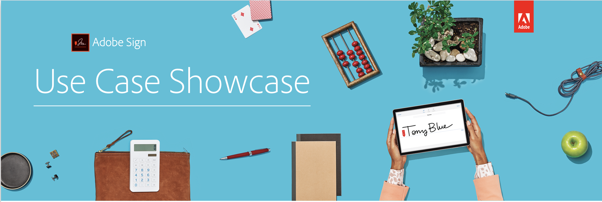

# Use Case Showcase 

The Use Case Showcase is a monthly livestream session that introduces you to new Adobe Sign use cases, trends, and shows you how your organization can implement and benefit from them. Each month a new topic will be highlighted.

Below are recordings of the latest sessions:

## 2020 Sessions by Industry

[Insurance](https://event.on24.com/wcc/r/2162717/1449ED610AD3B545004079728D9AE0F6)

Date: 2020-01-23

Focus: How Adobe Sign works for Financial Services and Insurance

Topics: 

* Industry trends
* Compliance and regulatory requirements in Financial sector
* Delivering an excellent user experience

[Financial Services](https://esign.adobe.com/2020-use-case-showcase-feb-reg.html)

Date: 2020-02-27

Focus: How Adobe Sign works for Banking

Topics:

* Industry trends 2020 and beyond 
* Digital documents and processes as a part of a broader digital transformation: How to move the needle
* Best practices: Banking use cases and the benefits of Adobe Sign
* Experience first: How to deliver excellent customer and employee experiences, improve efficiency, and comply with regulatory requirements in the banking industry

[Health Care](https://esign.adobe.com/2020-use-case-showcase-march-reg.html)

2020-03-26

Focus: How Adobe Sign works for healthcare

Topics:
* Growing Use of Telehealth
* Digital Transformation: Infrastructure and Scaling

[Life Science](https://esign.adobe.com/2020-use-case-showcase-april-reg.html)

2020-04-30

Focus: How Adobe Sign works for Life Sciences

Topics:

* Industry trends: 2020 and beyond
* Digital documents and processes as a part of a broader digital transformation: How to move the needle
* Best practices: Life Sciences Use cases and the benefits of Adobe Sign
* Experience first: How to deliver excellent customer and employee experiences, improve efficiency, and comply with regulatory requirements in this industry.
