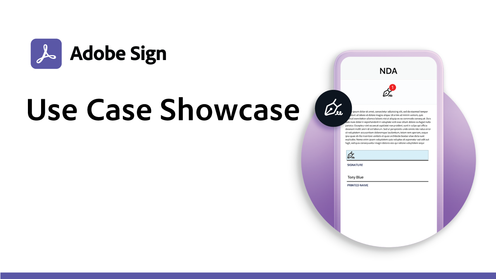
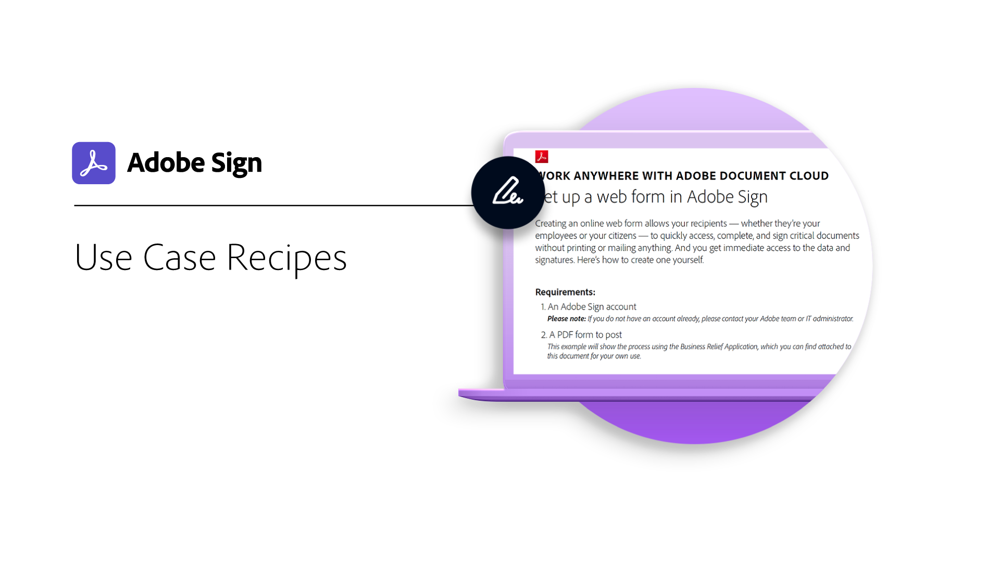

# Use Case

<table>
<tr>
  <td>
    
    

    <a href="use-case-showcase.md"><strong>Use Case Showcase</strong></a>
     
  </td>
  <td>
    
    

    <a href="recipes.md"><strong>Recipes</strong></a>
     
  <td>
    
    

     
  </td>
</tr>
</table>
